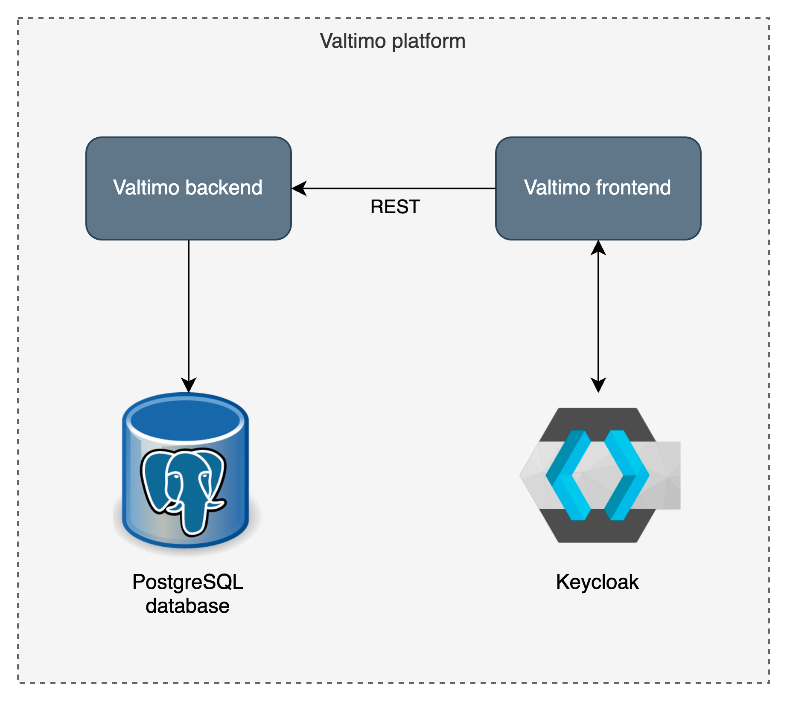

## Welcome to Valtimo

### What is Valtimo?
Valtimo is the low-code platform for Business Process Automation. Our goal is to make implementing business process automation and case management easy.

### What does the Valtimo platform contain?
- Valtimo consists of two services:
    - A Spring Boot Java/Kotlin backend
    - An Angular frontend
- Valtimo depends on two services:
    - Keycloak as an identity and access provider
    - A database (default is PostgreSQL)

More information about the backend and frontend can be found in their respective README files:
- [Valtimo backend libraries](backend/README.md)
- [Valtimo frontend libraries](frontend/README.md)

### Contributing
Contributions are welcome! To get you in the right direction, please consult the [Valtimo documentation](https://docs.valtimo.nl/contributing-to-valtimo/contributing-to-valtimo) for guidelines on how to contribute.

#### Code guidelines
<!--- TODO: write the coding guidelines--->
For contributing code, please refer to the [coding guidelines](CODING-GUIDELINES.md).

#### Branching strategy
For more information on what branches to create while working in this project, please refer
to [this page](https://docs.valtimo.nl/contributing-to-valtimo/branching-and-release-strategy).

### License
The source files in this repo are licensed under the [EUPL 1.2](https://joinup.ec.europa.eu/collection/eupl/eupl-text-eupl-12).
If you have any questions about the use of this codebase in a larger work: please reach out through the [Valtimo website](https://www.valtimo.nl/contact/).

### More information
- Website: https://www.valtimo.nl
- Documentation: https://docs.valtimo.nl
- Academy: https://academy.valtimo.nl
- Process Exchange (Dutch, GZAC edition only): https://exchange.gzac.nl/
- Designer: https://designer.valtimo.nl/
