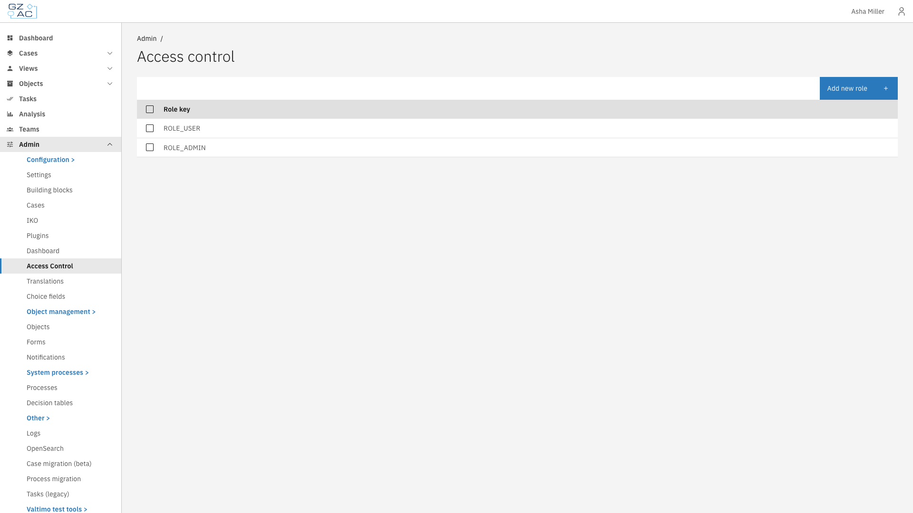

# Access control

Access control allows administrators to define roles and assign permissions that determine what users can see and do within the application.

This includes:

- **[Configurable elements](configurable-elements.md)** — Overview of resources and actions available for access control
- **[Roles](roles.md)** — Creating and managing roles
- **[Permissions](permissions.md)** — Granting permissions to roles
- **[Conditions](conditions.md)** — Restricting permissions with field and expression conditions
- **[Context conditions](context-conditions.md)** — Context-aware permission rules

---

## Accessing access control



Navigate to **Admin** in the sidebar


Click **Access Control**



<figure><figcaption>Access control overview</figcaption></figure>


Roles configured here apply platform-wide and affect all users with the corresponding role assignment in Keycloak.


---

## How access control works

Valtimo uses permission-based access control (PBAC). Each role can have multiple permissions that grant access to specific resources (such as cases, tasks, or documents) and actions (such as view, create, modify, or delete).

Permissions can be further refined using:

- **Conditions** — Restrict access based on field values (e.g., only cases with a specific status)
- **Context conditions** — Restrict access based on related resources (e.g., processes can only be started within the context of an active loan request case)

---

## Export

Roles and their permissions can be exported as JSON files for backup or migration purposes. Select one or more roles and click **Export** to download the configuration.
