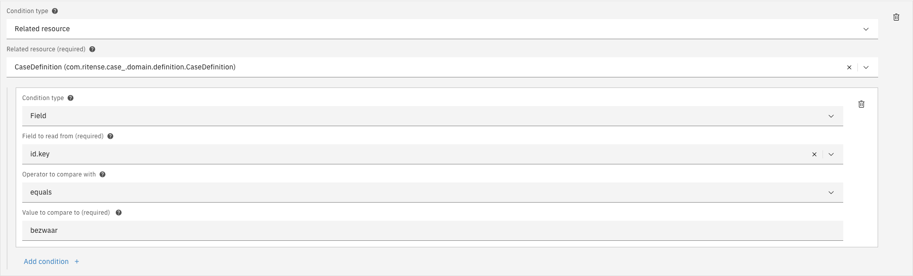
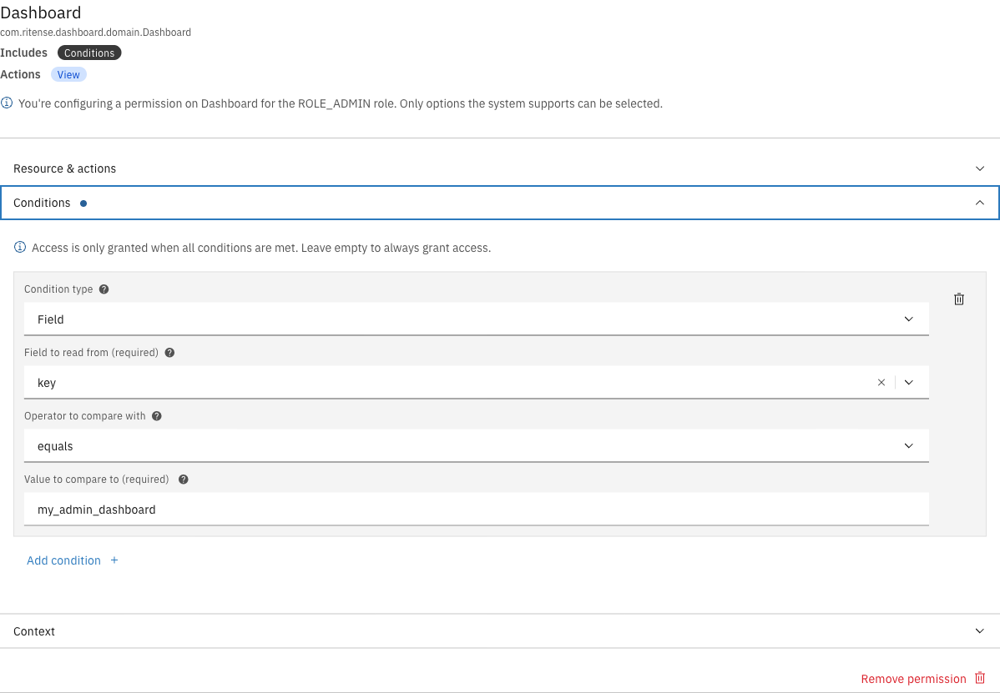
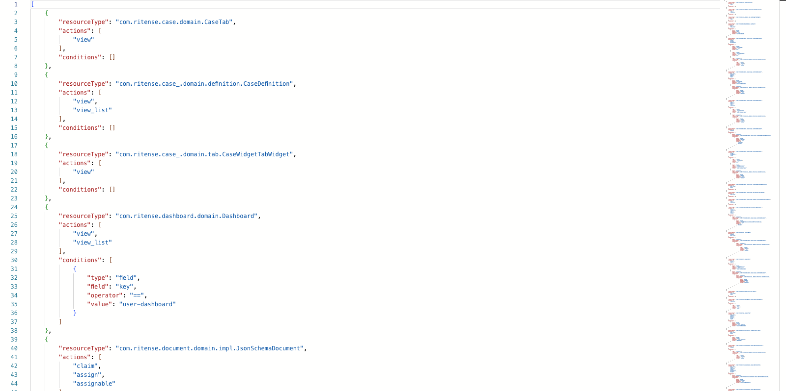

# Conditions

Conditions restrict when a permission applies. Without conditions, a permission grants access unconditionally. With conditions, access is only granted when all conditions are met.

---

## Condition types

There are three types of conditions:

| Type | Description |
|------|-------------|
| **Field** | Compares a direct property of the resource to a value |
| **JSON field** | Reads a value from a JSON path inside a field and compares it |
| **Related resource** | Checks conditions on a linked resource (supports nesting) |

---

## Field conditions

Field conditions compare a property of the resource to a specified value.

<figure><figcaption>Field condition configuration</figcaption></figure>

| Property | Description |
|----------|-------------|
| Field to read from | The resource property to compare (e.g., `key`, `assigneeId`) |
| Operator to compare with | The comparison operator (see [Operators](#operators)) |
| Value to compare to | The value to compare against |

### JSON format

```json
{
  "type": "field",
  "field": "key",
  "operator": "==",
  "value": "user-dashboard"
}
```

---

## JSON field conditions

JSON field conditions read a value from a JSON path inside a field. Use this when the field contains JSON data and you need to check a nested value.

| Property | Description |
|----------|-------------|
| Field to read from | The resource property containing JSON data |
| Path | JSON path to the value (e.g., `/status`, `/address/city`) |
| Operator to compare with | The comparison operator |
| Value to compare to | The value to compare against |
| Value type | The Java type of the value (e.g., `java.lang.String`, `java.lang.Boolean`) |

### JSON format

```json
{
  "type": "expression",
  "field": "content",
  "path": "/request/status",
  "operator": "==",
  "value": "APPROVED",
  "clazz": "java.lang.String"
}
```

### Supported value types

| Type | Description |
|------|-------------|
| `java.lang.String` | Text values (default) |
| `java.lang.Boolean` | `true` or `false` |
| `java.lang.Integer` | Whole numbers |
| `java.lang.Long` | Large whole numbers |
| `java.lang.Double` | Decimal numbers |
| `java.math.BigDecimal` | Precise decimal numbers |
| `java.util.Collection` | Lists or arrays |
| `java.time.LocalDate` | Dates (e.g., `2024-01-15`) |
| `java.time.LocalDateTime` | Date and time |

Custom types can be entered manually using the toggle in the editor.

---

## Related resource conditions

Related resource conditions check conditions on a linked resource. This enables permission rules that span multiple entities.

<figure><figcaption>Related resource condition with nested field condition</figcaption></figure>

| Property | Description |
|----------|-------------|
| Related resource | The linked resource type to check |
| Nested conditions | Conditions to evaluate on the related resource |

Related resource conditions can be nested to any depth, allowing complex permission rules across multiple entity relationships.

### JSON format

```json
{
  "type": "container",
  "resourceType": "com.ritense.case_.domain.definition.CaseDefinition",
  "conditions": [
    {
      "type": "field",
      "field": "id.key",
      "operator": "==",
      "value": "bezwaar"
    }
  ]
}
```

---

## Operators

| Operator | Label | Description |
|----------|-------|-------------|
| `==` | equals | Value must match exactly |
| `!=` | does not equal | Value must not match |
| `>` | is greater than | Value must be greater |
| `>=` | is greater than or equal to | Value must be greater or equal |
| `<` | is less than | Value must be less |
| `<=` | is less than or equal to | Value must be less or equal |
| `in` | is one of | Value must be in the provided list |
| `list_contains` | contains | List must contain the value |

---

## Special value placeholders

Placeholders allow dynamic values based on the current user's context.

| Placeholder | Description |
|-------------|-------------|
| `${currentUserId}` | The current user's ID |
| `${currentUsername}` | The current user's username |
| `${currentUserEmail}` | The current user's email address |
| `${currentUserRoles}` | List of the current user's roles |
| `${currentUserTeams}` | List of the current user's team memberships |

### Example

To grant access only to cases assigned to the current user:

```json
{
  "type": "field",
  "field": "assigneeId",
  "operator": "==",
  "value": "${currentUserId}"
}
```

---

## Adding a condition



Open a permission in the Editor tab


Expand the **Conditions** accordion


Click **Add condition**


Select the condition type


Configure the condition fields

<figure><figcaption>Configuring a field condition</figcaption></figure>


Click **Save** in the page header



---

## Removing a condition



Open a permission in the Editor tab


Expand the **Conditions** accordion


Click the trash icon next to the condition


Click **Save** to persist the change



---

## JSON editor

For advanced editing, use the JSON editor tab to directly modify condition configurations.

<figure><figcaption>JSON editor showing condition structure</figcaption></figure>


Invalid JSON will prevent saving. The editor validates the structure before allowing you to save.

