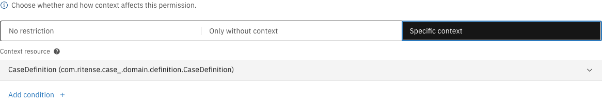
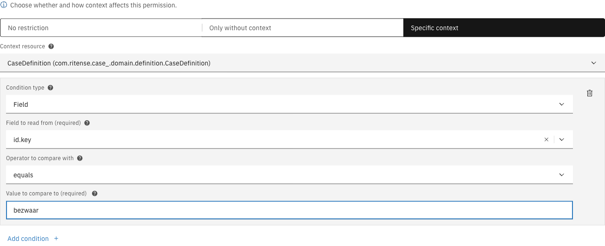

# Context conditions

Context conditions control when a permission applies based on how a resource is accessed. A resource can be accessed directly (e.g., starting a new case from the case list) or within the context of another resource (e.g., starting a process from within a case).

---

## Context modes

The Context section in the permission editor provides three modes:

<figure><figcaption>Context mode selector</figcaption></figure>

| Mode | Description |
|------|-------------|
| **No restriction** | Context is not considered — permission applies regardless of how the resource is accessed |
| **Only without context** | Permission only applies when the resource is accessed directly, not within a parent resource |
| **Specific context** | Permission only applies when accessed within a specific parent resource type |

---

## No restriction

The default mode. The permission applies whether the resource is accessed directly or within a parent resource. Context is ignored entirely.

Use this when the permission should apply universally, regardless of navigation path.

---

## Only without context

<figure><figcaption>Only without context mode</figcaption></figure>

The permission only applies when the resource is accessed on its own — not within any related resource.

### Example

A permission on `OperatonExecution` (process start) with "Only without context" would:
- **Apply** when starting a standalone process from the process overview
- **Not apply** when starting a process from within a case

---

## Specific context

<figure><figcaption>Specific context mode with resource selection</figcaption></figure>

The permission only applies when the resource is accessed within a specific parent resource type. You can optionally add conditions on the context resource to further restrict access.

### Configuration

| Property | Description |
|----------|-------------|
| Context resource | The parent resource type that must be present |
| Conditions | Optional conditions on the context resource (same syntax as regular [conditions](conditions.md)) |

### Example

A permission on `OperatonExecution` (process start) with context resource `CaseDefinition` and a condition `id.key = bezwaar` would allow processes to only be started within the context of a specific case type:

<figure><figcaption>Specific context with condition configured</figcaption></figure>

- **Apply** when starting a process from within a "bezwaar" case
- **Not apply** when starting a process from other case types
- **Not apply** when starting a process without a case context
