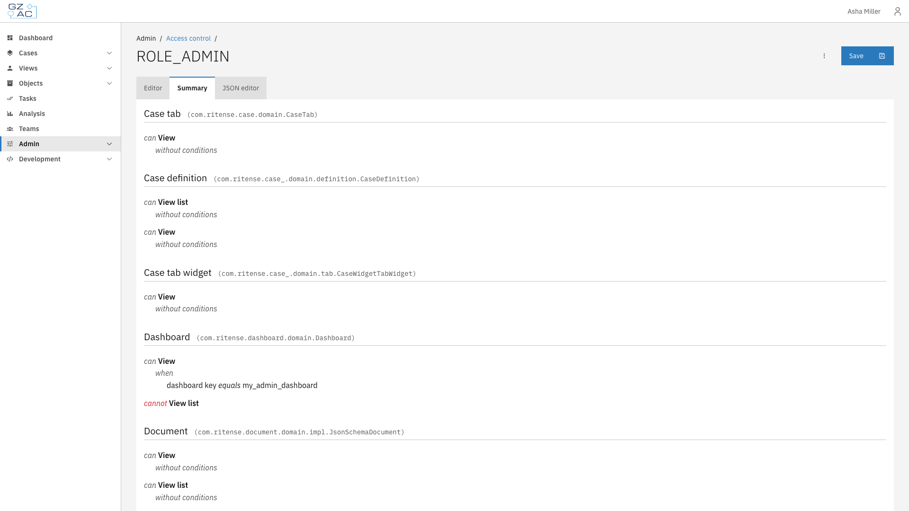
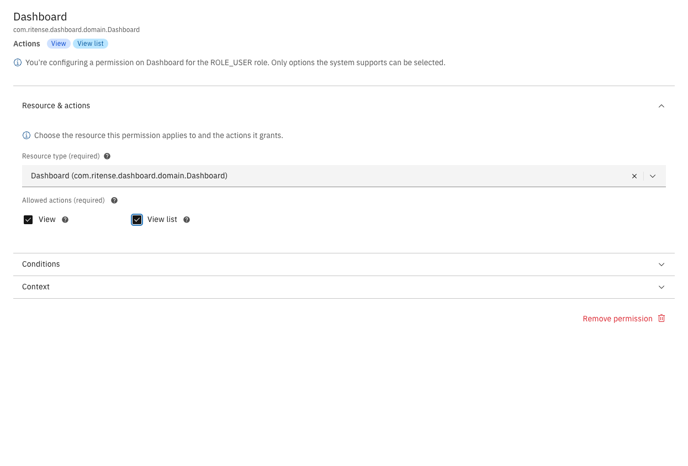
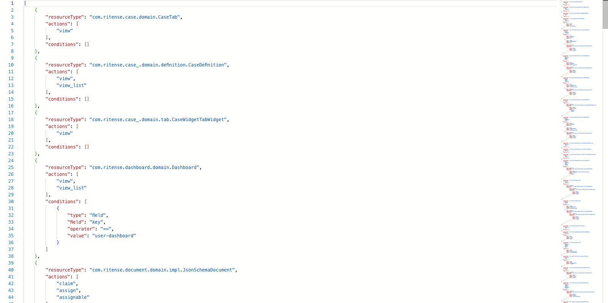

# Permissions

Permissions define what actions a role can perform on specific resources. Each permission consists of a resource type, one or more actions, and optional conditions that further restrict access.

---

## Accessing the permission editor



Navigate to **Admin** in the sidebar


Click **Access Control**


Click on a role to open its editor



The editor has three tabs:

- **Editor** — Visual interface for managing permissions
- **Summary** — Read-only overview of all permissions
- **JSON editor** — Direct JSON editing for advanced users

---

## Visual editor

The visual editor displays permissions in a sidebar on the left and a detail panel on the right.

<figure><figcaption>Permission editor</figcaption></figure>

Each permission in the sidebar shows:

- **Resource name** — The short name of the resource type (e.g., "Dashboard")
- **Actions** — Colored tags indicating which actions are granted
- **Indicators** — Tags showing if the permission has conditions or context restrictions

---

## Summary tab

The Summary tab provides a read-only overview of all permissions for the role. Each resource type is listed with its allowed actions and any conditions that apply.

<figure><figcaption>Summary tab</figcaption></figure>

Permissions are displayed in natural language format:

- **can [action]** — The role is granted this action
- **cannot [action]** — The role is explicitly denied this action
- **without conditions** — The permission applies unconditionally
- **when [condition]** — The permission is restricted by the specified condition

Clicking on a resource type or action navigates to the JSON editor filtered to that specific permission.

---

## Adding a permission



Click **New permission** in the sidebar


Select a **Resource type** from the dropdown


Check the **Allowed actions** you want to grant

<figure><figcaption>Configured permission</figcaption></figure>


Optionally, expand **Conditions** or **Context** to add restrictions (see [Conditions](conditions.md) and [Context conditions](context-conditions.md))


Click **Save** in the page header



---

## Editing a permission



Click on the permission in the sidebar


Modify the resource type, actions, conditions, or context as needed


Click **Save**



---

## Removing a permission



Click on the permission in the sidebar


Click **Remove permission** at the bottom of the detail panel


Confirm the removal


Click **Save** to persist the change




Changes are not persisted until you click **Save**. You can undo removals by navigating away without saving.


---

## JSON editor

For advanced users or bulk editing, the JSON editor provides direct access to the raw permission configuration.

<figure><figcaption>JSON editor</figcaption></figure>

The JSON format is an array of permission objects:

```json
{
  "resourceType": "com.ritense.dashboard.domain.Dashboard",
  "actions": ["view", "view_list"],
  "conditions": []
}
```

| Property | Description |
|----------|-------------|
| `resourceType` | Fully qualified class name of the resource |
| `actions` | Array of action keys (e.g., `view`, `create`, `modify`, `delete`) |
| `conditions` | Array of condition objects (see [Conditions](conditions.md)) |


Invalid JSON will prevent saving. The editor validates the structure before allowing you to save.

