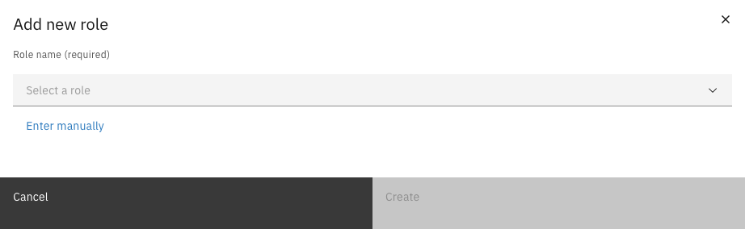
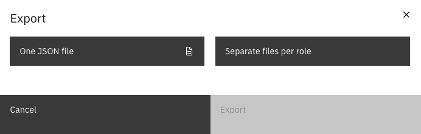

# Roles

Roles are containers for permissions. Each role maps to a Keycloak role — users with a given Keycloak role inherit all permissions configured for that role in Valtimo.

---

## Creating a role



Navigate to **Admin** in the sidebar


Click **Access Control**


Click **Add new role**


Select a role from the dropdown, or click **Enter manually** to type a custom role key

<figure><figcaption>Add role modal</figcaption></figure>


Click **Create**




The dropdown shows roles from Keycloak that are not yet configured in Valtimo. Use **Enter manually** when the role does not exist in Keycloak yet or when you need a custom key.


---

## Editing a role

To rename a role:



Click on the role in the list to open its editor


Click the **More** menu (three dots) in the header


Select **Edit**


Enter the new role key and click **Save**



---

## Deleting roles



Select one or more roles using the checkboxes


Click **Delete** in the action bar


Confirm the deletion




Deleting a role removes all its permissions. This action cannot be undone.


---

## Exporting roles

Roles and their permissions can be exported as JSON files for backup or migration.



Select one or more roles using the checkboxes


Click **Export** in the action bar


Choose an export format

<figure><figcaption>Export options</figcaption></figure>


Click **Export** to download the file(s)



| Option | Description |
|--------|-------------|
| One JSON file | All selected roles in a single file |
| Separate files per role | One JSON file per role (downloaded as separate files) |
