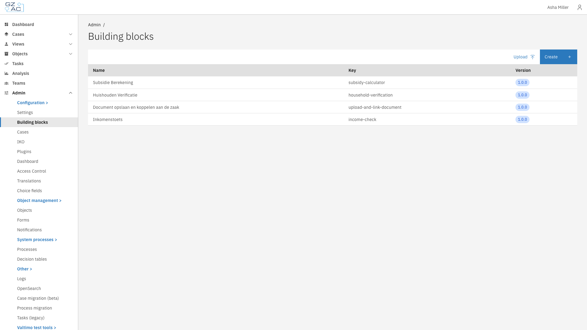
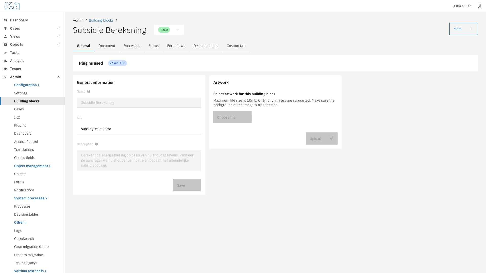

# Building blocks

Building blocks are reusable configuration bundles that package processes, forms, form flows, decision tables, and document schemas together. They allow you to create modular, versioned components that can be shared across cases or imported into other Valtimo implementations.

This section covers:

- **[General](general.md)** — Name, description, and artwork configuration
- **[Document](document.md)** — JSON schema for building block data
- **[Processes](processes.md)** — BPMN process definitions
- **[Forms](forms.md)** — Form definitions for user tasks
- **[Form flows](form-flows.md)** — Multi-step form wizards
- **[Decision tables](decision-tables.md)** — DMN decision tables

---

## Configuring building blocks



Go to **Admin** > **Building blocks**

<figure><figcaption>Building blocks list</figcaption></figure>


Click on a building block to configure it, or click **Create** to add a new one

<figure><figcaption>Building block detail view</figcaption></figure>



---

## Version selector

Each building block has a version tag (e.g., `1.0.0`). The version selector in the page header shows the current version.

---

## Read-only state

When a building block version is marked as **final**, all tabs become read-only. Configuration (general information, document schema, processes, forms, form flows, and decision tables) can no longer be modified.

To make changes, create a new draft version of the building block.

---

## Import and export

Building blocks can be exported as ZIP files containing all related configuration (processes, forms, decision tables, etc.). Use the **Upload** button on the list page to import a building block ZIP file.

---

## Linking to cases

Building blocks can be linked to cases via the case configuration. When a building block is linked to a case, its processes become available as actions within that case context.
