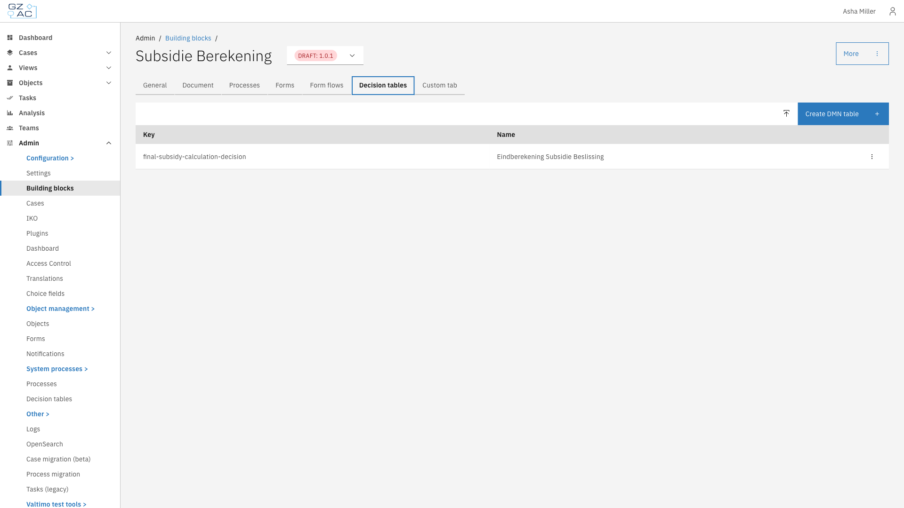
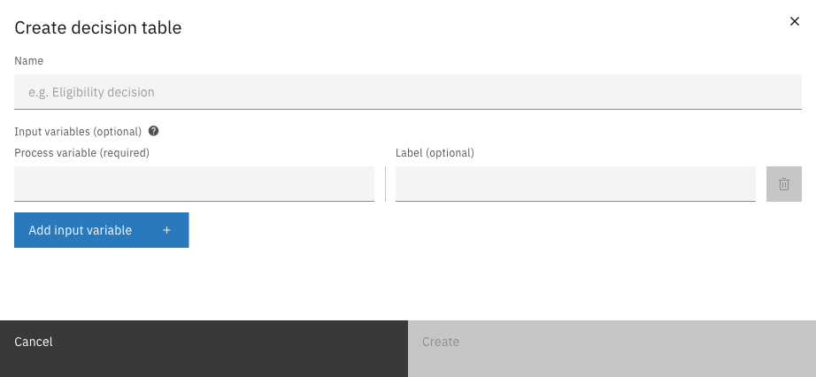
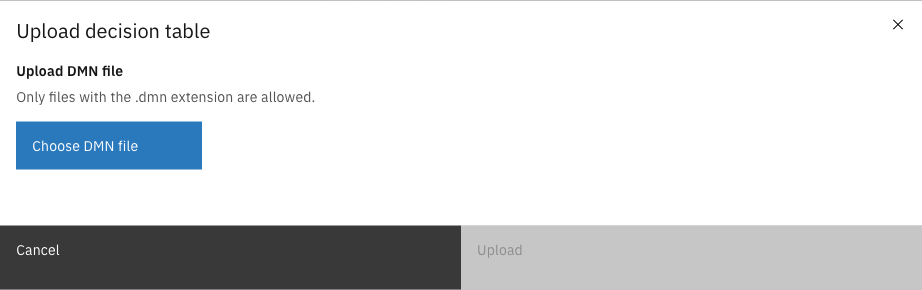
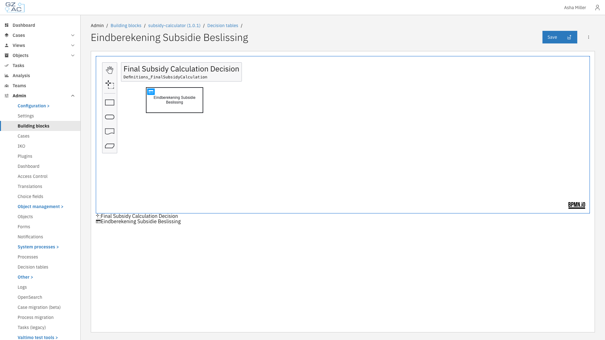

# Decision tables

## Overview

The Decision tables tab manages DMN (Decision Model and Notation) decision definitions within a building block. Decision tables allow you to define business rules in a tabular format that can be evaluated during process execution.

---

## Configuring decision tables



Go to **Admin** > **Building blocks**


Click on a building block to open its configuration


Click the **Decision tables** tab

<figure><figcaption>Decision tables tab showing list of decision tables</figcaption></figure>



The decision table list displays:

| Column | Description |
|--------|-------------|
| Key | Technical identifier used in process references |
| Name | Display name of the decision table |

---

### Creating a decision table



Click **Create DMN table** in the toolbar


Enter the decision table details

<figure><figcaption>Create decision table modal</figcaption></figure>


Click **Create** to open the DMN modeler



| Property | Description |
|----------|-------------|
| Name | Display name for the decision table (required) |
| Input variables | Process variables to use as inputs in the decision table (optional). Each variable has a process variable name (required) and a label (optional) |

---

### Uploading a decision table



Click the upload button (icon) next to **Create DMN table**


The upload dialog appears

<figure><figcaption>Upload decision table modal</figcaption></figure>


Click **Choose DMN file** and select a `.dmn` file from your computer


Click **Upload** to import the decision table



---

### Editing a decision table

Click on a decision table row to open it in the DMN modeler.

<figure><figcaption>DMN modeler showing the Decision Requirements Diagram</figcaption></figure>

The modeler provides:

| Element | Description |
|---------|-------------|
| DRD view | Visual diagram showing decision elements and their relationships |
| Decision table view | Tabular editor for defining rules (click on a decision element to open) |
| Save button | Saves changes to the decision table |
| Toolbar | Tools for creating additional decision elements, input data, and knowledge sources |

Click the decision element in the diagram to switch to the table view and edit the decision rules.

---

### Deleting a decision table



Click the overflow menu (three dots) on the decision table row


Select **Delete**


Confirm the deletion in the dialog




Decision tables cannot be edited or deleted when the building block version is finalized.


---

## Using decision tables

Decision tables can be invoked from processes using the DMN Business Rule Task. The task evaluates the decision table with input variables from the process context and returns the output values for use in subsequent process steps.