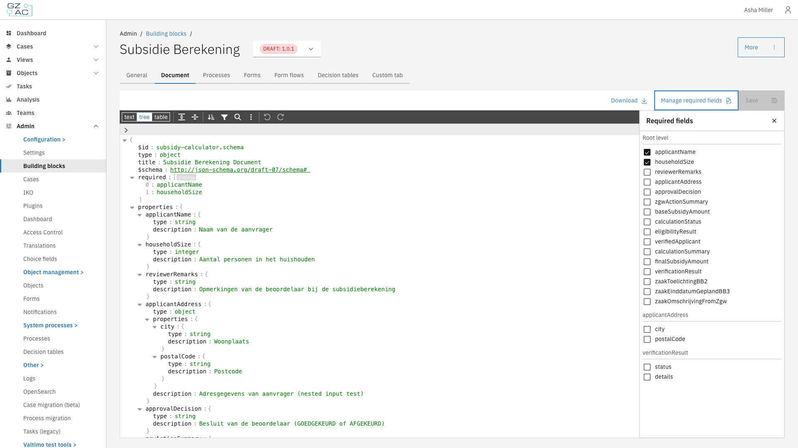
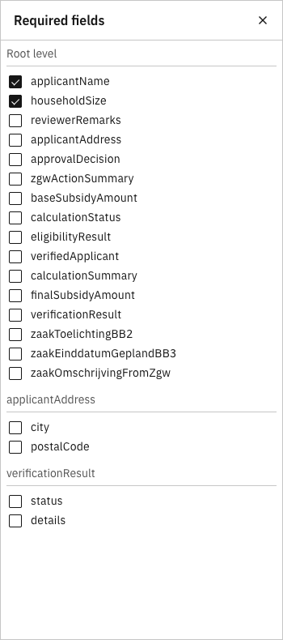

# Document

## Overview

The Document tab defines the JSON schema for a building block's data structure. This schema specifies which data fields the building block uses, their types, and validation constraints. When a building block is linked to a case, its document schema is merged with the case's document schema.

---

## Configuring the document schema



Navigate to **Admin** in the sidebar


Click **Building blocks**


Select a building block from the list


Click the **Document** tab



<figure><figcaption></figcaption></figure>

---

### Schema editor

The schema editor displays the JSON schema in a tree view. Use the toolbar to navigate and modify the schema.

| Action | Description |
|--------|-------------|
| text / tree / table | Switch between view modes |
| Expand all / Collapse all | Expand or collapse all nested objects |
| Sort | Sort properties alphabetically |
| Search (Ctrl+F) | Find text within the schema |
| Undo / Redo | Revert or reapply changes |

Edit values by clicking on them directly in the tree. After making changes, click **Save** to persist the schema.

Use **Download** to export the schema as a JSON file.

---

### Managing required fields

The required fields panel provides a convenient way to mark properties as required without manually editing the `required` array in the schema.



Click **Manage required fields** in the toolbar


The panel displays all properties grouped by object level (root and nested objects)


Check or uncheck properties to mark them as required or optional


Click **Save** to apply the changes



<figure><figcaption></figcaption></figure>

---

## Read-only state

When a building block version is marked as **final**, the schema editor becomes read-only. The schema can no longer be modified, and the Save button is disabled.

To make changes, create a new draft version of the building block.
