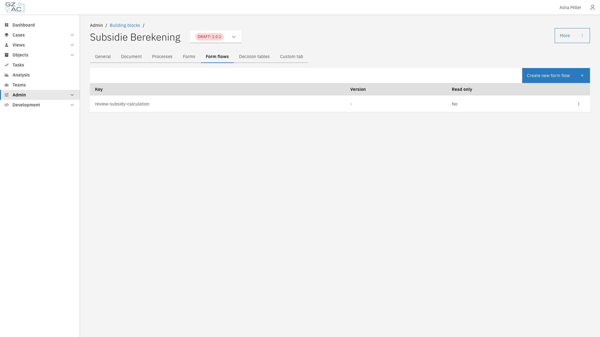
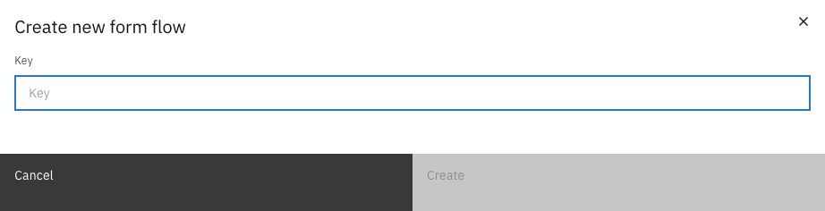
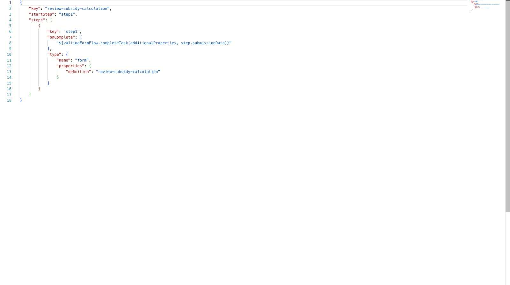

# Form flows

## Overview

Form flows are multi-step form wizards that guide users through a sequence of forms. They enable complex data collection by chaining multiple forms together, with support for conditional navigation, branching logic, and step transitions.

In the context of building blocks, form flows allow you to package reusable wizard-style interactions that can be linked to user tasks in BPMN processes.

---

## Configuring form flows



Navigate to **Admin** > **Building blocks** and select a building block


Click the **Form flows** tab

<figure><figcaption>Form flows tab showing the list of form flows</figcaption></figure>



The form flows list displays all form flows defined within this building block:

| Column | Description |
|--------|-------------|
| Key | Unique identifier for the form flow |
| Version | Current version number (or `-` if not versioned) |
| Read only | Whether the form flow can be edited |

### Adding a form flow



Click **Create new form flow**


Enter a unique key for the form flow

<figure><figcaption>Create new form flow modal</figcaption></figure>


Click **Create** to open the JSON editor



| Property | Description |
|----------|-------------|
| Key | Unique identifier for the form flow within this building block. Use lowercase with hyphens (e.g., `my-form-flow`) |

### Editing a form flow

Click on a form flow row to open the JSON editor. The editor provides syntax highlighting and validation against the form flow JSON schema.

<figure><figcaption>Form flow JSON editor</figcaption></figure>

Form flows are defined in JSON with the following structure:

| Property | Description |
|----------|-------------|
| `key` | Unique identifier matching the form flow key |
| `startStep` | Key of the first step to display |
| `steps` | Array of step definitions |

Each step contains:

| Property | Description |
|----------|-------------|
| `key` | Unique step identifier |
| `type` | Step type configuration (e.g., `form` to display a form) |
| `onComplete` | Array of expressions to execute when the step completes |

### Deleting a form flow



Click the overflow menu (three dots) on the form flow row


Select **Delete**


Confirm the deletion in the dialog




Form flows marked as read-only cannot be deleted.


## Form flow scope

Form flows in a building block can reference forms defined within the same building block.
