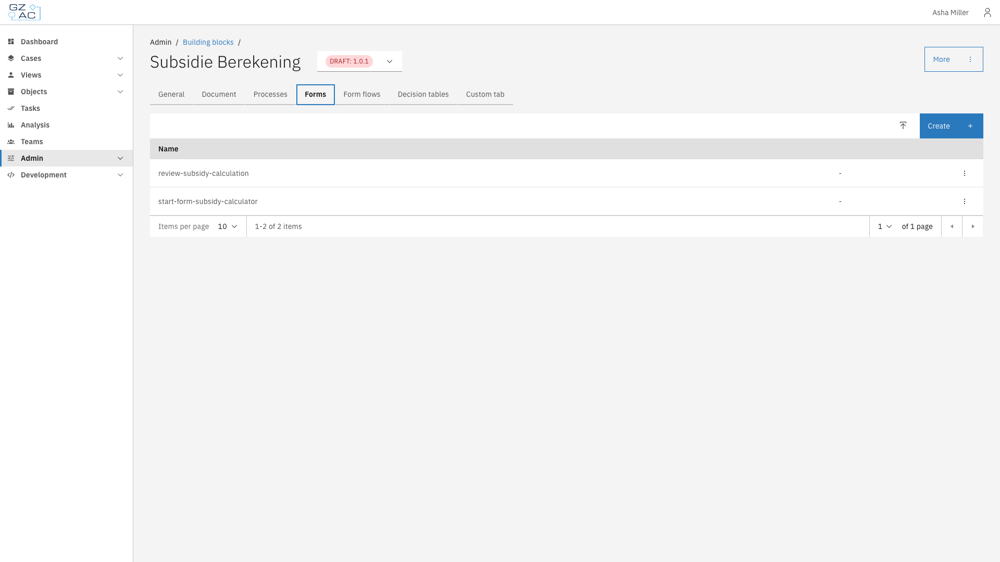
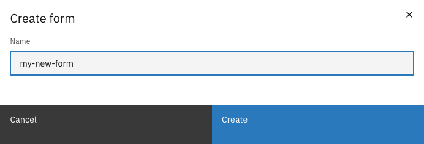
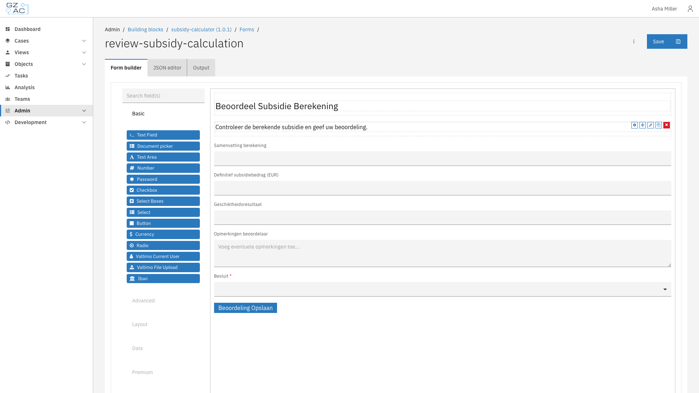

# Forms

## Overview

The Forms tab manages form definitions included in the building block. Forms defined here can be linked to user tasks in the building block's processes.

---

## Configuring forms



Go to **Admin** > **Building blocks**


Click on a building block to open its configuration


Click the **Forms** tab

<figure><figcaption>Forms tab showing list of forms</figcaption></figure>



The forms list displays all forms included in the building block. Each row shows:

| Column | Description |
|--------|-------------|
| Name | The form definition name |
| Read-only | Tag indicating if the form is read-only (imported forms) |

---

### Creating a form



Click the **Create** button in the action bar


Enter a name for the form

<figure><figcaption>Create form modal</figcaption></figure>


Click **Create** to open the form builder



---

### Editing a form

Click on a form row to open the form builder.

<figure><figcaption>Form builder</figcaption></figure>

The form builder has three tabs:

| Tab | Description |
|-----|-------------|
| Form builder | Visual drag-and-drop form designer |
| JSON editor | Direct JSON editing of the form definition |
| Output | Preview of the form's JSON output |

The left panel contains available field types organized by category:

- **Basic** — Text Field, Text Area, Number, Select, Checkbox, Radio, Button, etc.
- **Advanced** — Email, URL, Phone Number, Date/Time, etc.
- **Layout** — HTML Element, Content, Columns, Panel, Tabs, etc.
- **Data** — Hidden, Container, Data Map, etc.
- **Premium** — File, Nested Form, etc.

Drag fields from the left panel onto the form canvas to add them. Click on a field to configure its properties.

Click **Save** to save changes to the form.

---

### Uploading a form



Click the **Upload** button (icon next to Create)


Enter a name for the form


Click **Create** to open the form builder


Use the JSON editor tab to paste an existing form definition


Click **Save**



---

### Deleting a form

Forms can be deleted via the overflow menu (three dots) on each row. Read-only forms and forms in finalized building block versions cannot be deleted.

---

## Form scope

Forms in a building block are scoped to that building block. They can reference fields from the building block's document schema and will be available for process links within the building block's processes.
