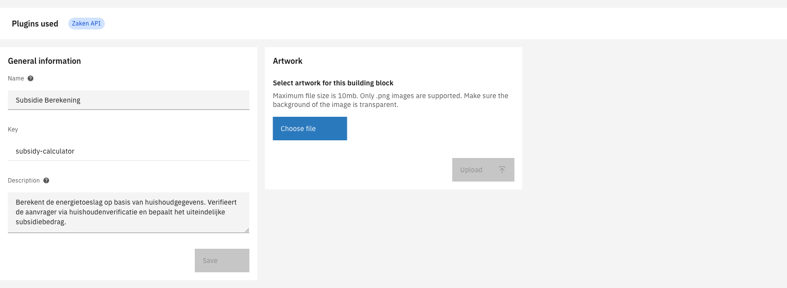
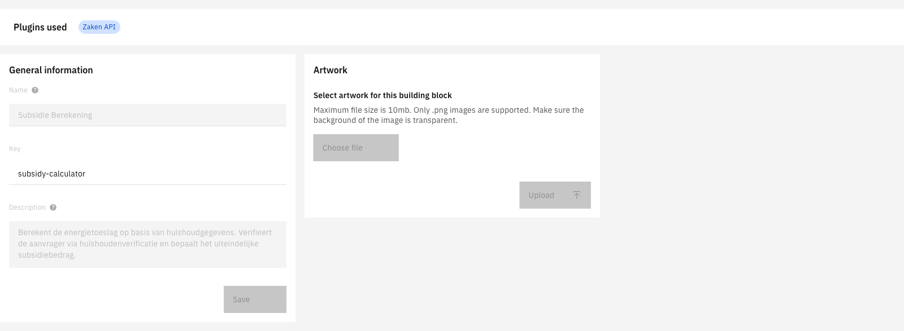

# General

## Overview

The General tab contains core configuration for a building block: metadata (name, key, description), plugin dependencies, and artwork. This tab is always the first one displayed when opening a building block.

---

## Configuring general information



Navigate to **Admin** in the sidebar


Click **Building blocks**


Select a building block from the list


The **General** tab is selected by default



<figure><figcaption></figcaption></figure>

---

### General information

The metadata section contains the building block's identity fields.

| Property | Description |
|----------|-------------|
| Name | Display name shown in the UI (required) |
| Key | Unique identifier for the building block (read-only after creation) |
| Description | Optional text explaining the building block's purpose |

Click **Save** after making changes to the name or description.

---

### Plugins used

This read-only section displays which plugins the building block depends on. Plugin dependencies are determined by the processes and configurations within the building block.

For more information about plugins, see [Plugins](../plugins/).

---

### Artwork

Upload a PNG image to visually represent the building block.

| Requirement | Value |
|-------------|-------|
| Format | PNG only |
| Maximum size | 10 MB |
| Recommendation | Use a transparent background |

To upload artwork:

1. Click **Choose file**
2. Select a PNG image
3. Click **Upload**

If artwork is already uploaded, it will be displayed as a preview. Use the **Delete** button to remove existing artwork.

---

## Read-only state

When a building block version is marked as **final**, all fields on the General tab become read-only. The name, description, and artwork can no longer be modified.

<figure><figcaption></figcaption></figure>

To make changes, create a new draft version of the building block.
