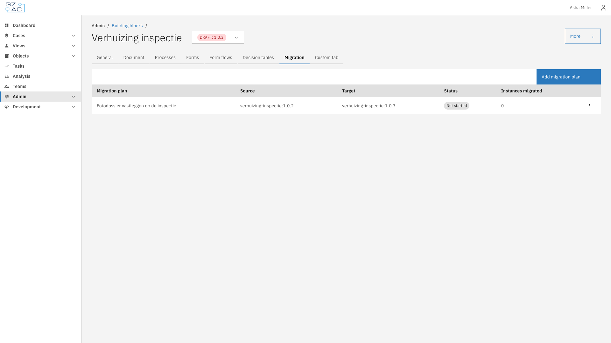
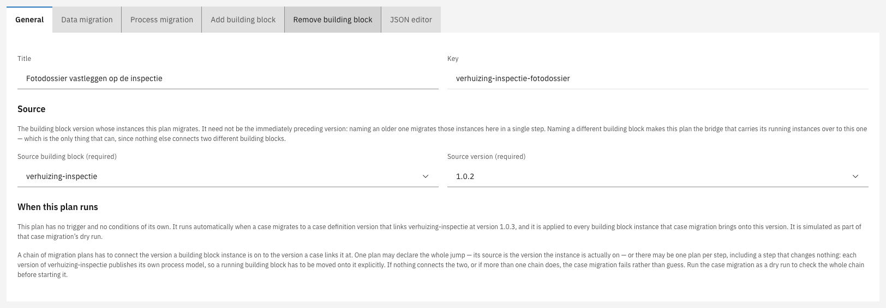

# Migration

Every version of a building block publishes its own process model and data structure, so a running
building block has to be moved onto a new version explicitly. The **Migration** tab of a building
block version holds the migration plans that describe those moves.

Building block plans use the same editor as case migration plans, but they are never started by hand:
a building block lives inside a case, so its plans run when a case migration moves a building block
onto the plan's version.


The concepts, editor tabs, and source and target rules are documented under
[Cases > Migration](../cases/migration/README.md). This page covers only what differs for building
blocks.


---

## Finding the migration screen



Expand **Admin** in the left sidebar


Click **Building blocks** under the Configuration section


Click a building block to open it


Select the version to migrate instances into


Click the **Migration** tab

<figure><figcaption>Building block migration tab</figcaption></figure>



The list shows every migration plan for that version:

| Column             | Description                                                                           |
|--------------------|---------------------------------------------------------------------------------------|
| Migration plan     | The plan's title                                                                      |
| Source             | The building block version the plan migrates instances from                           |
| Target             | The version the plan migrates instances into — always the version the plan belongs to |
| Status             | Not started, Running, Completed, or Completed with errors                             |
| Instances migrated | How many building block instances the plan has migrated                               |

---

## Differences from case migration

<figure><figcaption>When this plan runs</figcaption></figure>

| Aspect                      | Building block plans                                                                                                                                                 |
|-----------------------------|----------------------------------------------------------------------------------------------------------------------------------------------------------------------|
| Triggers                    | None. The **General** tab shows **When this plan runs** instead, explaining that the plan is applied automatically by a case migration                               |
| Conditions                  | None. The plan applies to every building block instance the case migration brings onto this version                                                                  |
| Manual start                | Not available. There is no **Start migration now** button                                                                                                            |
| Dry run                     | Not available on this tab. Dry-run the case migration instead: it walks the same chain of building block plans and reports the same problems                         |
| Source                      | A **Source building block** and **Source version**. Naming a different building block makes this plan the bridge that carries its running instances over to this one |
| Add / Remove building block | The owner is the migrating building block, so these tabs nest a building block inside it, or dissolve a nested one                                                   |

---

## Chaining plans

A chain of migration plans has to connect the version a building block instance is on to the version
a case links it at. One plan may declare the whole jump, or there may be one plan per step —
including a step that changes nothing, because each version publishes its own process model.


If nothing connects the two versions, or if more than one chain does, the case migration fails rather
than guess, and the whole case is left untouched. Run the case migration as a dry run to check the
chain before starting it.


See [Cases > Migration > Building blocks](../cases/migration/building-blocks.md) for how a case
decides which building block version its blocks should move to.
