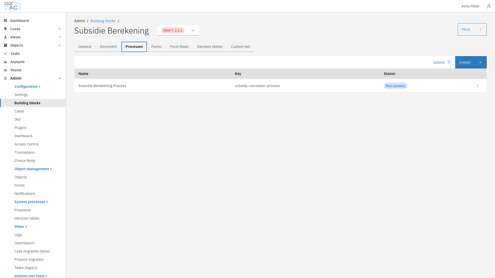
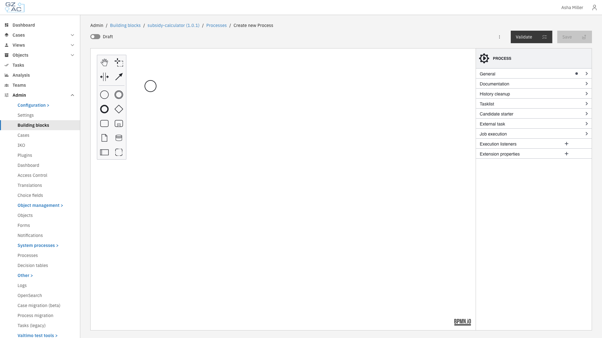
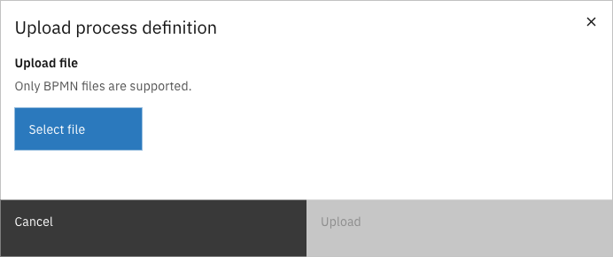

# Processes

The Processes tab manages BPMN process definitions within a building block. Processes define the automated workflows that execute when the building block is used.

Each building block can contain multiple process definitions. One process is designated as the **main process**, which serves as the entry point when the building block starts. Additional processes can be included as supporting workflows (e.g., sub-processes, call activities).

<figure><figcaption>Processes tab showing the process list</figcaption></figure>

The process list displays:

| Column | Description |
|--------|-------------|
| Name | Display name of the process definition |
| Key | Technical identifier used in BPMN references |
| Status | Shows **Main process** tag for the designated main process, and **Draft** tag for unpublished processes |

---

## Adding a process

Processes can be added by creating a new process in the BPMN modeler or by uploading an existing BPMN file.

### Creating a new process



Click **Create** in the toolbar


The BPMN modeler opens with an empty canvas

<figure><figcaption>BPMN modeler for creating a new process</figcaption></figure>


Design the process using the BPMN palette on the left. The properties panel on the right allows configuring element details.


Toggle **Draft** to save without validation, or leave it off to validate the process on save


Click **Save** to add the process to the building block



### Uploading a BPMN file



Click **Upload** in the toolbar


The upload dialog appears

<figure><figcaption>Upload process definition dialog</figcaption></figure>


Click **Select file** and choose a `.bpmn` file from your computer


Click **Upload** to import the process




If a process with the same key already exists, a confirmation dialog asks whether to replace the existing process.


---

## Managing processes

### Editing a process

Click on a process row to open it in the BPMN modeler. Make changes and click **Save** to update the process definition.

### Setting the main process

The main process is the entry point when the building block starts. To change which process is the main process:



Click the overflow menu (three dots) on the process row


Select **Mark as Main**




This action is disabled when the process is already the main process, or when there is only one process in the building block.


### Deleting a process



Click the overflow menu (three dots) on the process row


Select **Delete**


Confirm the deletion in the dialog




Deletion is disabled when the process is the main process, or when there is only one process in the building block.


---

## Process links

Process links connect BPMN activities to external functionality. When you select a linkable element in the modeler, a **Process link** panel appears in the properties sidebar with a **Create** button.

| Type | Use case |
|------|----------|
| Form | Link to form definitions for collecting user input |
| Form flow | Multi-step form workflows for complex user interactions |
| Building block | Invoke another building block via Call Activity |
| Plugin | Execute plugin actions (e.g., API calls, document generation) |
| UI component | Custom Angular UI components for specialized interfaces |

To create a process link, select an element in the modeler and click **Create** in the Process link panel. To remove an existing link, click **Unlink**.
