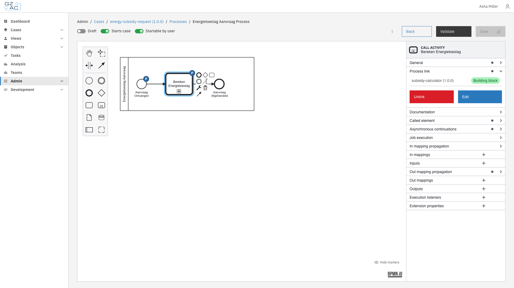
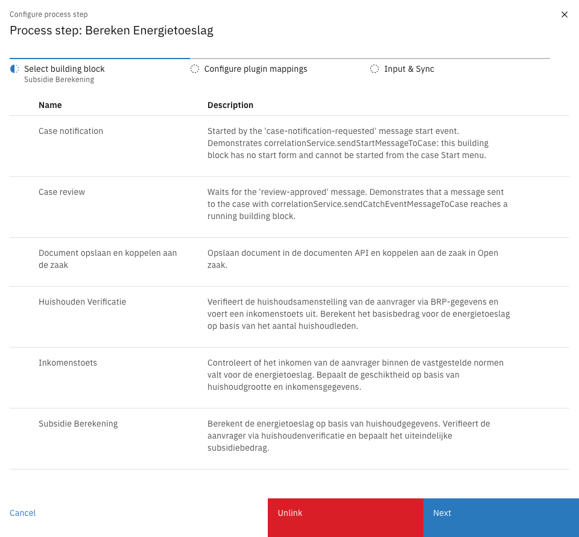
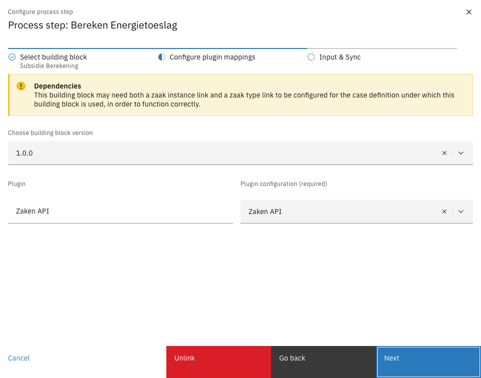
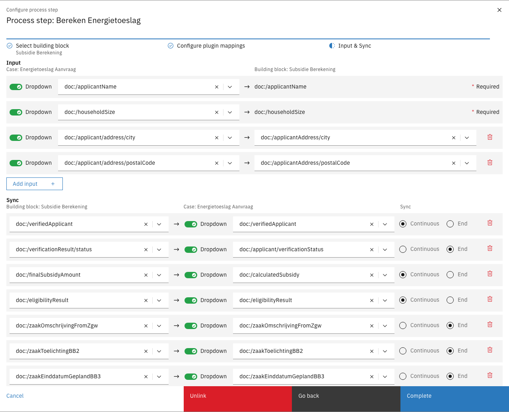
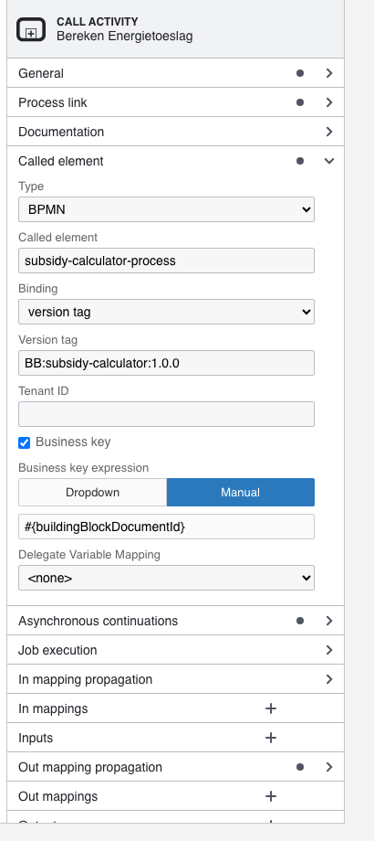
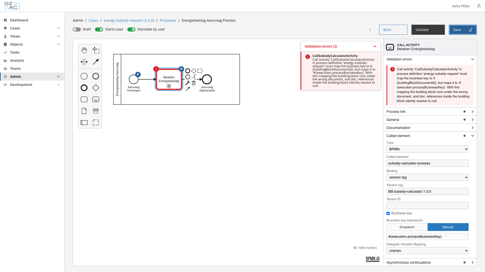

# Processes

The Processes tab manages BPMN process definitions within a building block. Processes define the automated workflows that execute when the building block is used.

Each building block can contain multiple process definitions. One process is designated as the **main process**, which serves as the entry point when the building block starts. Additional processes can be included as supporting workflows (e.g., sub-processes, call activities).

<figure><figcaption>Processes tab showing the process list</figcaption></figure>

The process list displays:

| Column | Description |
|--------|-------------|
| Name | Display name of the process definition |
| Key | Technical identifier used in BPMN references |
| Status | Shows **Main process** tag for the designated main process, and **Draft** tag for unpublished processes |

---

## Adding a process

Processes can be added by creating a new process in the BPMN modeler or by uploading an existing BPMN file.

### Creating a new process



Click **Create** in the toolbar


The BPMN modeler opens with an empty canvas

<figure><figcaption>BPMN modeler for creating a new process</figcaption></figure>


Design the process using the BPMN palette on the left. The properties panel on the right allows configuring element details.


Toggle **Draft** to save without validation, or leave it off to validate the process on save


Click **Save** to add the process to the building block



### Uploading a BPMN file



Click **Upload** in the toolbar


The upload dialog appears

<figure><figcaption>Upload process definition dialog</figcaption></figure>


Click **Select file** and choose a `.bpmn` file from your computer


Click **Upload** to import the process




If a process with the same key already exists, a confirmation dialog asks whether to replace the existing process.


---

## Managing processes

### Editing a process

Click on a process row to open it in the BPMN modeler. Make changes and click **Save** to update the process definition.

### Setting the main process

The main process is the entry point when the building block starts. To change which process is the main process:



Click the overflow menu (three dots) on the process row


Select **Mark as Main**




This action is disabled when the process is already the main process, or when there is only one process in the building block.


### Deleting a process



Click the overflow menu (three dots) on the process row


Select **Delete**


Confirm the deletion in the dialog




Deletion is disabled when the process is the main process, or when there is only one process in the building block.


---

## Process links

Process links connect BPMN activities to external functionality. When you select a linkable element in the modeler, a **Process link** panel appears in the properties sidebar with a **Create** button.

| Type | Use case |
|------|----------|
| Form | Link to form definitions for collecting user input |
| Form flow | Multi-step form workflows for complex user interactions |
| Building block | Invoke another building block via Call Activity |
| Plugin | Execute plugin actions (e.g., API calls, document generation) |
| UI component | Custom Angular UI components for specialized interfaces |

To create a process link, select an element in the modeler and click **Create** in the Process link panel. To remove an existing link, click **Unlink**.

---

## Building block call activities

A call activity can run a building block. This works in any process editor: a case process can call a building block, and a building block process can call another building block. The linked building block runs in its own isolated context, with its own document.

### Linking a building block to a call activity



Select the call activity in the modeler and click **Create** in the **Process link** panel. For an existing link, click **Edit**.

<figure><figcaption>Call activity with a building block link</figcaption></figure>


Choose **Building block** as the link type and select the building block to call

<figure><figcaption>Building block selection</figcaption></figure>


Choose the building block version and select a plugin configuration for every plugin the building block requires

<figure><figcaption>Plugin mappings</figcaption></figure>


Map the inputs and outputs of the building block in the **Input & Sync** step

<figure><figcaption>Input and sync mappings</figcaption></figure>


Click **Complete** to save the link, then click **Save** to save the process



---

## How data flows in and out of a building block

A building block does not read case data directly. Values enter and leave a building block through its own document, based on the mappings of the call activity link:

| Mapping | Direction | Building block side |
|---------|-----------|---------------------|
| Input | Caller → building block | Written to a building block field (`doc:`) when the building block starts |
| Sync | Building block → caller | Read from a building block field (`doc:`) and written back to the caller |

The caller side of a mapping can be any value: a case document field, a process variable, or a fixed value. The building block side is always a building block field. Each sync mapping has a timing:

| Sync timing | Behavior |
|-------------|----------|
| End | The value is written back when the building block completes (default) |
| Continuous | The value is written back on every saved change while the building block is still running |


Inside a building block, always reference values with the `doc:` prefix (for example `doc:/applicantName`). Mapped inputs never become process variables of the building block process: a `pv:` reference inside a building block only resolves process variables that the building block sets itself, and resolves to empty for caller data.


---

## The business key mapping

The called building block process runs under the building block document id as its business key. Everything inside the building block resolves its context through this business key; with a wrong or missing mapping the building block silently runs against the wrong document.

The editor configures this automatically when a building block is linked: the **Business key** option under **Called element** is enabled with the expression `#{buildingBlockDocumentId}`.

<figure><figcaption>Business key mapping</figcaption></figure>


For uploaded BPMN files, mind the XML namespaces on the call activity. The process engine ignores all `camunda:` extension elements as soon as one `operaton:` element of the same type is present — a common leftover of a Camunda-to-Operaton migration. A correct `camunda:in` business key mapping next to any `operaton:in` element is dead configuration.


---

## Validation of building block links


Available since Valtimo `13.43.0`


The configuration of a building block call activity is validated when the process is saved, and again when the call activity starts. This includes the business key mapping and the rule that the building block side of every input and sync mapping is a building block field.

When validation fails, the save is blocked: the editor highlights the call activity and shows a message that explains how to fix the configuration.

<figure><figcaption>Validation error on save</figcaption></figure>

---

## Passing files and attachments

Files are passed to a building block *by reference*, using the resource id of the file in the temporary resource storage. The temporary resource storage is not bound to a case, so a resource id remains usable inside any building block. For example, to send a generated document as an email attachment from a building block:



In the case process, generate the document (for example with the SmartDocuments plugin). The generated file is stored in the temporary resource storage and its resource id is written to a process variable.


Give the building block a field for the attachment list (for example `attachmentIds`) and map the process variable to it as an input.


In the mail action inside the building block, reference the field as `doc:/attachmentIds`.


