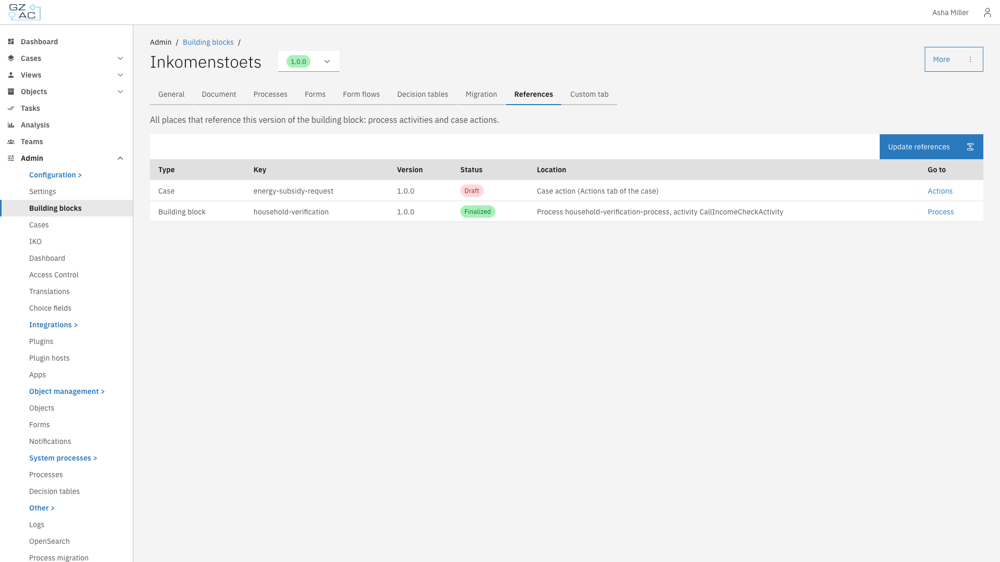
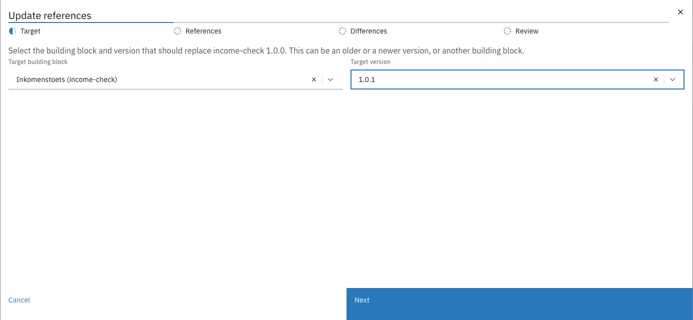
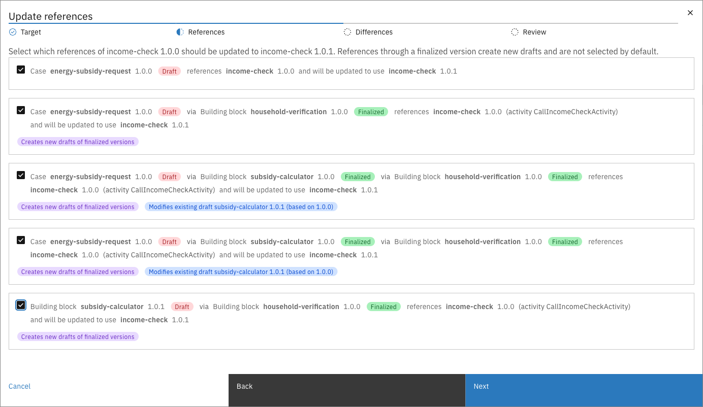
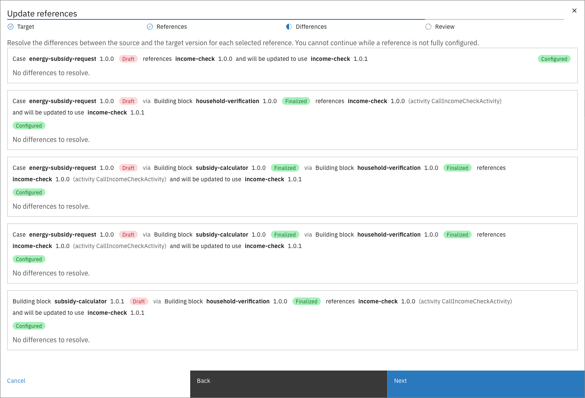
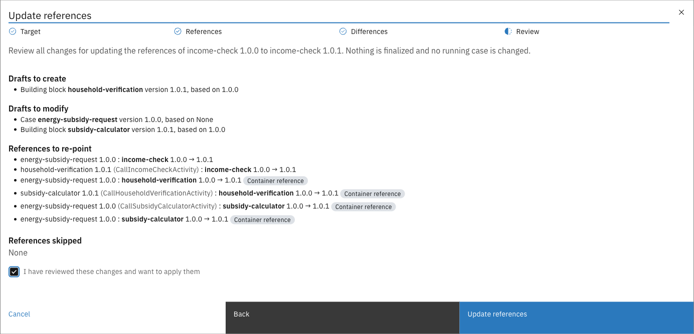
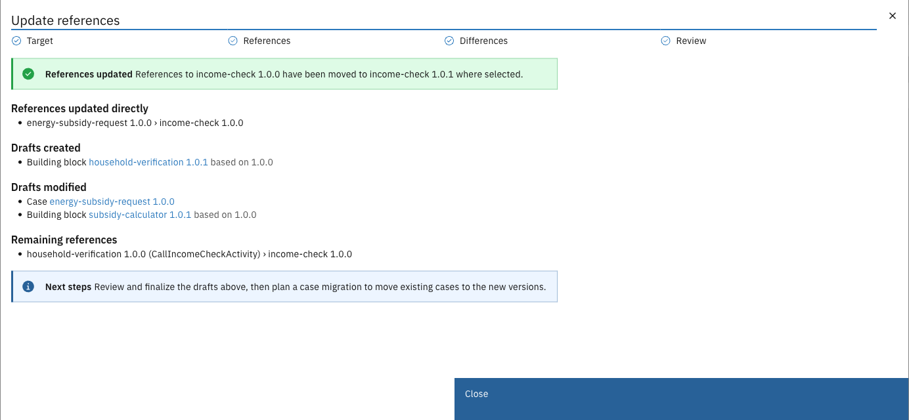

# References


Available since Valtimo `13.50.0`


A case or building block links to one exact version of a building block. The **References** tab of a
building block version shows every place that links to that version. **Update references** moves those
links onto another version, so you don't have to trace and edit each case and building block by hand.

---

## Finding the references



Expand **Admin** in the left sidebar


Click **Building blocks** under the Configuration section


Click a building block to open it


Select the version to look up


Click the **References** tab

<figure><figcaption>References tab</figcaption></figure>



The list shows direct references only. A case that uses this version through another building block is
listed under that building block's references instead.

| Column   | Description                                                                                      |
|----------|--------------------------------------------------------------------------------------------------|
| Type     | **Case** or **Building block**: the configuration that holds the reference                       |
| Key      | The key of that case or building block                                                           |
| Version  | The version of that case or building block                                                       |
| Status   | **Draft** or **Finalized**                                                                       |
| Location | A case action (**Actions** tab of the case), or the process and call activity that holds the link |
| Go to    | Opens the **Actions** tab of the case, or the process where the link is configured               |

---

## Updating references

**Update references** opens a wizard that moves the references of this version onto a target version.


The wizard only changes drafts. It creates new drafts where needed, but never finalizes anything and
never changes running cases. Afterwards, review and finalize the drafts, then move existing cases with a
[case migration](../cases/migration/README.md).


The button is disabled when nothing references this version, or when the environment does not allow
configuration changes.

### Target

Select the **Target building block** and **Target version**. The target can be a newer or an older
version of the same building block, or a version of another building block.

<figure><figcaption>Selecting the target version</figcaption></figure>

### References

Every reference is shown as a chain, from the case or building block at the top down to the link to this
version. Each container in the chain is marked **Draft** or **Finalized**.

<figure><figcaption>Choosing which references to update</figcaption></figure>

| Chain                              | Behaviour                                                                                                                                           |
|------------------------------------|-----------------------------------------------------------------------------------------------------------------------------------------------------|
| Drafts only                        | Selected by default. The link is updated in place; no versions are created                                                                          |
| Creates new drafts of finalized versions | Not selected by default. When selected, the wizard creates a new draft of each finalized container, based on the version in the chain, and points it to the new child version |
| Modifies existing draft            | A finalized container already has an open draft. The wizard changes that draft instead of creating a second one                                     |
| Cannot be updated                  | The chain can't be updated, for example because the open draft no longer contains the link. Change that draft yourself                              |

A container shared by several selected chains gets one new draft. Deselected chains keep using the
current version. Select at least one reference to continue.

### Differences

For each selected reference, the wizard compares this version with the target version. Each
reference is marked **Configured** when no further input is needed.

<figure><figcaption>Resolving differences</figcaption></figure>

| Difference                   | What to do                                                                                                            |
|------------------------------|-----------------------------------------------------------------------------------------------------------------------|
| Required input               | The target version requires an input the source did not. Enter the path that feeds it                                 |
| Plugin configuration         | The target version uses a plugin the source did not. Select a plugin configuration. Create one in plugin management first if none exists |
| Dropped mappings             | Input or output mappings to fields that no longer exist in the target version. They are removed                       |

You cannot continue while a reference is not fully configured.

### Review

The review lists the complete change set:

- **Drafts to create**: new drafts of finalized versions, with the version they are based on
- **Drafts to modify**: existing drafts that will be changed
- **References to re-point**: every link that moves, including the links between new drafts (marked **Container reference**)
- **References skipped**: references you deselected

<figure><figcaption>Reviewing the changes</figcaption></figure>

Select **I have reviewed these changes and want to apply them** and click **Update references**.

### Result

The result lists the references updated directly, the drafts created and modified (with links to open
them), and the references that still point to this version.

<figure><figcaption>References updated</figcaption></figure>

---

## Next steps

1. Review and finalize the drafts listed in the result
2. Plan a [case migration](../cases/migration/README.md) to move existing cases onto the new versions.
   Running building blocks follow through their own [migration plans](migration.md)
