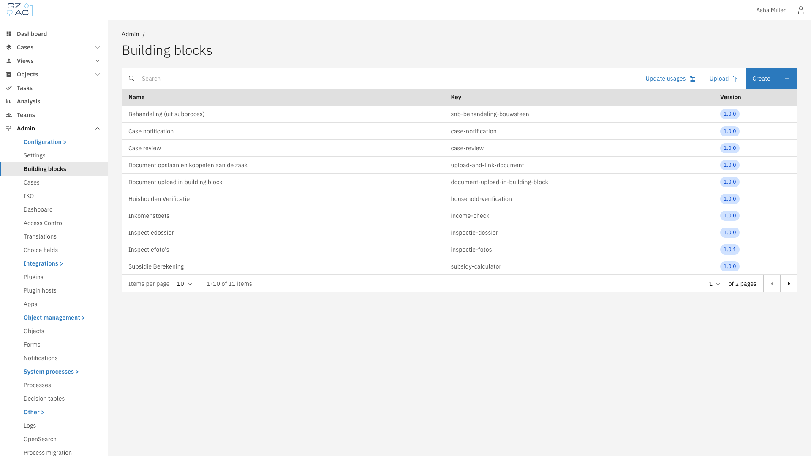
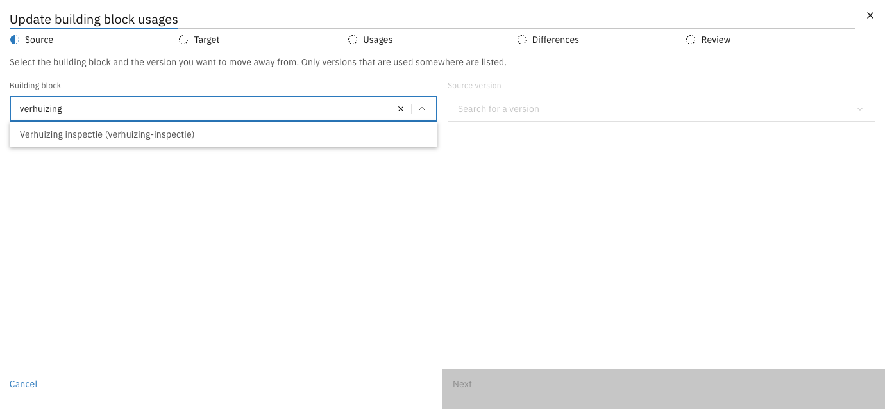
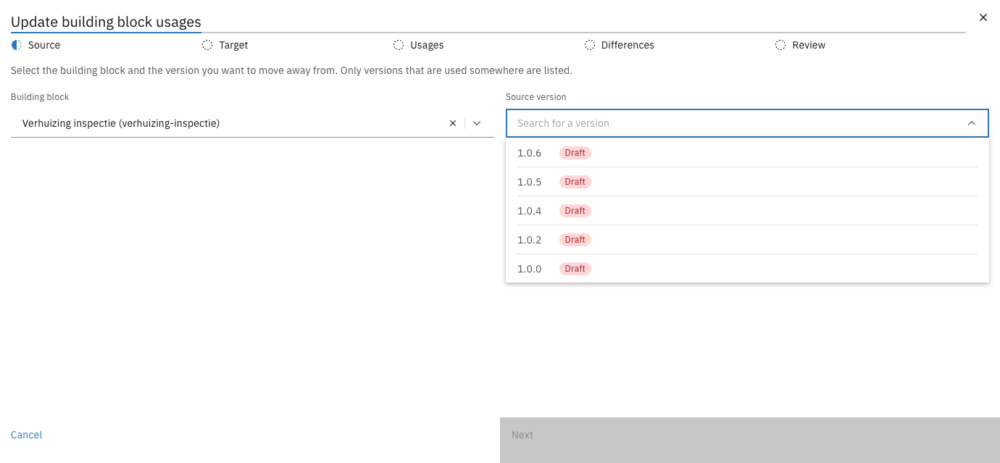
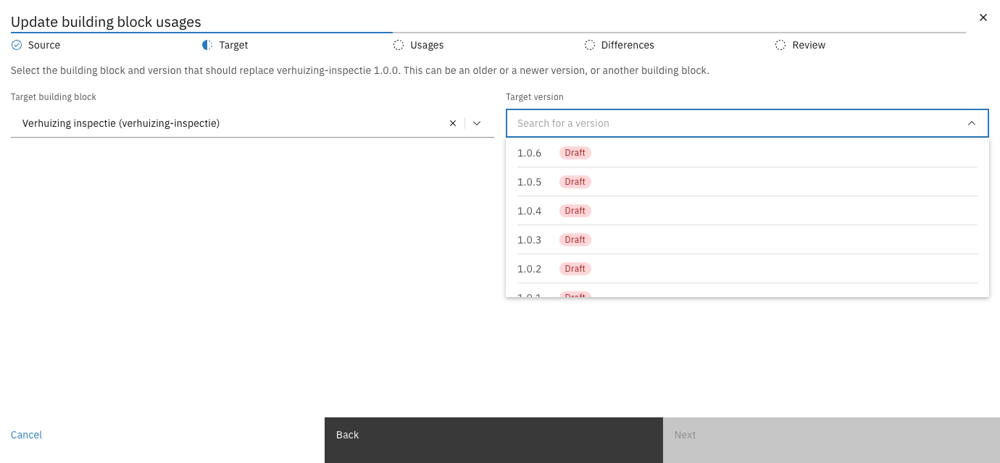
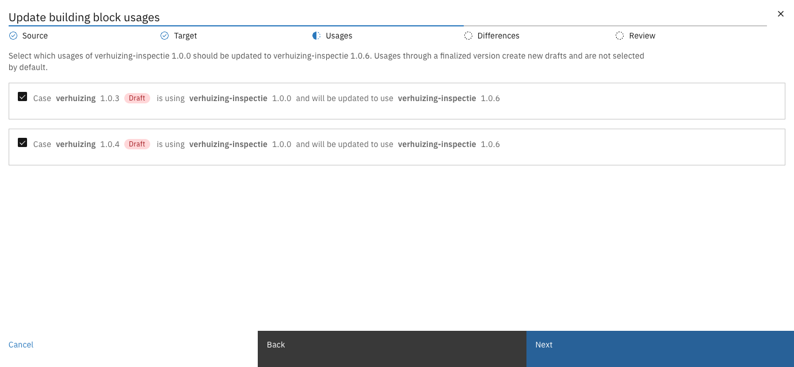
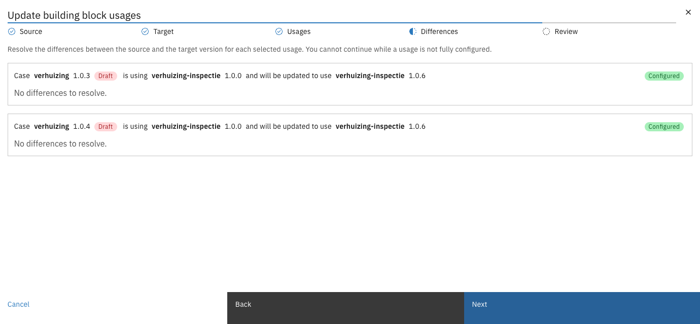
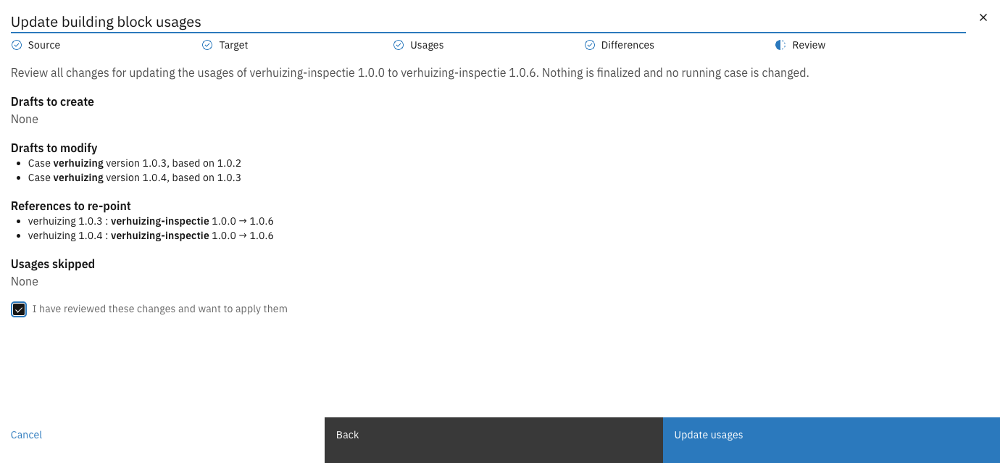
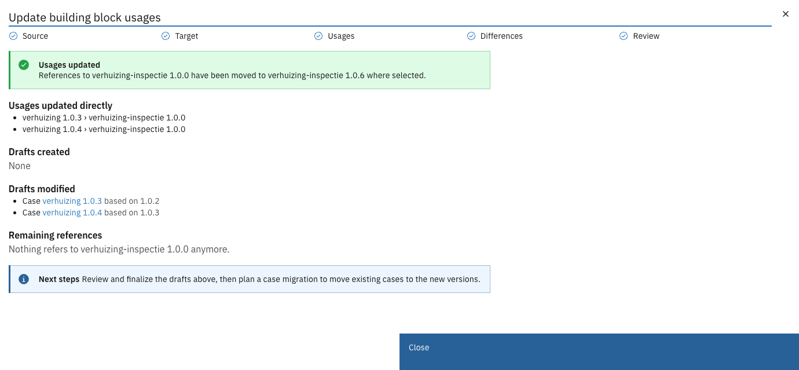

# Updating usages


Available since Valtimo `13.49.0`


The **Update usages** wizard moves every reference to one building block version onto another
version, of the same or of another building block, in a single pass.

Case definitions and other building blocks refer to a building block by key and version. When a new
version of a building block is published, those references keep pointing at the old version until
they are changed. The wizard finds all places where a version is used, lets you choose which ones to
move, resolves the differences between the two versions, and writes the changes into drafts.


The wizard changes configuration only. It does not finalize any version and does not touch running
cases. To move running building block instances onto a new version, use a
[migration plan](migration.md).


---

## Updating the usages of a building block version



Go to **Admin** > **Building blocks** and click **Update usages**

<figure><figcaption>Building blocks list with the Update usages button</figcaption></figure>


On the **Source** step, search for and select the building block

Only building blocks with at least one version in use are listed.

<figure><figcaption>Searching for a building block</figcaption></figure>


Select the **Source version**: the version to move away from, then click **Next**

Each version shows whether it is a draft or finalized. When only one version of the building block
is in use, it is selected automatically.

<figure><figcaption>Selecting the source version</figcaption></figure>


On the **Target** step, select the **Target building block** and the **Target version** that
replace the source version, then click **Next**

The target building block is the source building block by default. Select another building block to
replace the source with that building block. The target can be an older or a newer version.

<figure><figcaption>Selecting the target version</figcaption></figure>


On the **Usages** step, select the usages to update, then click **Next**

Each usage describes which case definition or building block uses the source version, and which
version it will use after the update. See [Usages](#usages) for details.

<figure><figcaption>Usages of the source version</figcaption></figure>


On the **Differences** step, resolve the differences for each selected usage, then click **Next**

**Next** stays disabled until every usage shows **Configured**. See [Differences](#differences) for
details.

<figure><figcaption>Differences per usage</figcaption></figure>


On the **Review** step, check the changes, select **I have reviewed these changes and want to apply
them**, and click **Update usages**

<figure><figcaption>Review of all changes</figcaption></figure>


Check the result and follow the next steps

The result lists the usages that were updated, the drafts that were created or modified, and any
references to the source version that remain. Click a draft to open it.

<figure><figcaption>Update result</figcaption></figure>



After the update, review and finalize the drafts, then plan a case migration to move existing
cases onto the new versions. See [Cases > Migration](../cases/migration/README.md).

---

## Usages

A usage is one reference to the source version. It starts at the case definition or building block at
the top and can go through other building blocks before it reaches the reference. For example:

> Case **verhuizing** 1.0.3 `Draft` is using **verhuizing-inspectie** 1.0.0 and will be updated to
> use **verhuizing-inspectie** 1.0.6

When the reference sits inside another building block, the usage shows the full path, for example
*Building block **outer** 1.0.0 via Building block **notify** 1.0.0 is using **send-email** 1.0.0*.

| Situation                                                 | Effect                                                                                                         |
|-----------------------------------------------------------|----------------------------------------------------------------------------------------------------------------|
| The version that holds the reference is a draft           | Only that draft is changed. Selected by default.                                                               |
| The version that holds the reference is finalized         | A new draft is created for each finalized version, up to the first draft on the path. Not selected by default. |
| A finalized version on the path already has an open draft | The change goes into that open draft instead of a new one. Shown as **Modifies existing draft**.               |
| The usage cannot be updated                               | The usage cannot be selected. The reason is shown below it.                                                    |

---

## Differences

The source and target versions can differ in the data they need. For each selected usage, the wizard
shows what has to be resolved:

| Difference           | Description                                                                                                                                                                                                                        |
|----------------------|------------------------------------------------------------------------------------------------------------------------------------------------------------------------------------------------------------------------------------|
| Required input       | The target version has a required input that the current mapping does not fill. Under **Source**, choose **Path** and select a field of the case or building block that uses it, or choose **Value** and enter a fixed value. |
| Plugin configuration | Only for usages that start at a case definition. The target version uses a plugin that has no configuration selected yet. Select an existing plugin configuration. If none exists, create one under **Admin** > **Plugins** first. |
| Dropped mapping      | The target version no longer has a field that is mapped today. The mapping is removed. No action is needed.                                                                                                                        |

A usage without differences shows **No differences to resolve**.

---

## Restrictions

- A usage cannot be updated to another building block when the case definition already uses that
  building block on its **Actions** tab, or when the target building block uses the version that
  holds the reference, which would make building blocks refer to each other.
- Drafts created for an update to another building block get a new major version.
- The wizard writes into drafts. The **Update usages** button is only available on an environment
  where configuration can be changed.
