# Cases

## Overview

The Cases configuration area lets you manage case definitions — the templates that define how
different types of cases behave in your Valtimo implementation. Each case definition specifies
its document structure, linked processes, forms, and how it appears to end users.

From here you can configure:

- **[General](general.md)** — Case handler settings and external start form
- **[Processes](processes.md)** — BPMN process definitions linked to the case
- **[Actions](actions.md)** — Startable items (processes and building blocks) users can trigger from a case
- **[Decision tables](decision-tables.md)** — DMN decision tables for automated decisions
- **[Document](document.md)** — JSON schema defining the case's data structure
- **[Forms](forms.md)** — Form definitions available for the case
- **[Form flows](form-flows.md)** — Multi-step form sequences
- **[Tasks](tasks/README.md)** — Task list column and search field configuration
- **[Case list](case-list/README.md)** — End-user case list columns and search fields
- **[Case details](case-details/README.md)** — Tabs, statuses, tags, and header configuration
- **[ZGW](zgw/README.md)** — Dutch government standards integration

---

## Configuring cases



Expand **Admin** in the left sidebar


Click **Cases** under the Configuration section

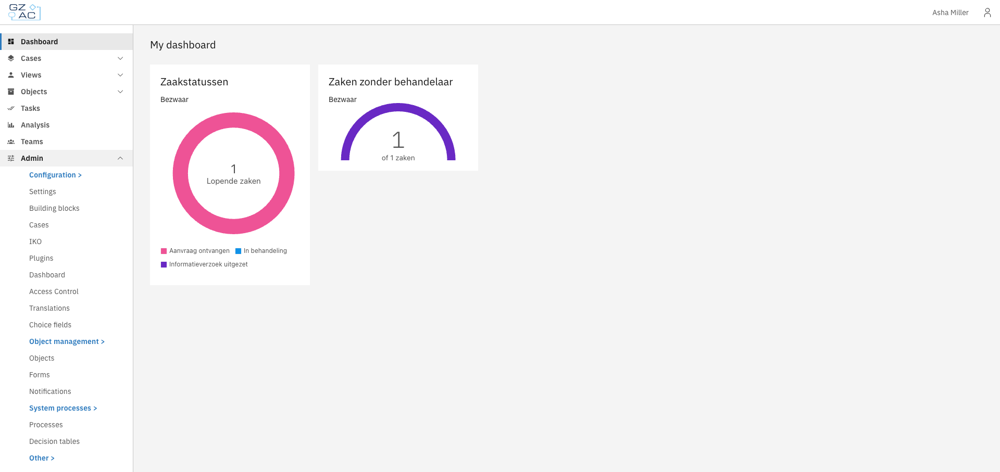


Click a case row to open its configuration


Use the tabs to navigate between configuration areas

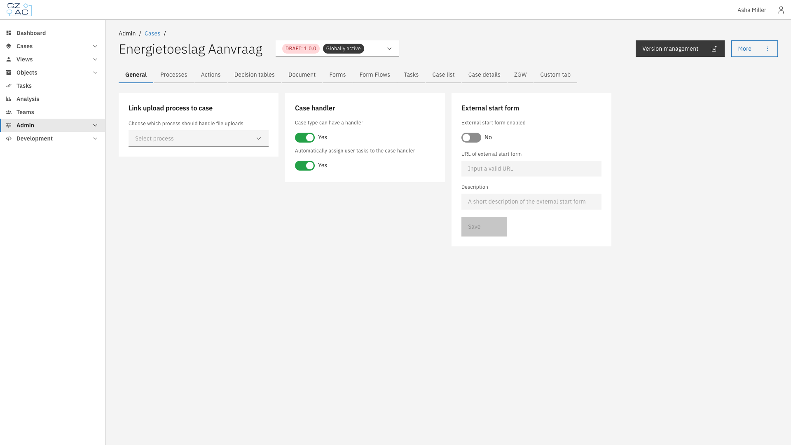



The cases list shows all defined case types with their name, key, current version, and status.
Cases marked "Needs configuration" have unresolved configuration issues that should be addressed.

### Creating a case

To create a new case definition from scratch:



Click the **Create** button in the toolbar


Fill in the case definition details:

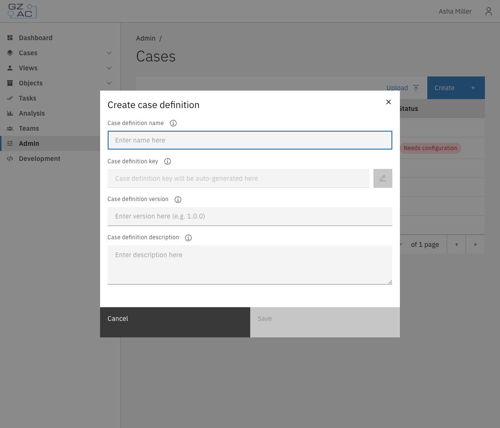

- **Name** — Display name for the case definition
- **Key** — Unique identifier (auto-generated from name, can be edited)
- **Version** — Semantic version number (e.g., `1.0.0`)
- **Description** — Optional description of what this case type handles

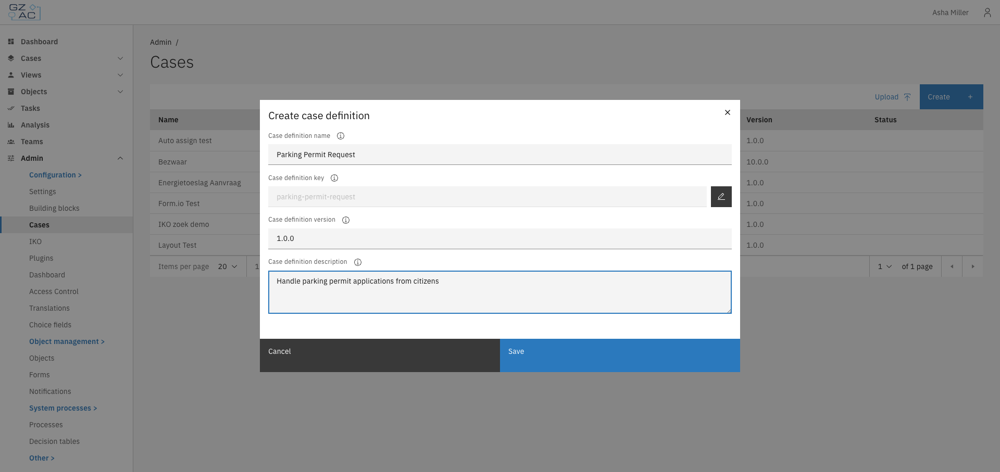


Click **Save** to create the case definition



The new case opens in draft mode, ready for configuration.

### Uploading a case

To import an existing case definition package:



Click the **Upload** button in the toolbar


Select a `.zip` file containing the case definition

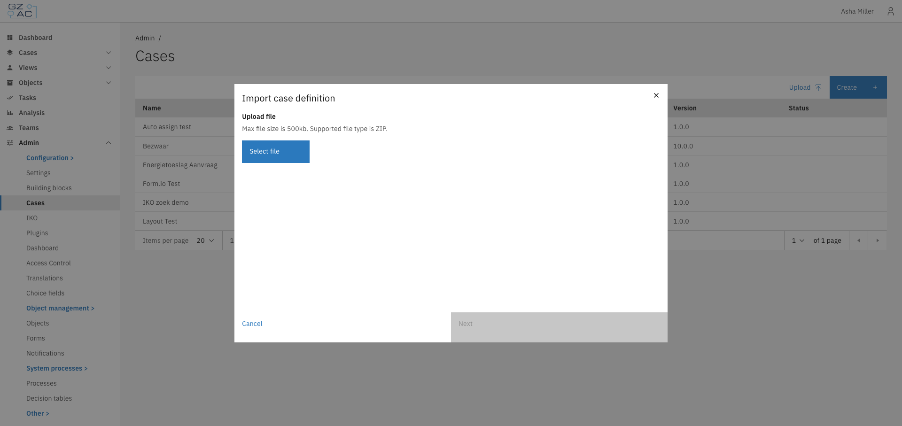


Configure the import settings:
- Review or modify the case name and key
- Map plugin configurations if the package uses plugins


Click **Next** to proceed through the wizard steps


Click **Start upload** to import the case definition



---

## Version management

Case definitions support versioning. The version selector in the header shows the current version
and allows switching between versions.

Click the **Version management** button to access version management options.The deployment page shows version information and provides actions depending on the version status:

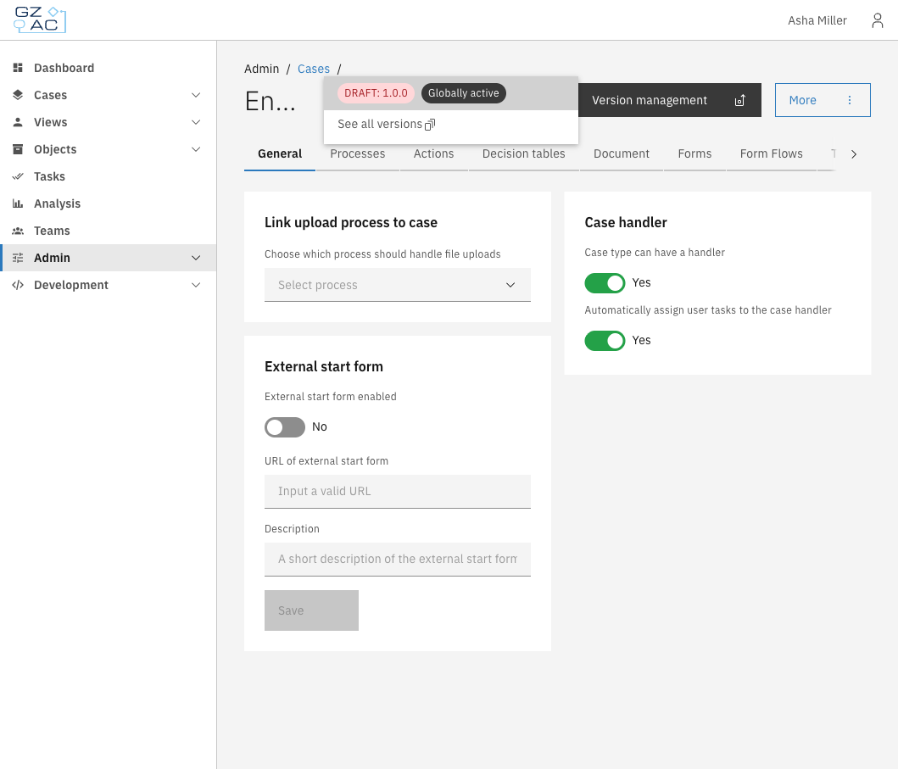

#### For published versions

- **Create draft version** — Create a new draft version based on this published version

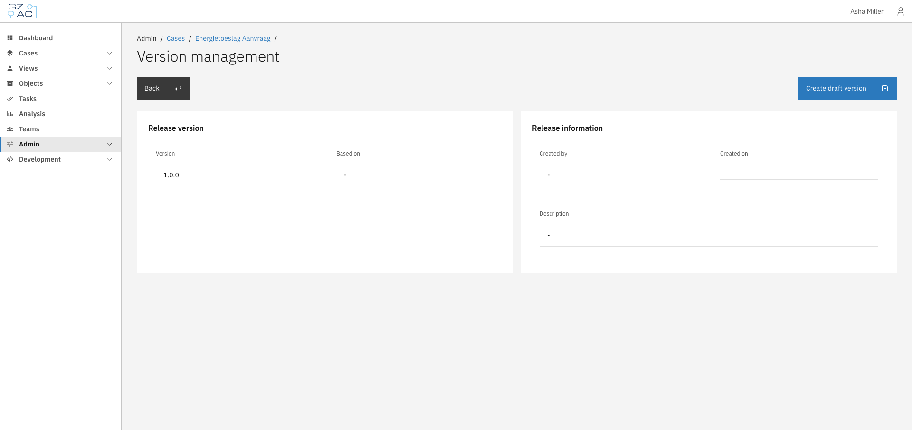

#### For draft versions

- **Finalize draft** — Publish the draft version (makes it available for new cases)
- **Delete draft** — Remove the draft version

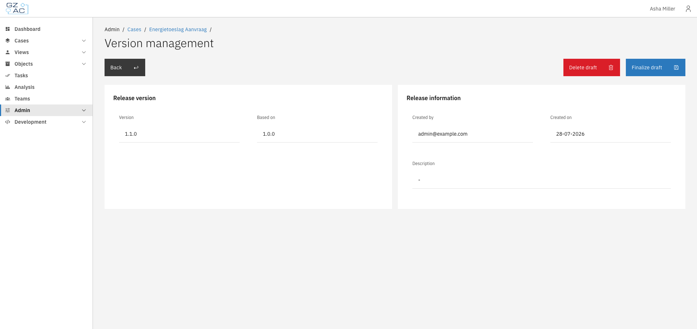

### Viewing all versions

Click **Show all versions** in the version selector to see a complete list of all versions for
the case definition. This opens a modal with a paginated table showing all versions and their
status (draft or published).

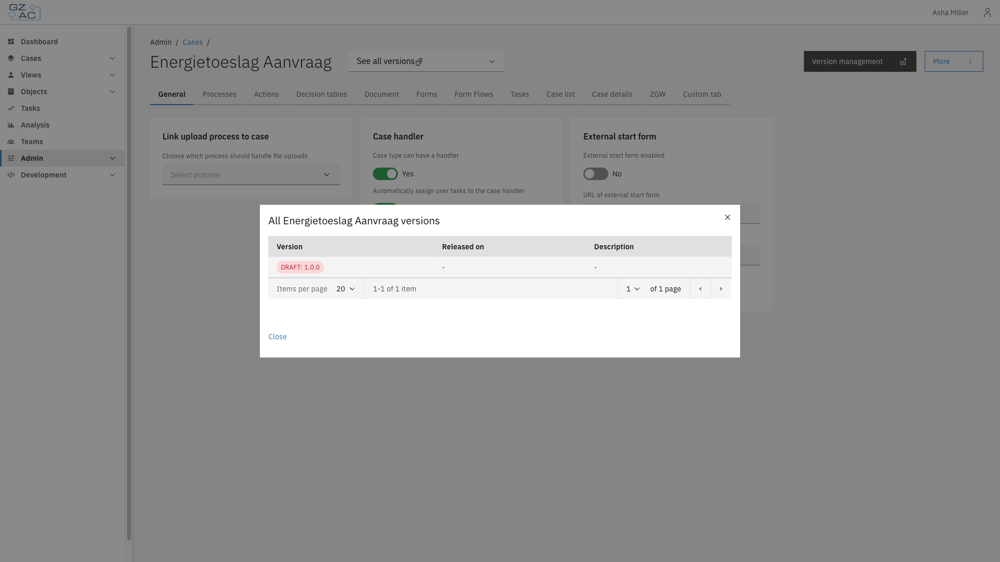


Most configuration changes are version-specific. When you modify a setting, it applies to the
selected version only.


### Creating a draft version

To create a new draft version from a published version:



Navigate to the deployment page of a published version


Click **Create draft version**


Fill in the new version details:

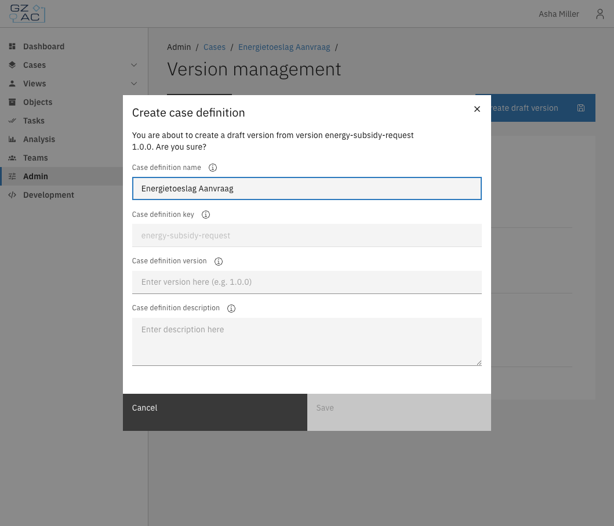

- **Name** — Display name for the case definition
- **Key** — Unique identifier (cannot be changed)
- **Version** — New version number (e.g., `1.1.0`)
- **Description** — Optional description of what this version changes


Click **Save** to create the draft



The new draft version opens in edit mode, ready for configuration changes.

### Finalizing a draft version

To publish a draft version:



Navigate to the deployment page of the draft version


Click **Finalize draft**


Review the confirmation message

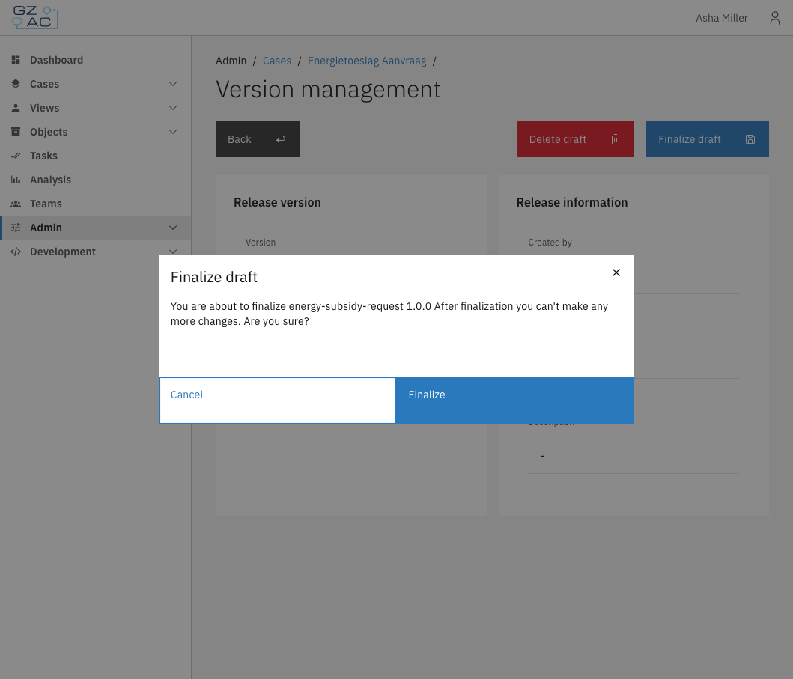


Click **Finalize** to publish




After finalization, the version becomes read-only. Create a new draft to make further changes.


### Deleting a draft version

To delete a draft version:



Navigate to the deployment page of the draft version


Click **Delete draft**


Confirm the deletion in the modal




Deleting a draft cannot be undone. All configuration changes in the draft will be lost.


### Setting the globally active version

The globally active version determines which version is used when creating new cases. To change it:



Select the version you want to activate


Click the **More** menu


Select **Set as active version**

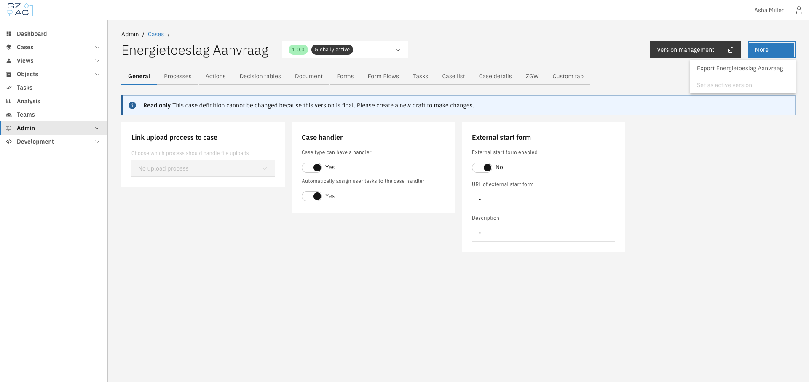


Confirm the change in the modal




Setting an older version as globally active may affect new case creation if the older version
lacks features or fields present in newer versions.


---

## Access control

Case access is controlled through the access control system. See [Access control](../access-control/README.md) for details on configuring permissions.

| Resource type                                        | Action      | Description                    |
|------------------------------------------------------|-------------|--------------------------------|
| `com.ritense.case_.domain.definition.CaseDefinition` | `view`      | View a case definition         |
|                                                      | `view_list` | View case definitions in lists |
