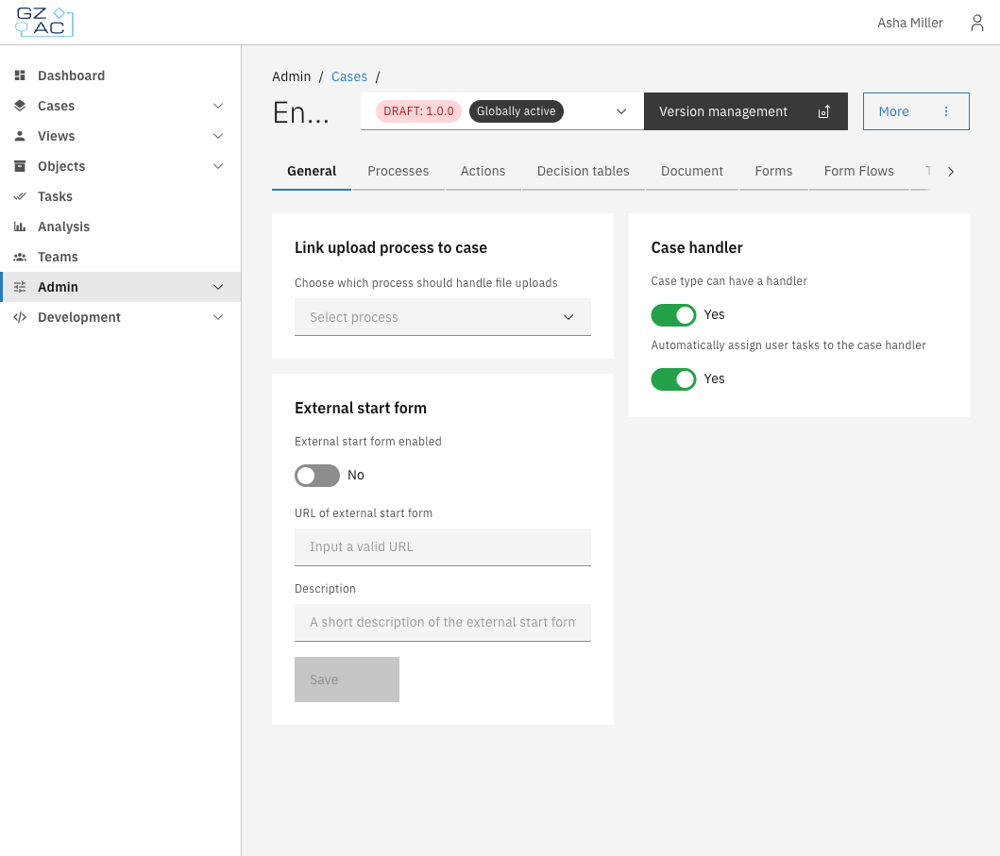

# Cases

## Overview

The Cases configuration area lets you manage case definitions — the templates that define how
different types of cases behave in your Valtimo implementation. Each case definition specifies
its document structure, linked processes, forms, and how it appears to end users.

From here you can configure:

- **[General](general.md)** — Case handler settings and external start form
- **[Processes](processes.md)** — BPMN process definitions linked to the case
- **[Actions](actions.md)** — Startable items (processes and building blocks) users can trigger from a case
- **[Decision tables](decision-tables.md)** — DMN decision tables for automated decisions
- **[Document](document.md)** — JSON schema defining the case's data structure
- **[Forms](forms.md)** — Form definitions available for the case
- **[Form flows](form-flows.md)** — Multi-step form sequences
- **[Tasks](tasks/README.md)** — Task list column and search field configuration
- **[Case list](case-list/README.md)** — End-user case list columns and search fields
- **[Case details](case-details/README.md)** — Tabs, statuses, tags, and header configuration
- **[ZGW](zgw/README.md)** — Dutch government standards integration

## Configuring cases

1. Expand **Admin** in the left sidebar
2. Click **Cases** under the Configuration section

The cases list shows all defined case types with their name, key, current version, and status.
Cases marked "Needs configuration" have unresolved configuration issues that should be addressed.

3. Click a case row to open its configuration
4. Use the tabs to navigate between configuration areas

Creating a case

To create a new case definition from scratch:

1. Click the **Create** button in the toolbar
2. Fill in the case definition details:

   - **Name** — Display name for the case definition
   - **Key** — Unique identifier (auto-generated from name, can be edited)
   - **Version** — Semantic version number (e.g., `1.0.0`)
   - **Description** — Optional description of what this case type handles

3. Click **Save** to create the case definition

The new case opens in draft mode, ready for configuration.

Uploading a case

To import an existing case definition package:

1. Click the **Upload** button in the toolbar
2. Select a `.zip` file containing the case definition

3. Configure the import settings:
   - Review or modify the case name and key
   - Map plugin configurations if the package uses plugins
4. Click **Next** to proceed through the wizard steps
5. Click **Start upload** to import the case definition

## Version management

Case definitions support versioning. The version selector in the header shows the current version
and allows switching between versions.

Viewing all versions

Click **Show all versions** in the version selector to see a complete list of all versions for
the case definition. This opens a modal with a paginated table showing all versions and their
status (draft or published).

# TODO: image here.


Most configuration changes are version-specific. When you modify a setting, it applies to the
selected version only.


### Version deployment

Click the **Version management** button to access version management options.

The deployment page shows version information and provides actions depending on the version status:

#### For published versions

- **Create draft version** — Create a new draft version based on this published version

#### For draft versions

- **Finalize draft** — Publish the draft version (makes it available for new cases)
- **Delete draft** — Remove the draft version

Deleting a draft version

To delete a draft version:

1. Navigate to the deployment page of the draft version
2. Click **Delete draft**
3. Confirm the deletion in the modal


Deleting a draft cannot be undone. All configuration changes in the draft will be lost.


Creating a draft version

To create a new draft version from a published version:

1. Navigate to the deployment page of a published version
2. Click **Create draft version**
3. Fill in the new version details:

   - **Name** — Display name for the case definition
   - **Key** — Unique identifier (cannot be changed)
   - **Version** — New version number (e.g., `1.1.0`)
   - **Description** — Optional description of what this version changes

4. Click **Save** to create the draft

The new draft version opens in edit mode, ready for configuration changes.

Finalizing a draft version

To publish a draft version:

1. Navigate to the deployment page of the draft version
2. Click **Finalize draft**
3. Review the confirmation message

4. Click **Finalize** to publish


After finalization, the version becomes read-only. Create a new draft to make further changes.


#### Setting the globally active version

The globally active version determines which version is used when creating new cases. To change it:

1. Select the version you want to activate
2. Click the **More** menu
3. Select **Set as active version**

4. Confirm the change in the modal


Setting an older version as globally active may affect new case creation if the older version
lacks features or fields present in newer versions.


## Access control

Case access is controlled through the access control system. The following permissions can be
configured for cases (documents):

| Permission | Description |
|------------|-------------|
| `view` | View a single case |
| `view_list` | View cases in lists |
| `create` | Create new cases |
| `modify` | Modify case data |
| `delete` | Delete cases |
| `claim` | Claim a case as handler |
| `assign` | Assign a case to another user |
| `assignable` | Be assignable as case handler |
| `export` | Export case data |

See [Access control](../access-control/README.md) for details on configuring permissions.
