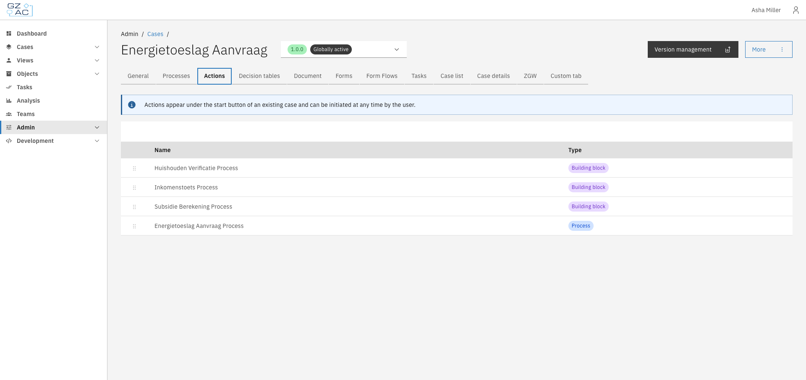
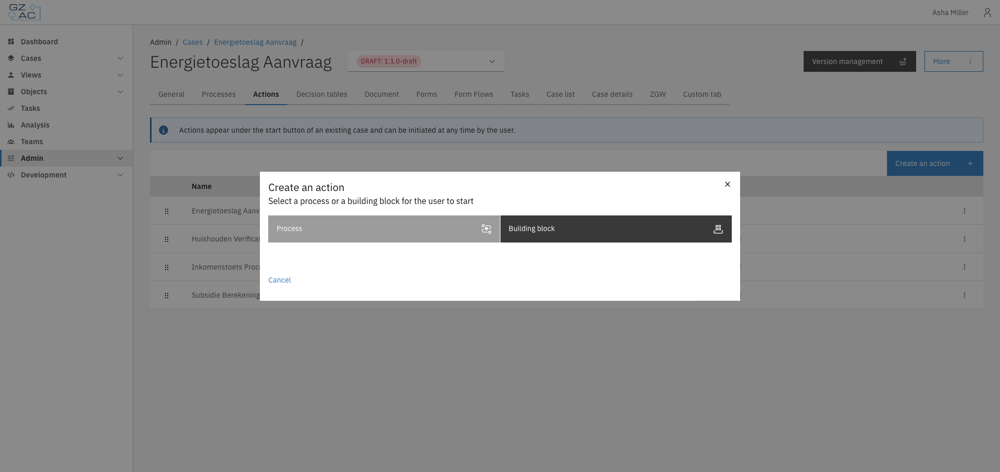
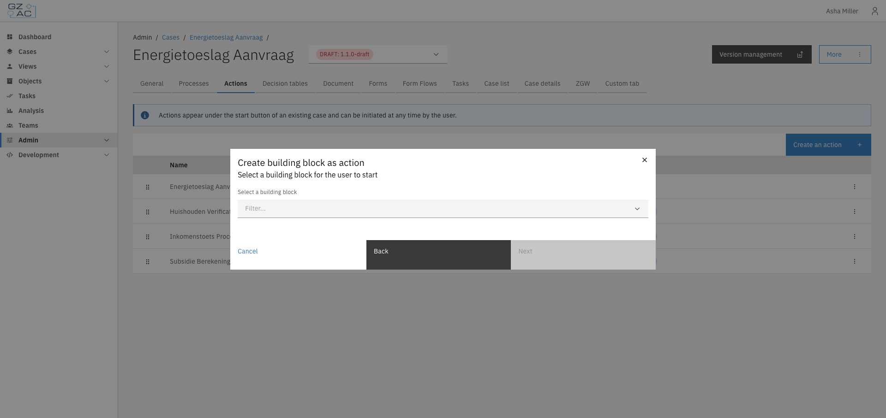
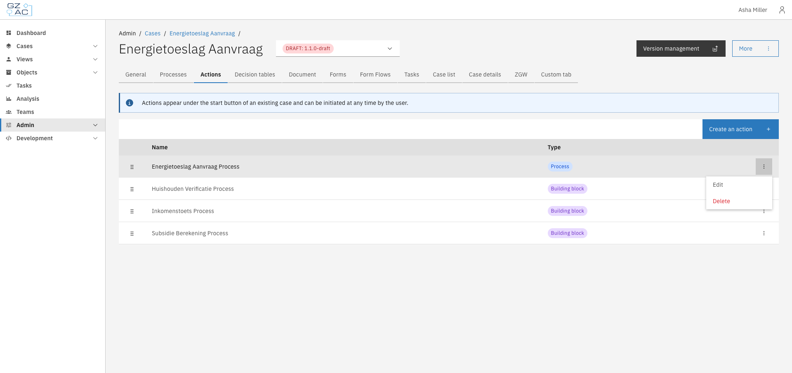
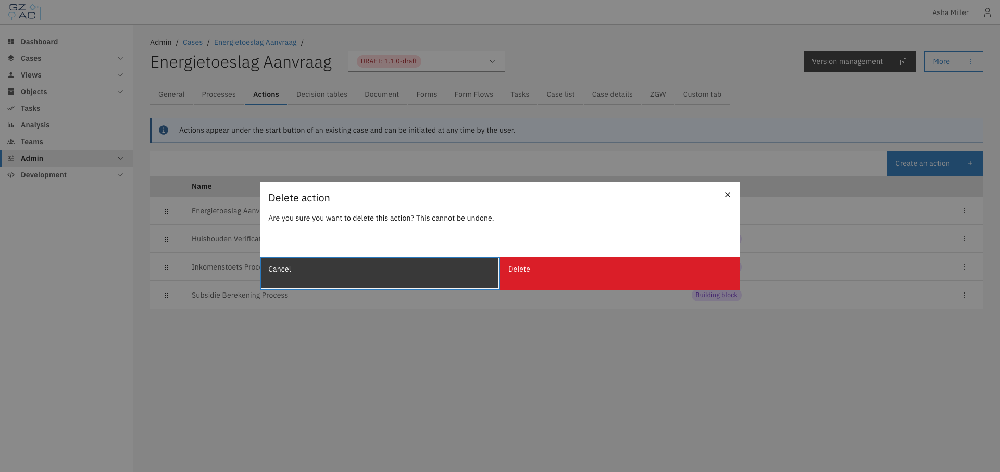

# Actions

The Actions tab lets you configure startable items — processes and building blocks that end
users can trigger directly from a case. These actions appear under the start button when
viewing an existing case.

## Overview

Actions provide a way for users to initiate additional workflows from within an existing case.
This is useful for:

- Starting follow-up processes related to the current case
- Triggering reusable building blocks that perform common operations
- Providing users with context-specific actions without requiring them to navigate elsewhere

There are two types of actions:

| Type | Description |
|------|-------------|
| **Process** | A BPMN process definition linked to the case. Starting this action runs the process in the context of the current case. |
| **Building block** | A reusable building block that can be configured with input/output mappings. See [Building blocks](../building-blocks/building-blocks.md) for more information. |

## Configuration

Navigate to **Admin** > **Cases** > select a case > **Actions** tab.

<figure><figcaption>The Actions tab displays all configured actions with their names and types.</figcaption></figure>

### Adding an action

1. Click **Create an action**
2. Select the action type: **Process** or **Building block**

<figure><figcaption>Choose between adding a process or a building block as an action.</figcaption></figure>

3. Select the specific process or building block from the dropdown

<figure><figcaption>Select a building block from the available options.</figcaption></figure>

4. For building blocks, click **Next** to configure input/output mappings if needed
5. Click **Add** to save the action


Each process or building block can only be added once per case. Items already configured as
actions will not appear in the selection dropdown.


### Reordering actions

Actions can be reordered by dragging and dropping rows in the list. The order determines how
actions appear to end users in the case view.

### Editing an action

1. Click on a row or use the overflow menu on the right side of the row
2. Select **Edit**
3. For processes, you can change which process is linked
4. For building blocks, you can update the input/output mappings
5. Save your changes

<figure><figcaption>Access Edit and Delete options via the overflow menu.</figcaption></figure>

### Deleting an action

1. Click the overflow menu on the row you want to delete
2. Select **Delete**
3. Confirm the deletion in the confirmation dialog

<figure><figcaption>Confirm deletion of an action.</figcaption></figure>

## Access control

Actions are filtered based on the user's permissions. An action only appears to users who have
permission to execute it.

### Resources and actions

| Resource type | Action | Effect |
|---------------|--------|--------|
| `com.ritense.valtimo.operaton.domain.OperatonExecution` | `create` | Required to start the process associated with the action. This applies to both process actions and building block actions (which have an underlying main process). |

When an action is triggered from within a case, the permission check includes the current
document as context. This allows permissions to be scoped based on the specific case instance
using [context conditions](../access-control/context-conditions.md).

### Examples

<details>
<summary>Permission to start any process action</summary>

```json
{
    "resourceType": "com.ritense.valtimo.operaton.domain.OperatonExecution",
    "action": "create",
    "conditions": []
}
```

</details>

<details>
<summary>Permission to start a specific process</summary>

```json
{
    "resourceType": "com.ritense.valtimo.operaton.domain.OperatonExecution",
    "action": "create",
    "conditions": [
        {
            "type": "field",
            "field": "processDefinitionKey",
            "operator": "==",
            "value": "my-follow-up-process"
        }
    ]
}
```

</details>
