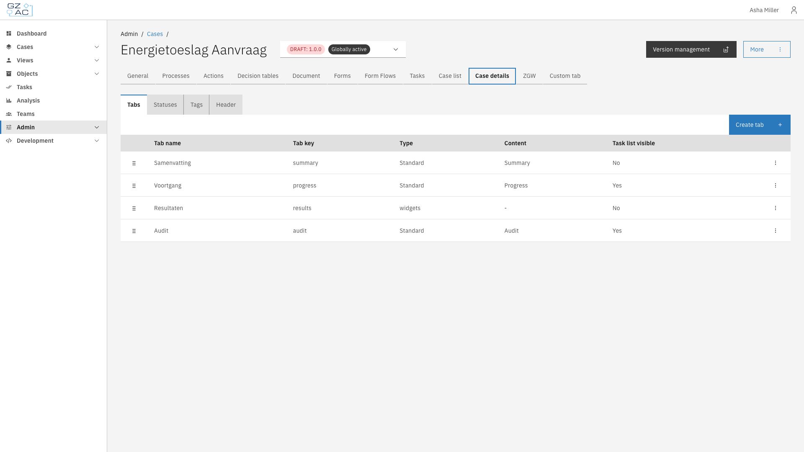

# Case details

The Case details tab configures how case information is presented to end users — internal
statuses, tags, and the tabs and header shown on a case's detail page.

This includes:

- **[Tabs](tabs.md)** — Which tabs appear on a case's detail page, and their content
- **[Statuses](statuses.md)** — Internal status labels for cases of this type
- **[Tags](tags.md)** — Labels users can attach to individual cases
- **[Header](header.md)** — Fields shown in the case detail header

---

## Configuring case details



Expand **Admin** in the left sidebar


Click **Cases** under the Configuration section


Click a case definition to open it


Click the **Case details** tab

<figure><figcaption>Case details tab overview</figcaption></figure>




Tabs, Tags, and Header apply to the selected case definition version and can only be edited on a
draft version. Statuses are the exception — they apply globally to **all** versions of the case
type, regardless of which version is selected. See [Statuses](statuses.md) for details.

