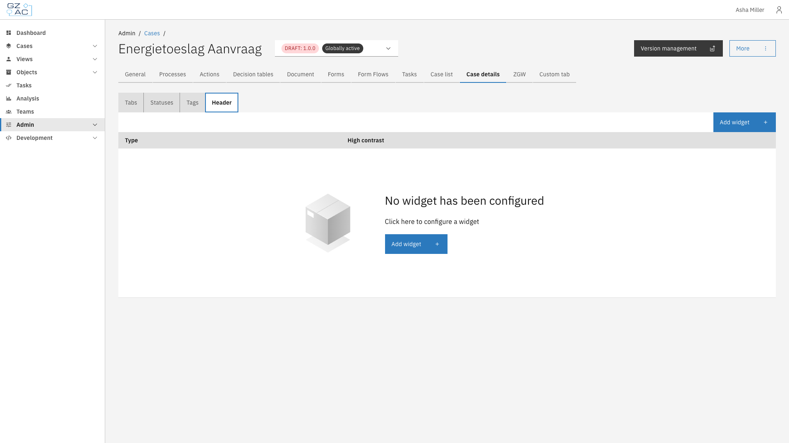
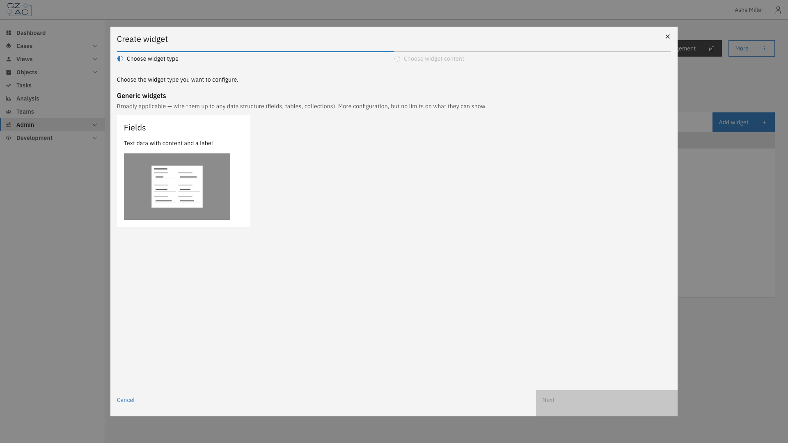
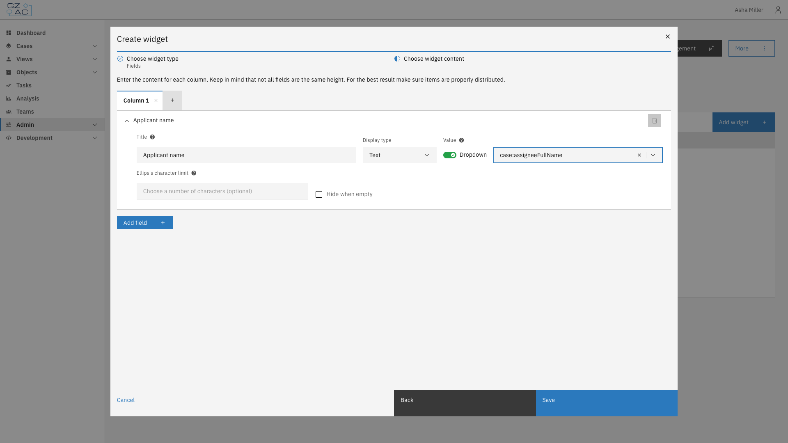
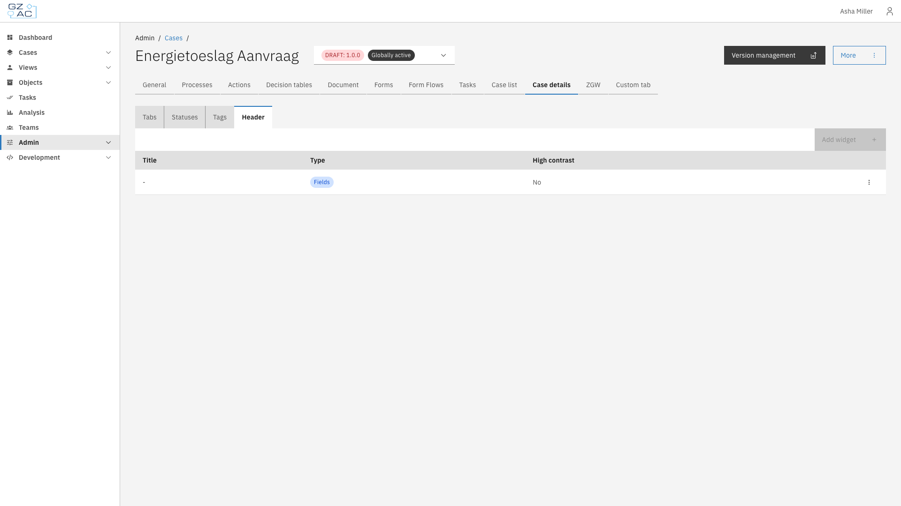

# Header

The Header sub-tab configures the fields shown at the top of a case's detail page — for example,
key applicant or case details that should be visible at a glance, regardless of which tab is
selected.

The header supports exactly one **Fields** widget, laid out in up to four columns. Each column can
contain any number of fields, each showing a label and a value resolved from a path on the case
or document.

---

## Configuring a header



Expand **Admin** in the left sidebar


Click **Cases** under the Configuration section


Click a case definition to open it


Click the **Case details** tab, then the **Header** sub-tab

<figure><figcaption>Header sub-tab empty state</figcaption></figure>



### Adding a header widget



Click **Add widget**


Since Fields is the only available widget type for the header, select it and click **Next**

<figure><figcaption>Add widget wizard type step</figcaption></figure>


Configure the widget content. Fields are organized into columns — use the **+** tab to add
another column (up to four), and **Add field** to add a field row within a column:

<figure><figcaption>Add widget wizard content step</figcaption></figure>

| Property | Description |
|----------|--------------|
| Title | Label shown above the field's value |
| Display type | How the value is formatted: Text, Yes/No, Currency, Date, Date and time, Enumeration, Number, Percentage, or Link |
| Value | Path to the case or document property to display, selected from a dropdown of available paths or typed manually |
| Ellipsis character limit | For Text fields, truncates long values with an ellipsis after this many characters |
| Hide when empty | Hides the field entirely if its resolved value is empty |

Some display types reveal additional options, such as a currency code for Currency, a date format
for Date, or repeatable value pairs for Enumeration.


Click **Save**

Only one widget can exist in the header. Once configured, **Add widget** is disabled — edit or
delete the existing widget via its row's overflow menu (⋮) instead:

<figure><figcaption>Header with configured widget</figcaption></figure>




The header widget has no separate widget title, icon, width, or JSON editor options — it always
spans the full header width and is edited only through this form.

