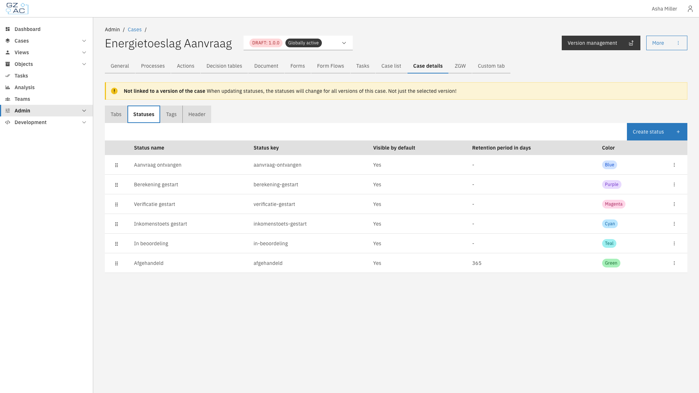
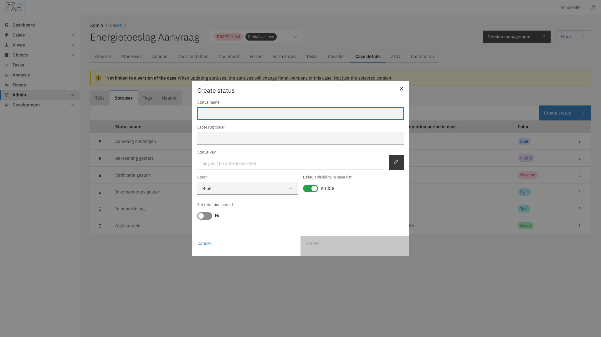
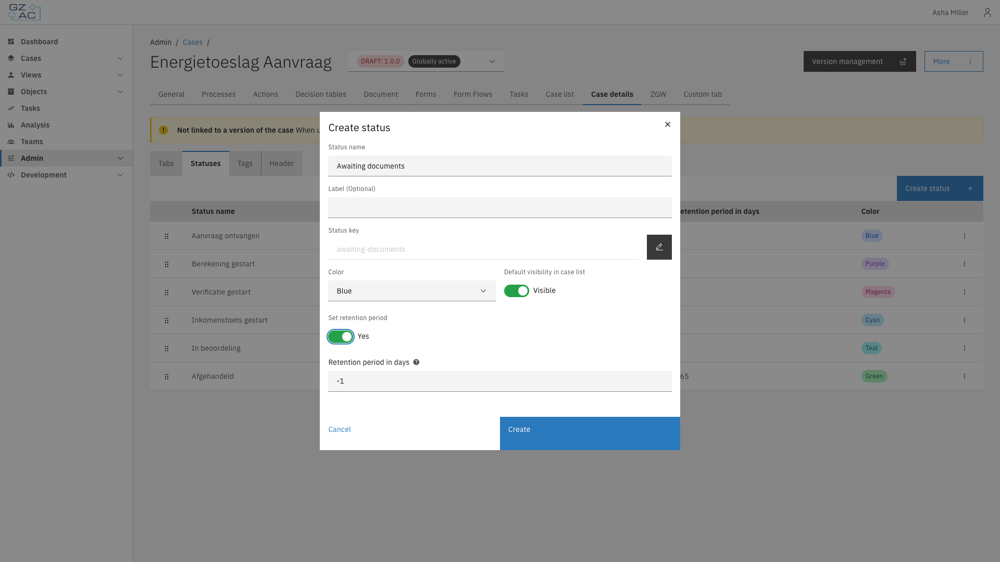
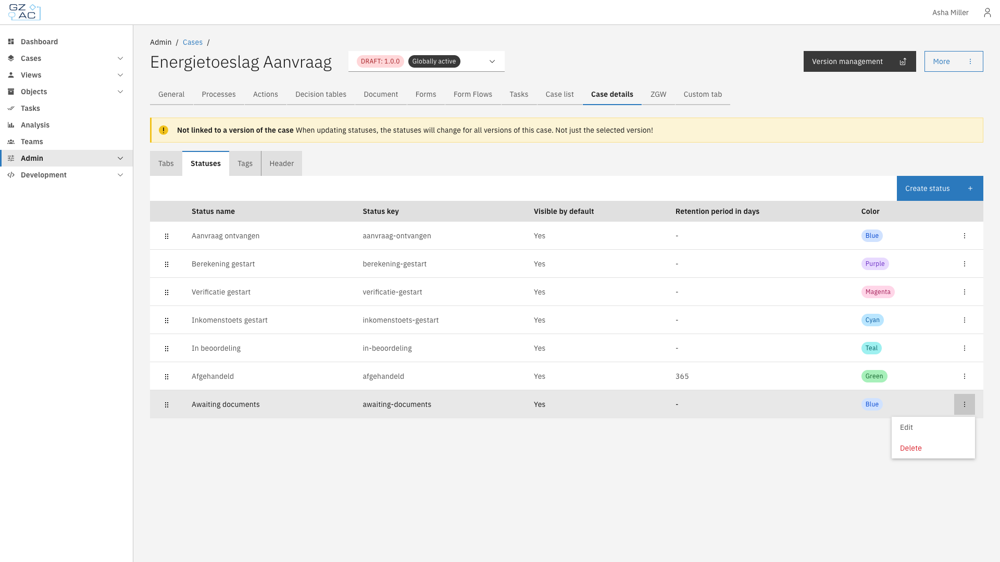
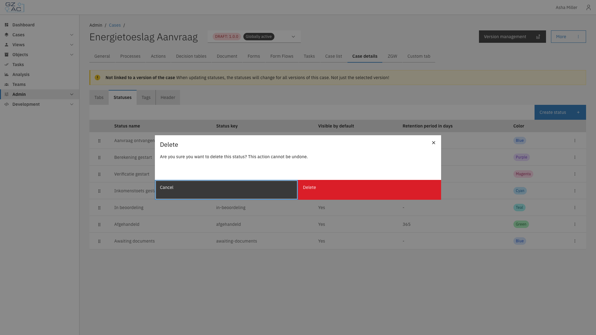

# Statuses

The Statuses sub-tab manages the internal status labels that can be assigned to cases of this
type. Statuses are shown on the case detail page and can be used to filter the case list.

## Overview

Each status has a name, a color, and an optional retention period that determines when cases with
that status are automatically deleted.


Statuses apply to **all versions** of the case type, not just the version you're currently
viewing. Updating a status changes it everywhere the case type is used.


## Configuring statuses

1. Expand **Admin** in the left sidebar
2. Click **Cases** under the Configuration section
3. Click a case definition to open it
4. Click the **Case details** tab, then the **Statuses** sub-tab

The list shows every configured status with its name, key, default visibility, retention period,
and color. Drag a row by its handle to reorder statuses.

### Creating a status

1. Click **Create status**
2. Fill in the status details:

   - **Status name** — Display name for the status. The **Status key** is generated from this
     automatically; click the pencil icon to edit it manually.
   - **Label (Optional)** — Alternate text shown instead of the status name, if needed
   - **Color** — Tag color used to display the status
   - **Default visibility in case list** — Whether cases with this status are shown in the case
     list by default
   - **Set retention period** — Enables the **Retention period in days** field:

| Retention period in days | Effect |
|---------------------------|--------|
| `0` or higher | The case is automatically deleted this many days after reaching the status |
| `-1` (default) | No retention period — the case is never automatically deleted for this status |

3. Click **Create**


Changing the retention period on an existing status does not retroactively update cases that
already have that status.


### Editing or deleting a status

Click a row, or use its overflow menu (⋮), to **Edit** or **Delete** a status.

Deleting a status requires confirmation:


Deleting a status cannot be undone. Cases already assigned that status keep it as an
unrecognized value.


