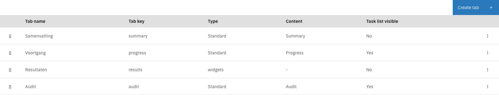
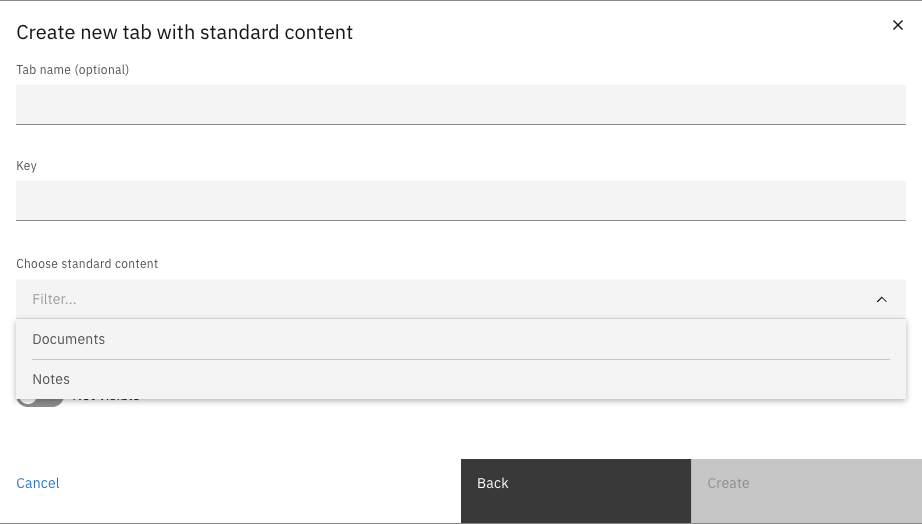
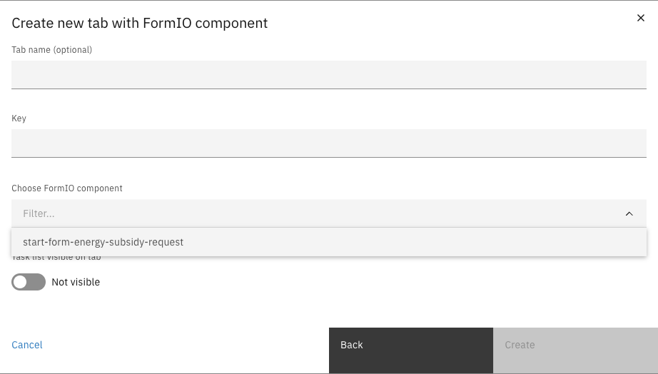
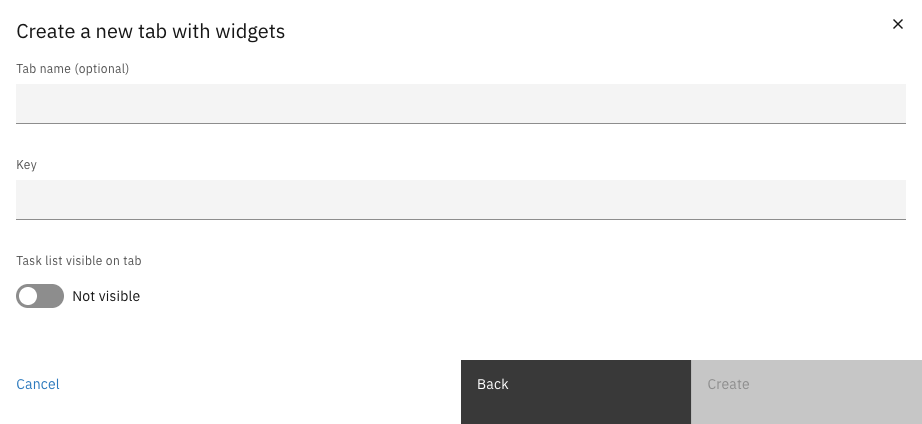
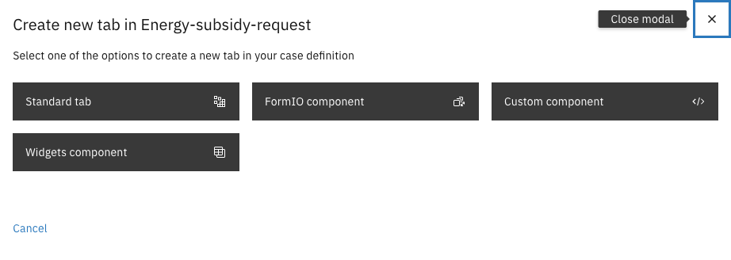
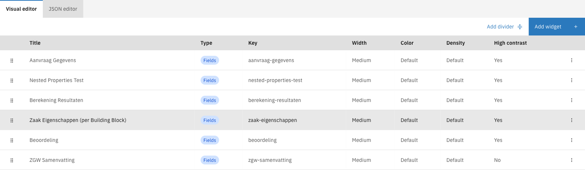
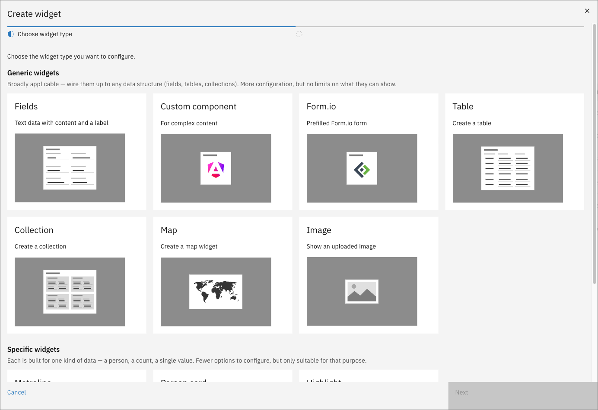
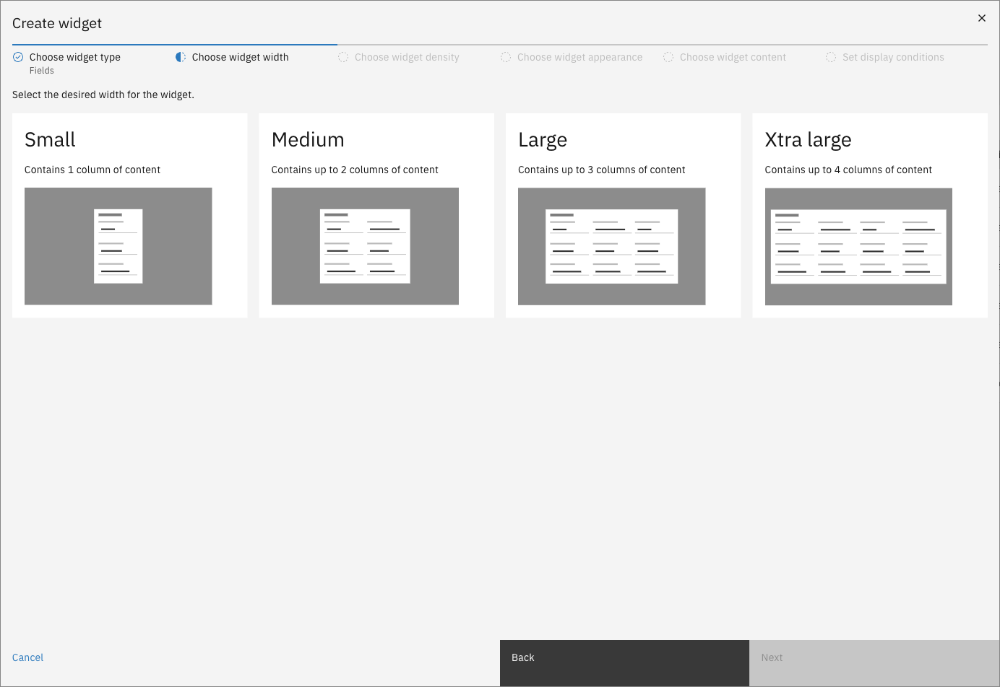

# Tabs

The Tabs sub-tab configures which tabs appear on the case detail page and what
content each tab displays.

Each tab on a case detail page can display different types of content. Valtimo supports several
tab types to cover common use cases:

| Type | Description |
|------|-------------|
| **Standard** | Built-in tabs for common case views: Summary, Progress, Audit, Documents, and Notes |
| **FormIO** | Display a Form.io form pre-filled with case data |
| **Custom** | Use a custom Angular component registered in the application |
| **Widgets** | Build flexible layouts using configurable widgets (Fields, Tables, Collections, and more) |


Tabs can only be created, edited, or deleted on a draft case version. Published versions are
read-only.


---

## Configuring tabs



Expand **Admin** in the left sidebar


Click **Cases** under the Configuration section


Click a case definition to open it


Click the **Case details** tab, then the **Tabs** sub-tab

<figure><figcaption>Tabs list</figcaption></figure>



The list shows every configured tab with its name, key, type, content, and whether the task list
is visible. Drag a row by its handle to reorder tabs.

### Tab types

<details>
<summary><strong>Standard tabs</strong> — Built-in components for common case views</summary>

Standard tabs use built-in components for common case views.

<figure><figcaption>Standard tab form</figcaption></figure>

| Property                 | Description                                                    |
|--------------------------|----------------------------------------------------------------|
| Tab name                 | Optional display name for the tab (can be translated)          |
| Key                      | Unique identifier for the tab (alphanumeric and hyphens only)  |
| Choose standard content  | Select from: Summary, Progress, Audit, Documents, or Notes     |
| Task list visible on tab | Whether to show the task list alongside the tab content        |

**Standard content types:**

| Content   | Description                                   |
|-----------|-----------------------------------------------|
| Summary   | Overview of case data with configured widgets |
| Progress  | Timeline view of the case workflow            |
| Audit     | History of all changes made to the case       |
| Documents | List of documents attached to the case        |
| Notes     | User notes and comments on the case           |


Each standard content type can only be used once per case. The dropdown only shows content
types that haven't been configured yet.


</details>

<details>
<summary><strong>FormIO tabs</strong> — Display a Form.io form pre-filled with case data</summary>

FormIO tabs display a Form.io form definition, pre-filled with case data. This is useful for
showing structured data or creating read-only views of submitted forms.

<figure><figcaption>FormIO tab form</figcaption></figure>

| Property                 | Description                                                            |
|--------------------------|------------------------------------------------------------------------|
| Tab name                 | Optional display name for the tab                                      |
| Key                      | Unique identifier for the tab                                          |
| Choose FormIO component  | Select from available Form.io form definitions linked to this case     |
| Task list visible on tab | Whether to show the task list alongside the form                       |

</details>

<details>
<summary><strong>Custom tabs</strong> — Use a custom Angular component</summary>

Custom tabs use Angular components registered in the application. This requires frontend
development to create and register the component.

| Property                 | Description                                        |
|--------------------------|----------------------------------------------------|
| Tab name                 | Optional display name for the tab                  |
| Key                      | Unique identifier for the tab                      |
| Choose custom component  | Select from registered custom components           |
| Task list visible on tab | Whether to show the task list alongside the component |


Custom components must be registered in the frontend application before they appear in the
dropdown. See the developer documentation for details on creating custom tab components.


</details>

<details>
<summary><strong>Widget tabs</strong> — Build flexible layouts using configurable widgets</summary>

Widget tabs provide the most flexibility — you can build custom layouts using multiple widgets,
each displaying different types of content.

<figure><figcaption>Widget tab form</figcaption></figure>

| Property                 | Description                                          |
|--------------------------|------------------------------------------------------|
| Tab name                 | Optional display name for the tab                    |
| Key                      | Unique identifier for the tab                        |
| Task list visible on tab | Whether to show the task list alongside the widgets  |

After creating a widget tab, click it in the list to open the widget editor and configure its
content. See [Configuring widget tabs](#configuring-widget-tabs) for details.

</details>

### Creating a tab



Click **Create tab**


Select a tab type

<figure><figcaption>Create tab type selection</figcaption></figure>


Fill in the tab configuration — see the [Tab types](#tab-types) section for details on each
tab type's configuration options


Click **Create**



### Editing or deleting a tab

Click a row to edit the tab or open the widget editor (for widget tabs). Use the row's overflow
menu (⋮) to access **Edit** or **Delete** options.


Deleting a tab cannot be undone.


---

## Configuring widget tabs

Widget tabs are configured through a dedicated editor that lets you add, arrange, and configure
individual widgets.

<figure><figcaption>Widget tab editor</figcaption></figure>

The editor shows:
- **Visual editor** / **JSON editor** tabs — switch between graphical and code-based editing
- A list of configured widgets with their properties
- **Add divider** and **Add widget** buttons

### Widget types

Widgets are organized into two categories:

**Generic widgets** — Broadly applicable widgets that can be configured for any data structure:

<details>
<summary><strong>Fields</strong> — Display labeled text data in columns</summary>

The Fields widget displays case data as labeled field-value pairs, organized into columns.

**Use cases:**
- Display applicant details, case metadata, or calculation results
- Show structured data from the case document
- Create summary views of key information

**Content configuration:**
- **Widget title** — Title displayed above the widget
- **Columns** — Organize fields into 1–4 columns (based on widget width)
- **Fields per column** — Add multiple fields to each column

For each field:

| Property            | Description                                                                            |
|---------------------|----------------------------------------------------------------------------------------|
| Title               | Label shown above the value                                                            |
| Display type        | Text, Yes/No, Currency, Date, Date and time, Enumeration, Number, Percentage, or Link |
| Value               | Path to the case or document property (e.g., `doc:applicant.name`)                     |
| Ellipsis char limit | Truncate long text values after this many characters                                   |
| Hide when empty     | Hide the field if its resolved value is empty                                          |

</details>

<details>
<summary><strong>Custom component</strong> — Use a custom Angular component</summary>

The Custom component widget embeds a custom Angular component registered in the application.

**Use cases:**
- Display complex visualizations or interactive content
- Integrate third-party components
- Build specialized views not covered by standard widgets

**Content configuration:**
- **Widget title** — Title displayed above the widget
- **Component name** — Select from registered custom widget components


Custom widget components must be registered in the frontend application before they appear
in the selection. See the developer documentation for implementation details.


</details>

<details>
<summary><strong>Form.io</strong> — Display a pre-filled Form.io form</summary>

The Form.io widget renders a Form.io form definition with fields pre-populated from case data.

**Use cases:**
- Show submitted form data in a structured layout
- Display read-only views of complex forms
- Reuse existing form definitions as display widgets

**Content configuration:**
- **Widget title** — Title displayed above the widget
- **Form definition** — Select from available Form.io forms linked to the case

</details>

<details>
<summary><strong>Table</strong> — Display data in a table format</summary>

The Table widget displays array data from the case document as a table with configurable columns.

**Use cases:**
- Display lists of items (e.g., uploaded documents, related objects)
- Show tabular data from external systems
- Present collections with sortable columns

**Content configuration:**
- **Widget title** — Title displayed above the widget
- **Data path** — Path to the array in the case document (e.g., `doc:items`)
- **Columns** — Define columns to display

For each column:

| Property     | Description                                 |
|--------------|---------------------------------------------|
| Title        | Column header text                          |
| Value path   | Path to the property within each array item |
| Display type | How to format the value                     |

</details>

<details>
<summary><strong>Collection</strong> — Display a list of items with configurable templates</summary>

The Collection widget displays array data as a list of cards or items, with flexible templates
for each item.

**Use cases:**
- Display related records with expandable details
- Show lists with rich formatting per item
- Present collections where each item needs its own layout

**Content configuration:**
- **Widget title** — Title displayed above the widget
- **Data path** — Path to the array in the case document
- **Item template** — Configure fields to display for each item
- **Layout options** — Card style, spacing, and arrangement

</details>

<details>
<summary><strong>Map</strong> — Display a map with markers</summary>

The Map widget displays an interactive map with markers based on location data from the case.

**Use cases:**
- Show property or site locations
- Display delivery addresses or service areas
- Visualize geographic data

**Content configuration:**
- **Widget title** — Title displayed above the widget
- **Location data path** — Path to coordinates (latitude/longitude) in the case document
- **Marker configuration** — Icon, color, and popup content
- **Map options** — Initial zoom level and center point

</details>

<details>
<summary><strong>Image</strong> — Display an uploaded image</summary>

The Image widget displays an image stored as part of the case.

**Use cases:**
- Show uploaded photos or scanned documents
- Display logos or visual references
- Present image attachments inline

**Content configuration:**
- **Widget title** — Title displayed above the widget
- **Image path** — Path to the image data or URL in the case document
- **Alt text** — Accessibility text for the image
- **Size options** — Width constraints and aspect ratio

</details>

**Specific widgets** — Purpose-built widgets for particular data types:

<details>
<summary><strong>Metroline</strong> — Show progression through steps</summary>

The Metroline widget displays case progression as a visual timeline, similar to a metro/subway
line with stations representing steps.

**Use cases:**
- Show workflow progress through defined stages
- Display case status in a visual format
- Present milestone completion

**Content configuration:**
- **Widget title** — Title displayed above the widget
- **Steps** — Define the steps/stations in the metroline
- **Current step path** — Path to the current step value in the case document
- **Completed steps path** — Path to completed steps array (optional)

</details>

<details>
<summary><strong>Person card</strong> — Display a person with their details</summary>

The Person card widget displays information about a person in a card format with contact
details and key information.

**Use cases:**
- Show applicant or contact information
- Display case handler or assignee details
- Present stakeholder profiles

**Content configuration:**
- **Widget title** — Title displayed above the widget
- **Name path** — Path to the person's name
- **Contact details** — Paths to email, phone, address
- **Additional fields** — Role, department, or other attributes
- **Photo path** — Optional path to a profile image

</details>

<details>
<summary><strong>Highlight</strong> — Highlight a single value or count</summary>

The Highlight widget displays a single prominent value, ideal for key metrics or status
indicators.

**Use cases:**
- Show case priority or status
- Display counts (e.g., "3 open tasks")
- Highlight important deadlines or values

**Content configuration:**
- **Widget title** — Title displayed above the widget
- **Value path** — Path to the value to display
- **Label** — Text shown above or below the value
- **Display type** — Number, currency, date, or text
- **Style** — Color and size options for emphasis

</details>

### Adding widgets



**Choose widget type**

Select the type of widget to add.

<figure><figcaption>Widget type selection</figcaption></figure>


**Choose widget width**

Select the desired width for the widget.

<figure><figcaption>Widget wizard width step</figcaption></figure>

| Width      | Columns | Description                  |
|------------|---------|------------------------------|
| Small      | 1       | Single column of content     |
| Medium     | 2       | Up to 2 columns of content   |
| Large      | 3       | Up to 3 columns of content   |
| Xtra large | 4       | Up to 4 columns of content   |



**Choose widget density**

Select how compact the widget content appears.

| Density | Description                        |
|---------|------------------------------------|
| Default | Standard spacing between elements  |
| Compact | Reduced spacing for denser content |



**Choose widget appearance**

Configure the visual styling of the widget.

| Property      | Description                                                                                               |
|---------------|-----------------------------------------------------------------------------------------------------------|
| Color         | Background color style: Default, High Contrast, Blue, Periwinkle, Purple, Turquoise, Green, Brown, Red, Orange, or Yellow |
| High contrast | Use high-contrast styling for better visibility                                                           |



**Choose widget content**

Configure the widget-specific content. The available options vary by widget type — see the
[Widget types](#widget-types) section for details on each widget's content configuration.


**Set display conditions**

Optionally configure conditions that control when the widget is shown or hidden based on case
data values. If no conditions are set, the widget is always visible.

Conditions allow you to show widgets only when specific criteria are met — for example, showing
an "Approval Details" widget only when the case status is "Approved".


Click **Save** to add the widget to the tab



### Editing or deleting widgets

Click a widget row to edit its configuration. Use the row's overflow menu (⋮) to access
**Edit** or **Delete** options.

Drag widgets by their handle to reorder them on the page.

### Adding dividers

Click **Add divider** to insert a horizontal divider between widgets, helping to visually
separate content sections.

---

## Access control

Access to tabs and widgets can be configured through access control to control which users can
see specific tabs or widgets on the case detail page.

More information about access control can be found [here](../../access-control/README.md).

### Resources and actions

| Resource type | Action | Effect                                                |
|---------------|--------|-------------------------------------------------------|
| `com.ritense.case.domain.CaseTab` | `view` | Allows viewing a specific tab on the case detail page |
| `com.ritense.case_.domain.tab.CaseWidgetTabWidget` | `view` | Allows viewing case widget tabs                       |

### Examples

<details>
<summary>Permission to view a specific tab</summary>

```json
{
    "resourceType": "com.ritense.case.domain.CaseTab",
    "action": "view",
    "conditions": [
        {
            "type": "field",
            "field": "key",
            "operator": "==",
            "value": "summary"
        }
    ]
}
```

</details>

<details>
<summary>Permission to view all tabs for a case type</summary>

```json
{
    "resourceType": "com.ritense.case.domain.CaseTab",
    "action": "view",
    "conditions": [
        {
            "type": "field",
            "field": "caseDefinitionName",
            "operator": "==",
            "value": "energy-subsidy-request"
        }
    ]
}
```

</details>

<details>
<summary>Permission to view a specific widget tab</summary>

```json
{
    "resourceType": "com.ritense.case_.domain.tab.CaseWidgetTabWidget",
    "action": "view",
    "conditions": [
        {
            "type": "field",
            "field": "key",
            "operator": "==",
            "value": "applicant-details"
        }
    ]
}
```

</details>
