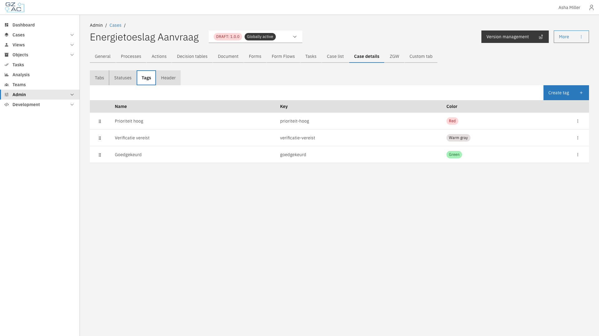
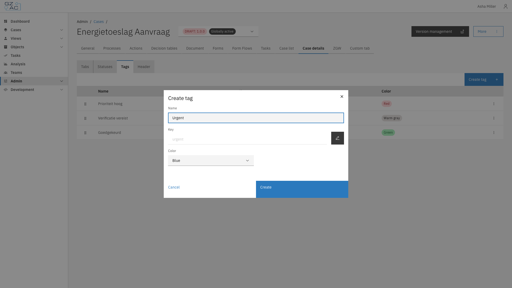
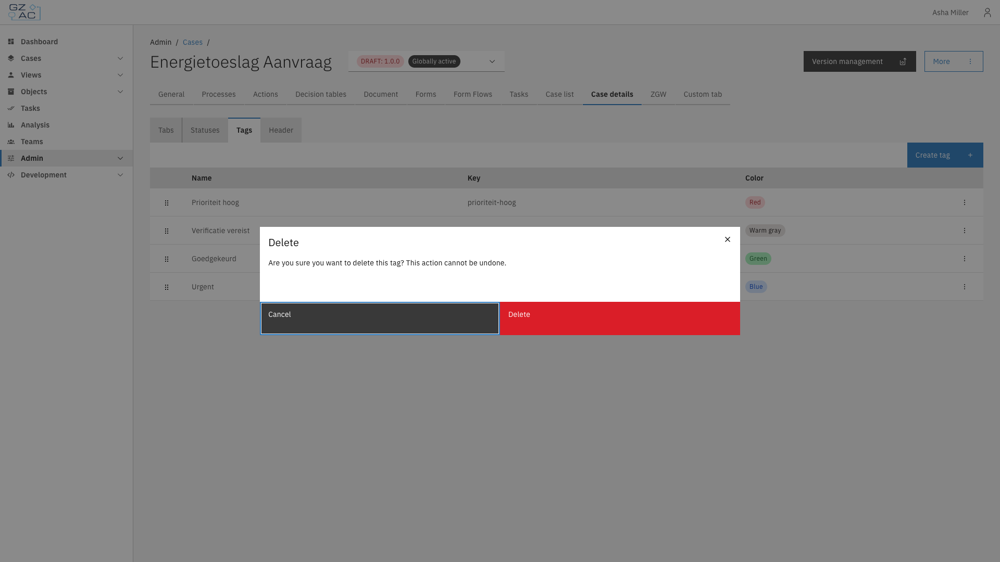

# Tags

The Tags sub-tab manages the labels that users can attach to individual cases from the case
detail page, to mark them for follow-up, categorization, or filtering purposes.

## Overview

Unlike [statuses](statuses.md), tags apply only to the case definition version you're configuring.

## Configuring tags

1. Expand **Admin** in the left sidebar
2. Click **Cases** under the Configuration section
3. Click a case definition to open it
4. Click the **Case details** tab, then the **Tags** sub-tab

The list shows every configured tag with its name, key, and color. Drag a row by its handle to
reorder tags.


Tags can only be created, edited, or deleted on a draft case version. Published versions are
read-only.


### Creating a tag

1. Click **Create tag**
2. Fill in the tag details:

   - **Name** — Display name for the tag. The **Key** is generated from this automatically; click
     the pencil icon to edit it manually.
   - **Color** — Tag color

3. Click **Create**

### Editing or deleting a tag

Click a row, or use its overflow menu (⋮), to **Edit** or **Delete** a tag. Deleting a tag
requires confirmation:


Deleting a tag cannot be undone. Cases that had the tag attached lose it.

