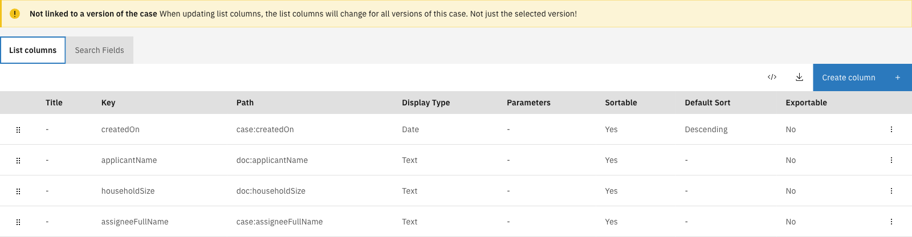

# Case list

The Case list tab configures how cases appear in the end-user case list view for a specific case
type. This includes the columns displayed in the list and the search fields available for
filtering.

This includes:

- **[List columns](list-columns.md)** — Columns displayed in the case list
- **[Search fields](search-fields.md)** — Search fields available for filtering cases

---

## Configuring the case list



Expand **Admin** in the left sidebar


Click **Cases** under the Configuration section


Click a case definition to open it


Click the **Case list** tab

<figure><figcaption>Case list tab overview</figcaption></figure>




List columns and search fields apply to **all** versions of the case definition, not just the
currently selected version. Changes made here affect how all cases of this type appear in the
case list.
