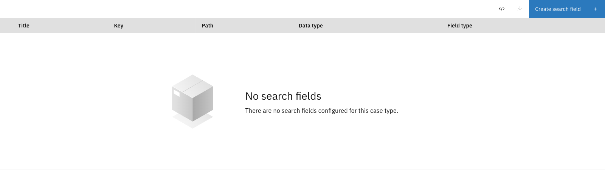
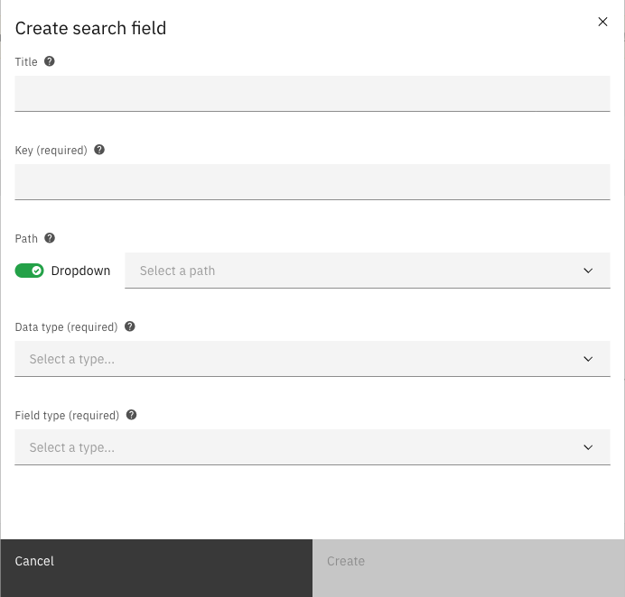
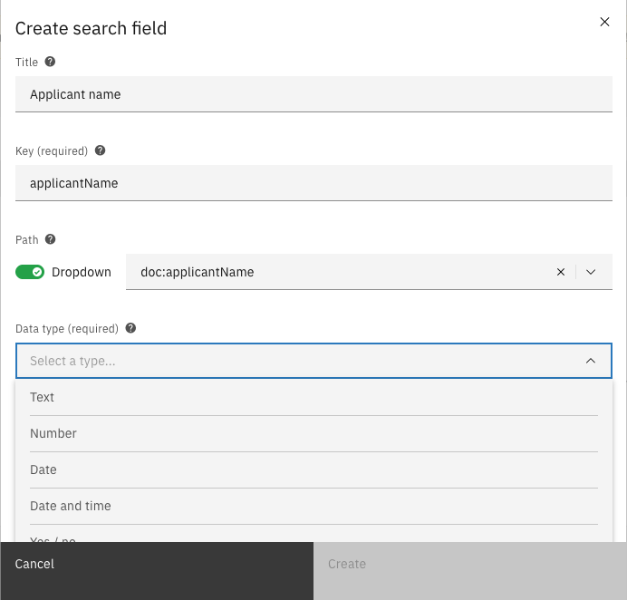
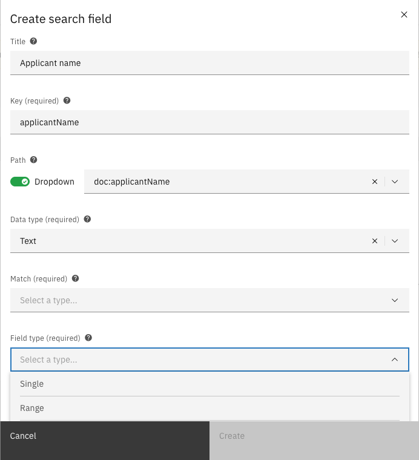
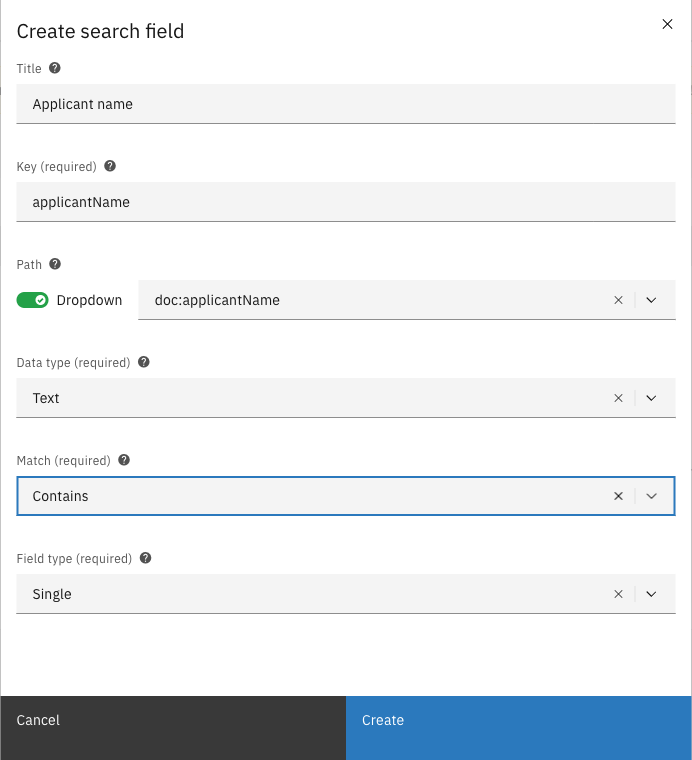

# Search fields

Search fields allow end users to filter the case list by specific data fields. Each search field
can be configured with a data type, match behavior, and field type to control how users interact
with the filter.

---

## Configuring search fields



Expand **Admin** in the left sidebar


Click **Cases** under the Configuration section


Click a case definition to open it


Click the **Case list** tab, then the **Search fields** sub-tab

<figure><figcaption>Search fields configuration</figcaption></figure>



The list shows all configured search fields with their key, path, data type, and field type.
Drag the handle on the left of each row to reorder fields.

### Creating a search field



Click the **Create search field** button


Fill in the search field properties

<figure><figcaption>Create search field modal</figcaption></figure>


Select a path from the dropdown to specify which data field to search


Select a data type

<figure><figcaption>Data type options</figcaption></figure>


Select a field type

<figure><figcaption>Field type options</figcaption></figure>


Configure additional options based on the data type (e.g., match type for text fields)

<figure><figcaption>Filled search field form</figcaption></figure>


Click **Create** to add the search field



#### Search field properties

| Property | Description |
|----------|-------------|
| Title | Display name for the search field |
| Key | Unique identifier for the search field |
| Path | Path to the searchable data value |
| Data type | The type of data being searched |
| Match | How search values are matched (text fields only) |
| Field type | How the search input is presented to users |
| Dropdown data provider | Source of dropdown options (dropdown field types only) |

#### Data types

| Type | Description |
|------|-------------|
| Text | Text/string values |
| Number | Numeric values |
| Date | Date values (without time) |
| Date and time | Date values with time component |
| Yes / no | Boolean values |

#### Field types

| Type | Description |
|------|-------------|
| Single | Single value text input |
| Range | Two inputs for from/to values |
| Single select dropdown | Dropdown with single selection |
| Multi select dropdown | Dropdown allowing multiple selections |

#### Match types (text fields only)

| Type | Description |
|------|-------------|
| Exact | Value must match exactly |
| Contains | Value must contain the search term |

#### Dropdown data providers

When using dropdown field types, you can configure where the dropdown options come from:

| Provider | Description |
|----------|-------------|
| Database | Fixed values stored in the database |
| JSON file | Values loaded from a configuration file on the server |

### Editing a search field

Click a search field row to open the edit modal. Modify the properties and click **Save** to
apply changes.

### Deleting a search field

Click the overflow menu (three dots) on the right side of a search field row and select
**Delete**.

### Reordering search fields

Drag the handle on the left side of each row to change the field order. The order in the
configuration list matches the order in the end-user search panel.

---

## JSON editor

Click the **JSON editor** button to view and edit the search field configuration as JSON.

---

## Exporting configuration

Click the download button to export the current search field configuration as a JSON file.

---

## Access control

Access to search fields can be configured through access control.
More information about access control can be found [here](../../access-control/README.md).

### Resources and actions

| Resource type | Action | Effect |
|---------------|--------|--------|
| `com.ritense.document.domain.impl.searchfield.SearchField` | `view_list` | Allows viewing search fields in the case list filter panel |

<details>
<summary>Permission to view search fields</summary>

```json
{
    "resourceType": "com.ritense.document.domain.impl.searchfield.SearchField",
    "action": "view_list",
    "conditions": []
}
```

</details>