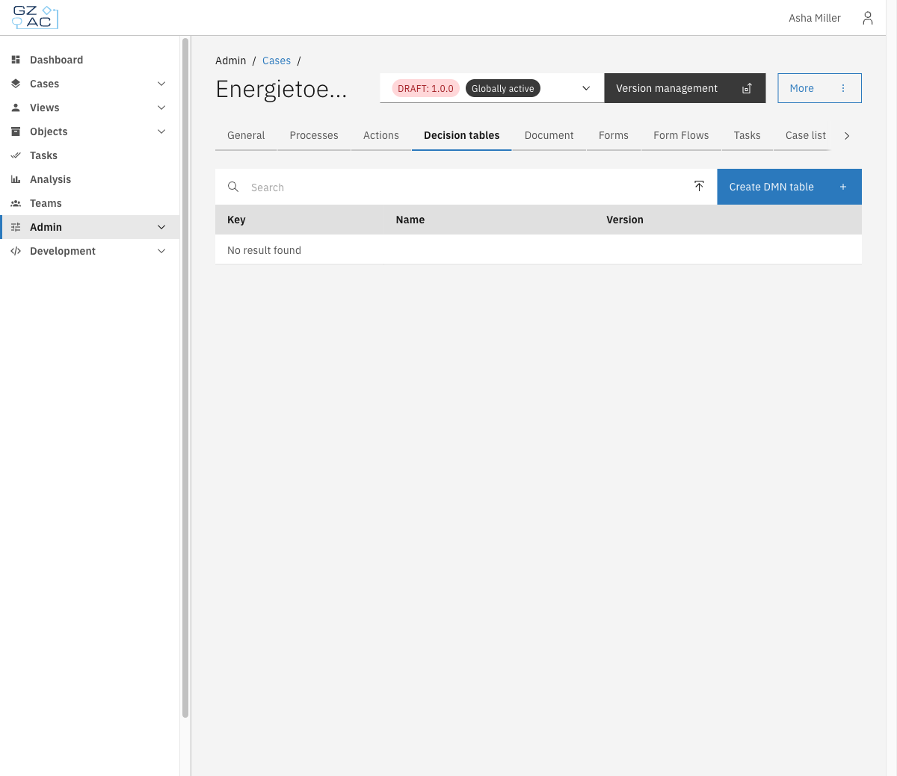
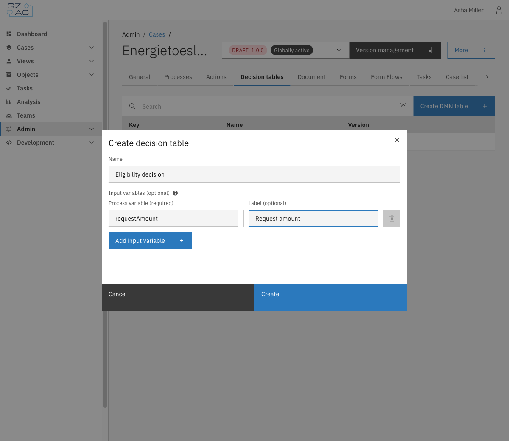
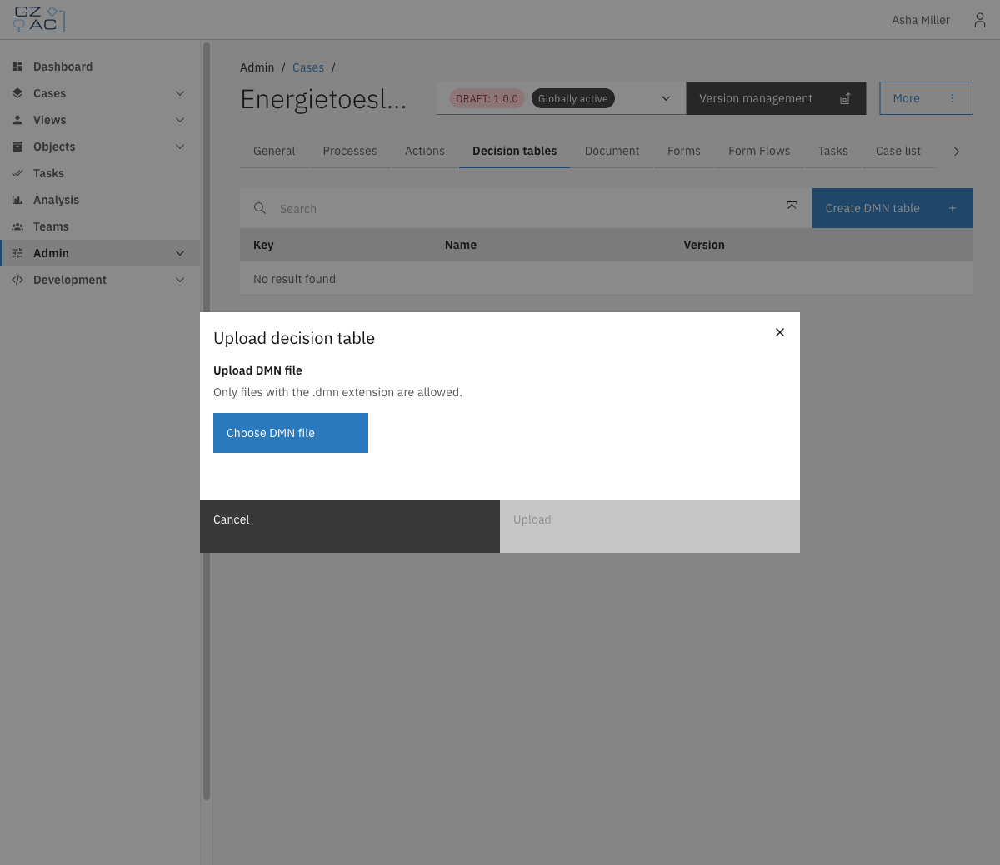
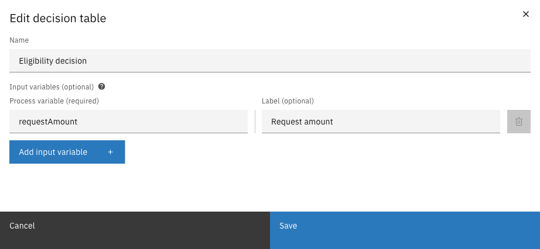
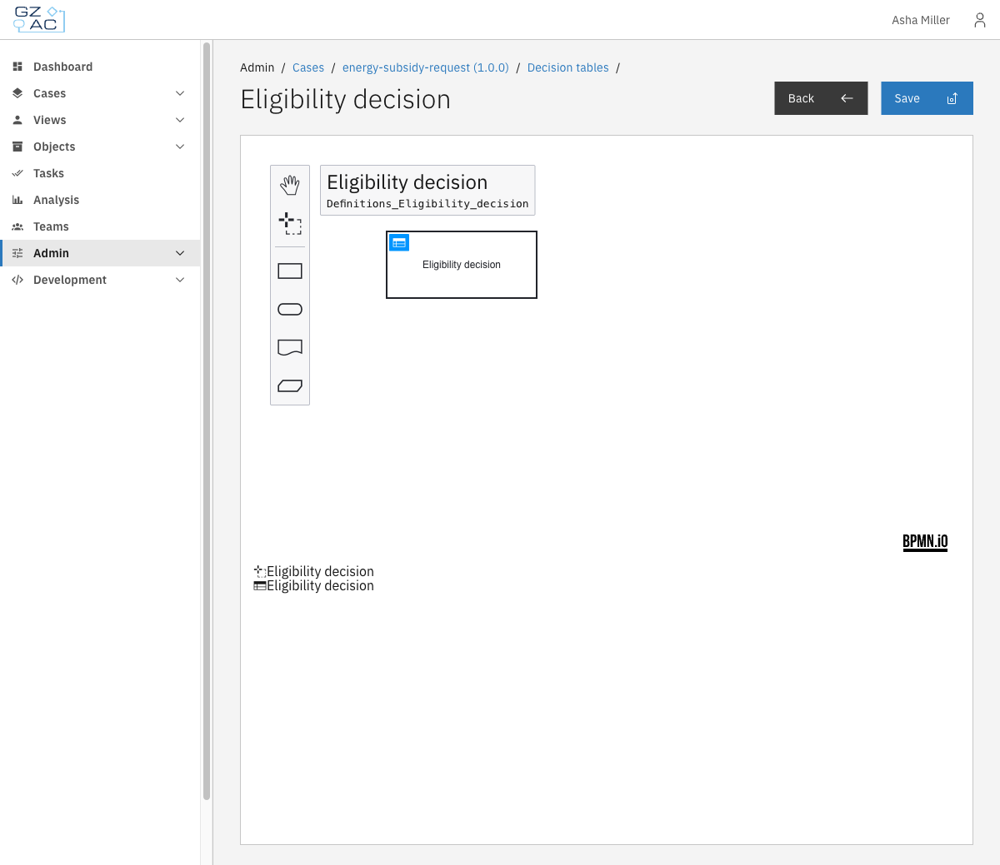

# Decision tables

The Decision tables tab lets you manage DMN decision tables for automated business decisions within the case definition.

A decision table encodes business rules as a structured table: given one or more input values (process variables), the table evaluates the matching rule and returns an output. Decision tables follow the [DMN (Decision Model and Notation)](https://www.omg.org/dmn/) standard and are executed automatically as part of a process.

Use decision tables to separate business logic from process flow — for example, to determine eligibility, calculate a fee, or classify a request based on its attributes.

---

## Configuring decision tables



Expand **Admin** in the left sidebar


Click **Cases** under the Configuration section


Click a case definition to open it


Click the **Decision tables** tab

<figure><figcaption>Decision tables tab empty state</figcaption></figure>



### Creating a new decision table



Click **Create DMN table** in the toolbar


Fill in the form:

- **Name** — Display name for the decision table (e.g. _Eligibility decision_)
- **Input variables (optional)** — Add one row per process variable that will be used as input in the table. For each row, enter:
  - **Process variable** (required) — The variable name from the process (e.g. `requestAmount`)
  - **Label** (optional) — A human-readable column header shown in the DMN editor

| Property | Description |
|----------|-------------|
| Name | Display name for the decision table |
| Process variable | Name of the process variable used as an input column (e.g. `requestAmount`) |
| Label | Human-readable column header shown in the DMN editor (optional) |

<figure><figcaption>Create decision table modal</figcaption></figure>


Click **Create**

The DMN modeler opens. Design the decision logic in the editor and click **Save** to deploy the table.



### Uploading an existing DMN file



Click the upload icon in the toolbar (next to the search field)


Click **Choose DMN file** and select a `.dmn` file from your system

<figure><figcaption>Upload decision table modal</figcaption></figure>


Click **Upload**

The file is deployed immediately and appears in the list.



### Decision tables list

After adding one or more decision tables, the list shows each table's **Key**, **Name**, and **Version**.

<figure><figcaption>Decision tables list</figcaption></figure>

### Editing a decision table

To edit a decision table's properties:



Open the overflow menu (⋮) on the row


Click **Edit**

<figure><figcaption>Edit decision table modal</figcaption></figure>


Modify the decision table properties:

- **Name** — Update the display name
- **Input variables** — Add, remove, or modify input columns


Click **Save**



To edit the decision logic itself, click directly on the row to open the DMN modeler.

<figure><figcaption>DMN modeler</figcaption></figure>

Modify the decision logic in the editor, then click **Save** to deploy the changes.

### Deleting a decision table



Open the overflow menu (⋮) on the row

<figure><figcaption>Row overflow menu</figcaption></figure>


Click **Delete**


Confirm the deletion in the modal




Deleting a decision table cannot be undone. Any process that relies on it will stop functioning correctly.

