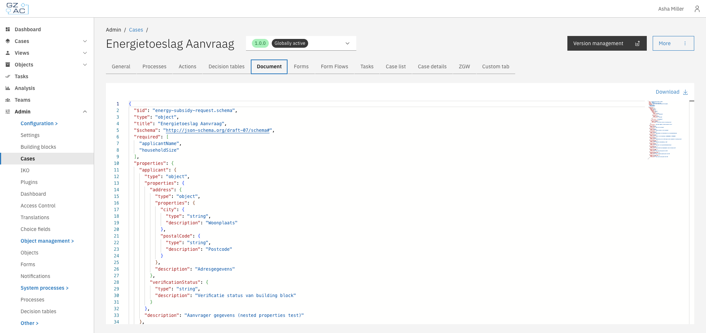
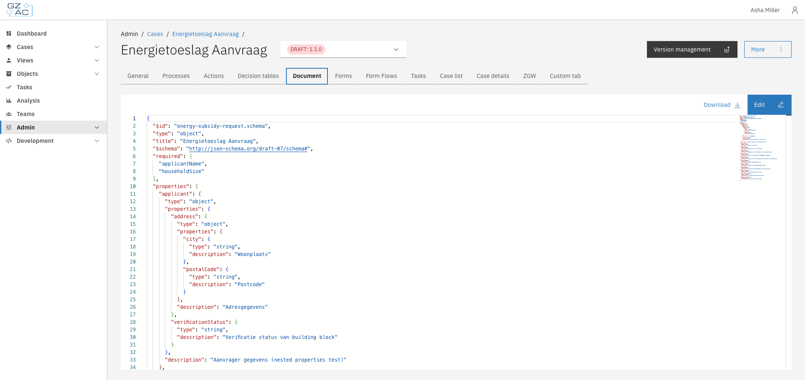
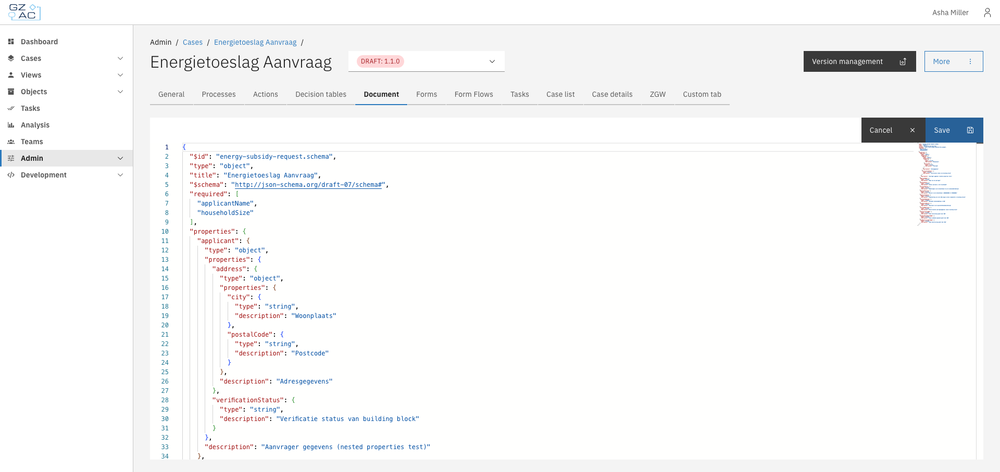

# Document

The Document tab displays and allows editing of the JSON schema that defines the case's data
structure. This schema determines what data fields are available in the case and their types,
validation rules, and descriptions.

## Overview

Every case type in Valtimo has a document definition — a JSON Schema that describes the structure
of data stored in each case instance. The Document tab provides a JSON editor to view and modify
this schema directly.

The schema follows the [JSON Schema](https://json-schema.org/) specification (draft-07) and
defines:

- **Properties** — The data fields available in the case (strings, numbers, objects, arrays)
- **Required fields** — Which properties must have values
- **Nested structures** — Objects within objects for organizing related data
- **Descriptions** — Human-readable explanations shown in forms and UI

## Configuration

Navigate to **Admin** > **Cases** > select a case > **Document** tab.

### Viewing the schema

The JSON editor displays the current document definition with syntax highlighting and line numbers.




On final (published) versions, the schema is read-only. Only the **Download** button is available.


### Editing the schema

To edit the document definition, you must be viewing a draft version of the case.



1. Click **Edit** to enter edit mode
2. Modify the JSON schema in the editor
3. Click **Save** to apply changes, or **Cancel** to discard




Changes to the document definition affect how case data is stored and displayed. Ensure your
schema is valid JSON Schema before saving. Invalid schemas may cause errors in forms and case
views.


### Downloading the schema

Click **Download** to save the schema as a JSON file. The file is named
`{case-key}-v{version}.json` (e.g., `energy-subsidy-request-v1.0.0.json`).

This is useful for:

- Backing up the schema before making changes
- Sharing definitions between environments
- Version control in external repositories

## Schema structure

A typical document definition includes:

```json
{
  "$id": "my-case.schema",
  "$schema": "http://json-schema.org/draft-07/schema#",
  "title": "My Case",
  "type": "object",
  "required": ["applicantName"],
  "properties": {
    "applicantName": {
      "type": "string",
      "description": "Name of the applicant"
    },
    "status": {
      "type": "string",
      "description": "Current case status"
    }
  }
}
```

| Field | Description |
|-------|-------------|
| `$id` | Unique identifier for the schema |
| `$schema` | JSON Schema version (use `http://json-schema.org/draft-07/schema#`) |
| `title` | Display name for the case type |
| `type` | Always `object` for document definitions |
| `required` | Array of property names that must have values |
| `properties` | Object containing field definitions |