# Form flows

The Form flows tab lets you configure multi-step form sequences for complex data collection
workflows.

A form flow guides a user through a sequence of forms, like a wizard. Use it to break a single
task into several screens, to branch based on user input (for example, showing different
follow-up forms for approved and denied requests), and to run actions when a step opens,
completes, or the user goes back. A form flow is normally linked to a BPMN user task via a
[process link](processes.md).

Each form flow definition is JSON against a schema. The form flow editor has two tabs that
work on the same definition: a **JSON editor** (the default) with autocomplete and
validation, and a visual **Editor (beta)** that shows the steps, transitions, and actions
as a form-based UI.

---

## Configuring form flows



Expand **Admin** in the left sidebar


Click **Cases** under the Configuration section


Click a case definition to open it


Click the **Form Flows** tab

<figure>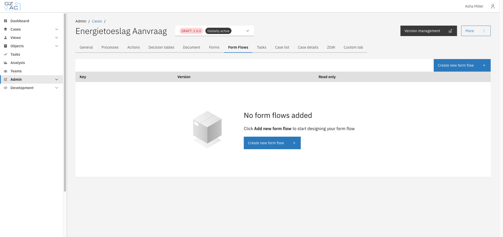<figcaption>The Form Flows tab lists all form flow definitions configured for the case.</figcaption></figure>



### Adding a form flow



Click **Create new form flow**


Enter a unique **Key** for the form flow

<figure>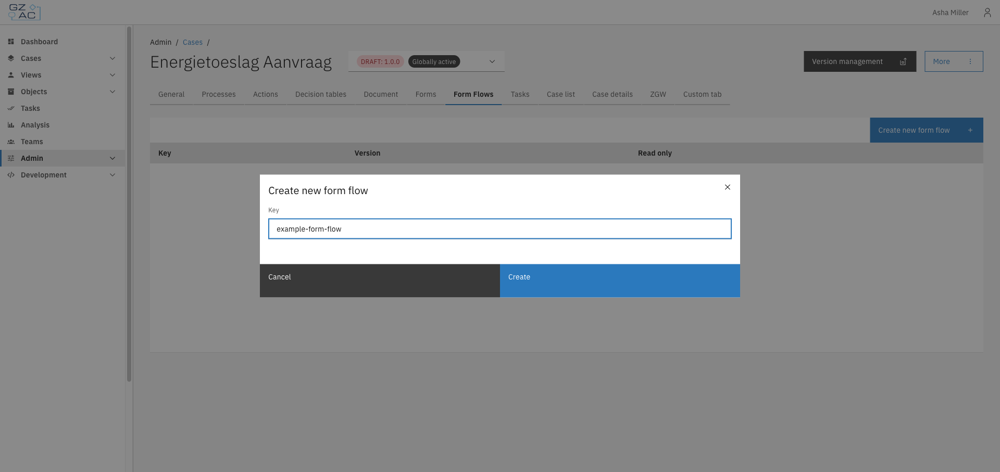<figcaption>The key identifies the form flow definition and is used to link it from a process.</figcaption></figure>


Click **Create**

You're taken to the form flow editor, which opens on the **JSON editor** tab with a minimal
default definition: a single `start-step` and an empty `steps` array.

<figure>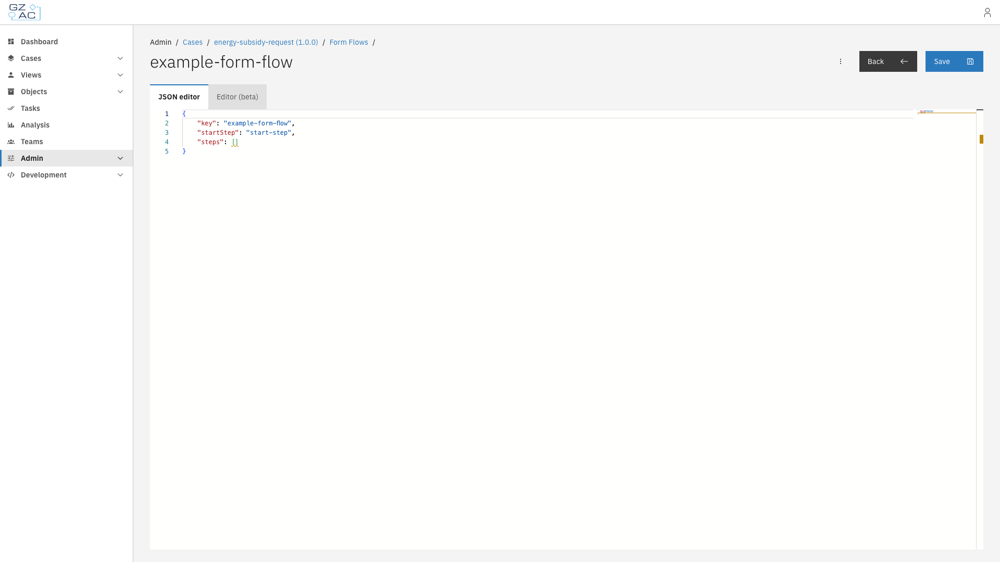<figcaption>A newly created form flow starts with an empty steps array.</figcaption></figure>



### Editing in the JSON editor

Add and configure steps directly in the JSON editor. The editor validates your changes against
the form flow schema as you type and offers autocomplete for property names and values.

<figure>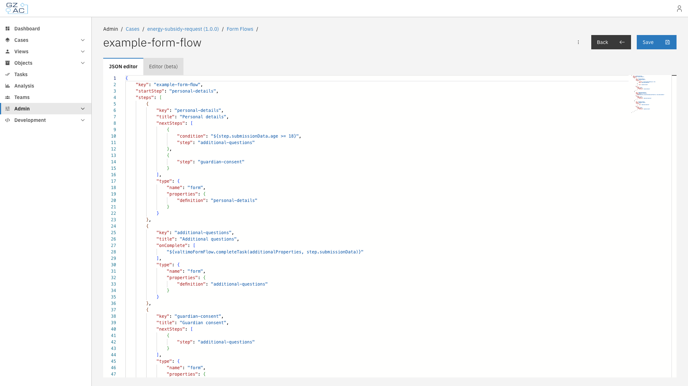<figcaption>A form flow with a personal-details step that branches to one of two follow-up steps depending on the submitted age, and completes the surrounding task once finished.</figcaption></figure>

Click **Save** once the JSON is valid (the button is disabled otherwise). Use the overflow menu
(⋮) to **Export** the definition as a JSON file or **Delete** the form flow.

<figure>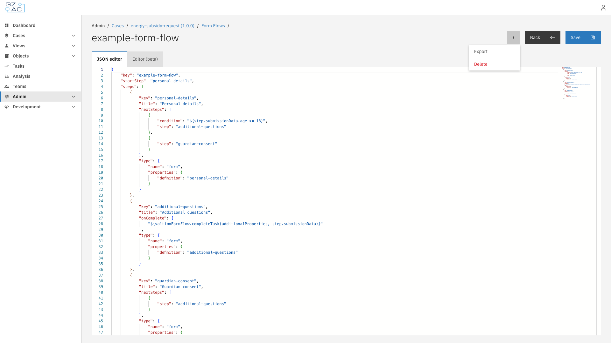<figcaption>Export downloads the form flow definition as a JSON file; Delete removes it.</figcaption></figure>

#### Form flow definition fields

| Field | Description |
|-------|-------------|
| `key` | Identifier of the form flow definition. Overwritten with the key from the URL when you save, so it doesn't need to be edited manually. |
| `startStep` | The step shown first when the form flow starts. Must match the `key` of one of the entries in `steps`. |
| `steps` | All steps in the form flow. At least one step is required, and step keys must be unique. |

#### Step fields

| Field | Description |
|-------|-------------|
| `key` | Identifier of the step, referenced from `startStep` and from `nextSteps`. |
| `title` | Optional. Label shown in the breadcrumb trail at the top of the form flow (when breadcrumbs are enabled). Falls back to a translation key if left empty. |
| `type` | What is rendered for the step — see [step types](#step-types) below. |
| `nextSteps` | Where the user can go after completing the step. Entries are evaluated in order; the first one whose `condition` is true is taken. At most one entry may omit its condition — that one is the default. If no entry matches, the form flow ends. |
| `onOpen` | Actions run when the user opens the step. |
| `onBack` | Actions run when the user navigates back from the step. |
| `onComplete` | Actions run when the user completes the step (submits the form). |

`onOpen`, `onBack`, and `onComplete` are each an array of [SpEL](https://docs.spring.io/spring-framework/reference/core/expressions.html)
expressions wrapped in `${...}`, evaluated in order. Common examples:

```json
"onComplete": [
    "${valtimoFormFlow.completeTask(additionalProperties, step.submissionData)}",
    "${valtimoFormFlow.startCase(instance.id, {'doc:/target':'/source'})}",
    "${valtimoFormFlow.startSupportingProcess(instance.id, {'doc:/target':'/source'})}"
]
```

#### Step types

| `type.name` | `type.properties` | Description |
|-------------|--------------------|--------------|
| `form` | `{ "definition": "<form key>" }` | Renders a Form.io form. `definition` must match the key of a form defined for the case (see [Forms](forms.md)). |
| `custom-component` | `{ "componentId": "<component id>" }` | Renders a custom Angular component instead of a form, identified by `componentId` as registered in the frontend. |

#### Next step fields

| Field | Description |
|-------|-------------|
| `step` | The `key` of the step to transition to. Must match one of the entries in `steps`. |
| `condition` | Optional. A SpEL expression wrapped in `${...}` evaluated against the current step's submission data, e.g. `${step.submissionData.personalDetails.age >= 21}`. Omit to make this entry the default transition. |

### Editing in the visual editor (beta)


Available since Valtimo `13.44.0`


The **Editor (beta)** tab offers a visual alternative to writing the JSON by hand. Both tabs
work on the same definition, so you can switch between them at any time.

<figure>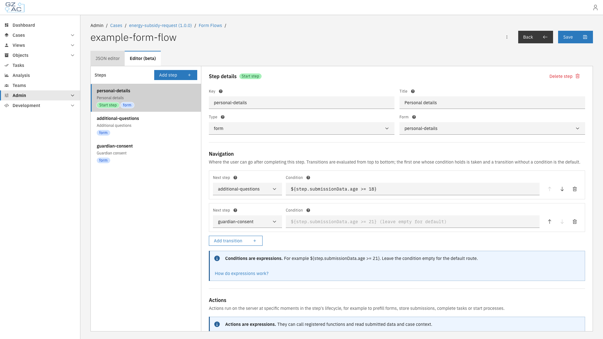<figcaption>The visual editor shows the steps of the flow in a sidebar and the configuration of the selected step next to it.</figcaption></figure>

The left panel lists the steps of the flow; **Add step** adds a new one. Selecting a step
shows its configuration on the right:

- **Step details** — The key identifies the step; renaming it automatically updates the start
  step and every transition that references it. The optional title is shown in the breadcrumb
  trail while a user walks through the form flow. The type determines what the step shows:
  for a `form` step, the **Form** dropdown lists the forms of this case definition; for a
  `custom-component` step, the **Component ID** dropdown lists the custom components
  registered by the implementation (the `custom-component` type is unavailable when none are
  registered).
- **Start step** — The step where the form flow begins carries a *Start step* tag. Any other
  step can be made the start step with the **Make start step** button.
- **Navigation** — Transitions define where the user can go after completing the step. Each
  transition points to another step and can have a SpEL condition. Transitions are evaluated
  from top to bottom — the first one whose condition holds is taken, and a transition without
  a condition is the default. The order can be changed with the arrow buttons.
- **Actions** — Expressions that run when the step opens, when it is completed, or when the
  user navigates back. The **Add action** menu lists the registered form flow functions with
  their parameters, next to the option to write a blank expression.

<figure>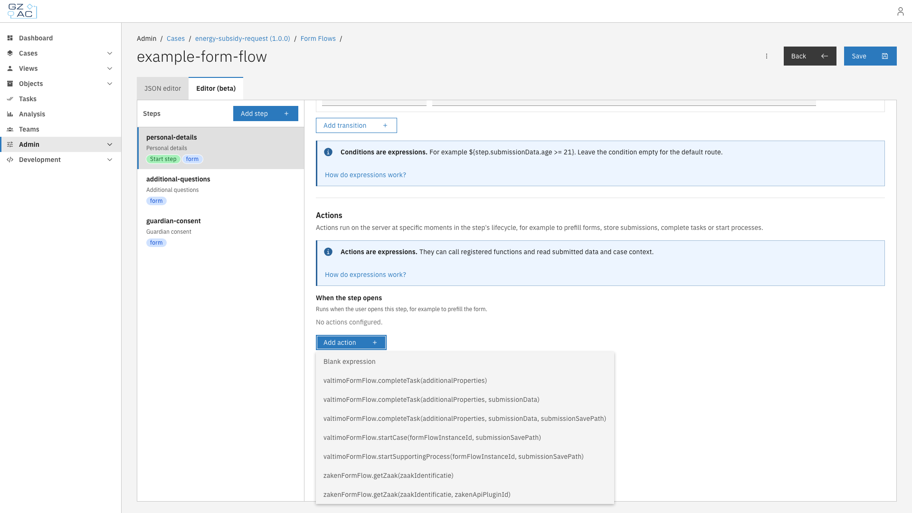<figcaption>The Add action menu lists the registered form flow functions, such as valtimoFormFlow.completeTask.</figcaption></figure>

The **How do expressions work?** link opens a help dialog explaining conditions and actions,
including exactly which data is available in `additionalProperties` for this application.

<figure>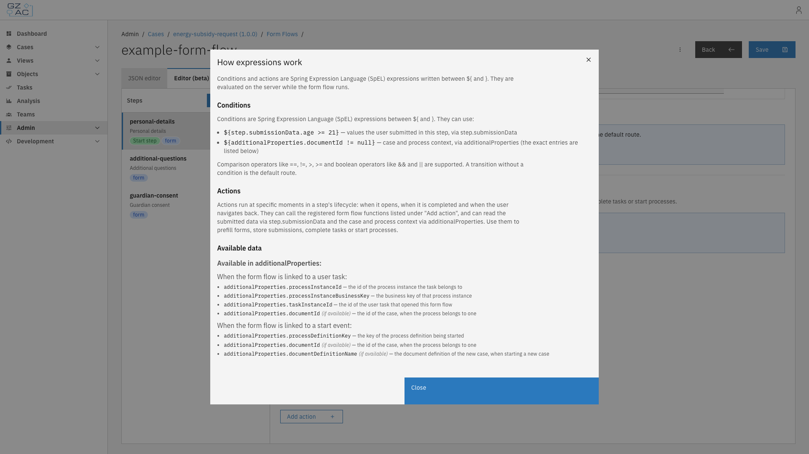<figcaption>The help dialog documents the expression syntax and the available context data.</figcaption></figure>

The editor validates the definition while editing — duplicate step keys, a missing start
step, transitions to unknown steps, and multiple default transitions are reported — and warns
when leaving the page with unsaved changes.

### Managing existing form flows

Form flows already created for the case appear in the list on the Form Flows tab.

<figure>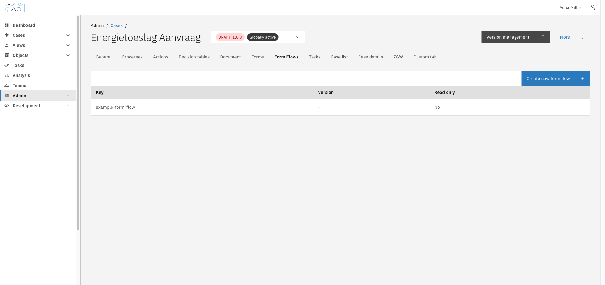<figcaption>Existing form flows are listed with their key, version, and read-only status.</figcaption></figure>

Use the overflow menu on a row to **Edit** (opens the editor) or **Delete** the form flow.

<figure>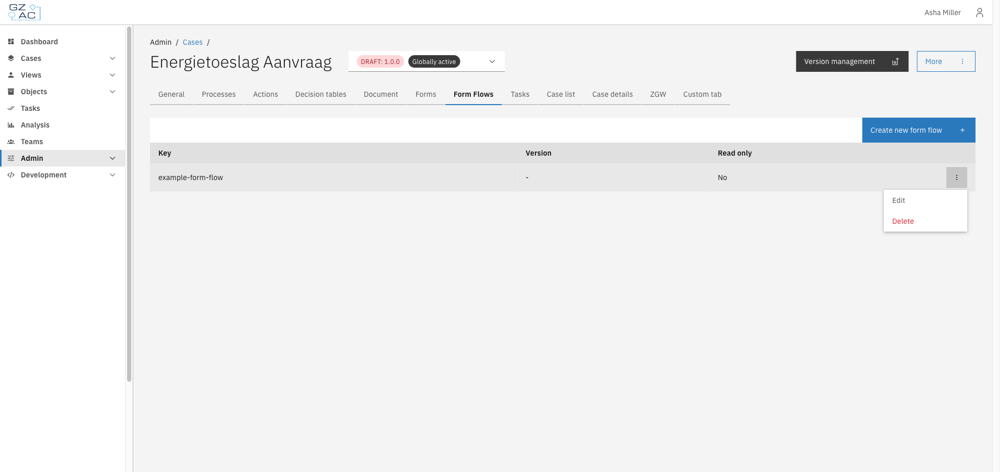<figcaption>Edit and Delete options for a form flow in the list.</figcaption></figure>

Deleting a form flow requires confirmation.

<figure>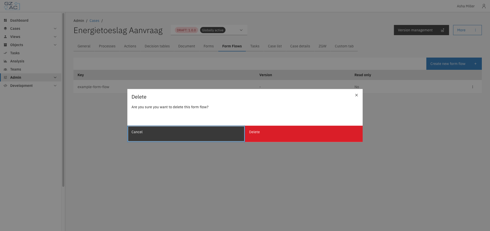<figcaption>Confirm deletion of a form flow.</figcaption></figure>

