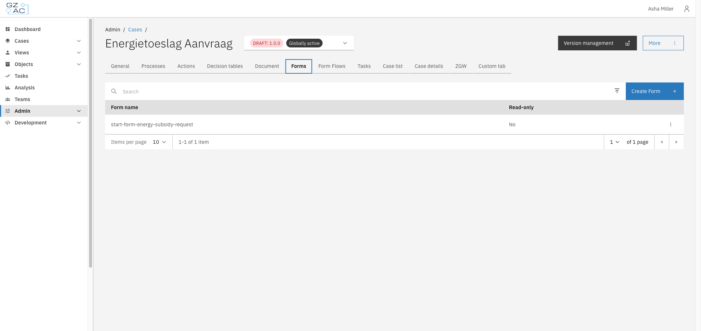
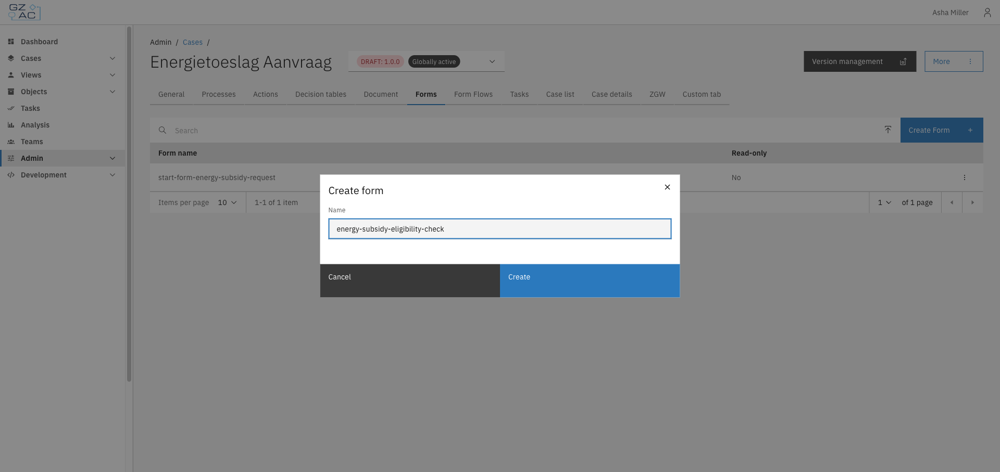
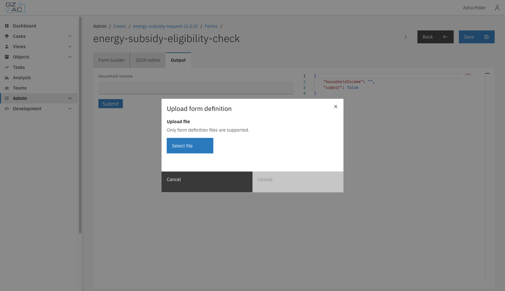
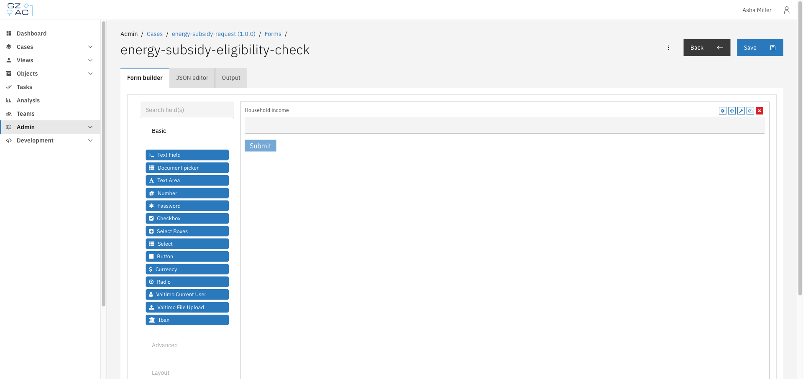
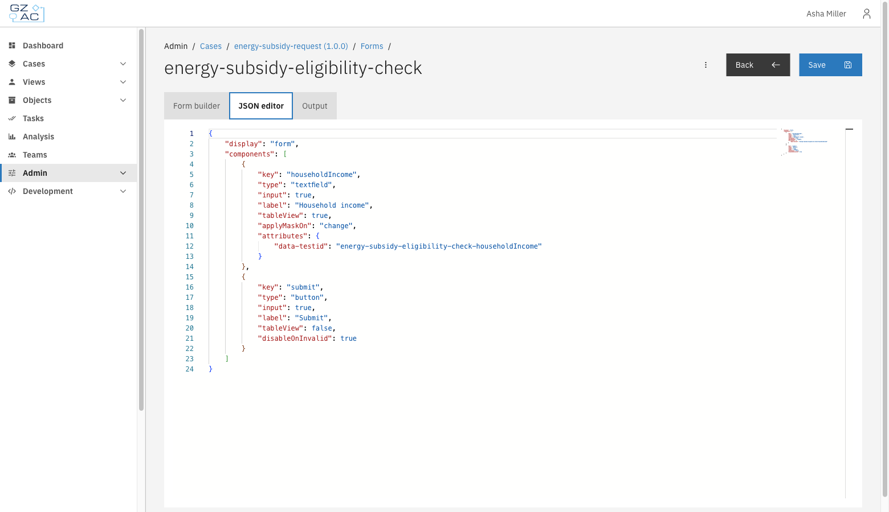
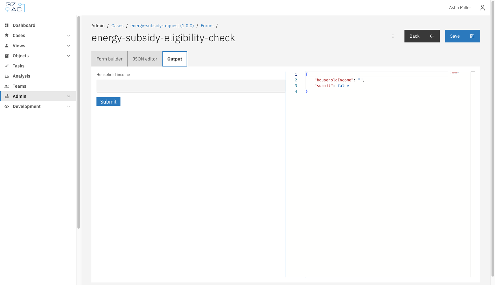
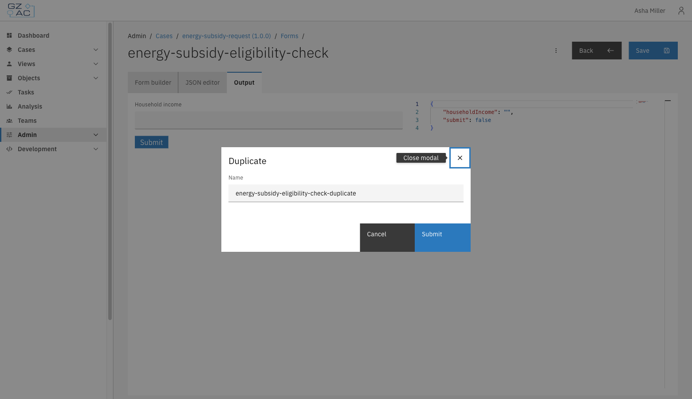
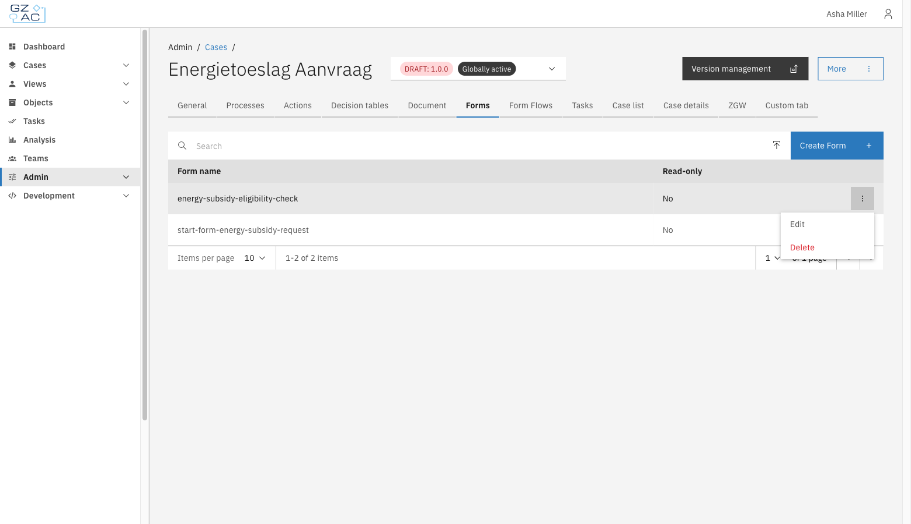
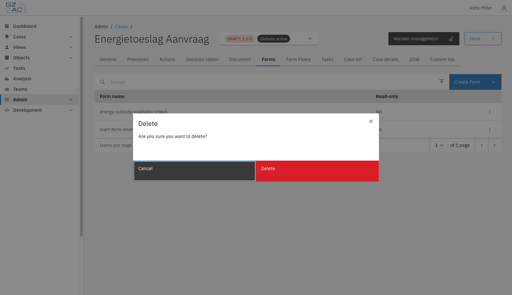

# Forms

The Forms tab lets you manage the Form.io form definitions available for the case. These forms are used as start forms, user task forms, and other form-driven steps within the case's processes.

## Overview

Each form definition is a [Form.io](https://form.io) form: a JSON structure describing input fields, layout, and validation, built with a drag-and-drop builder. Forms can be created from scratch, uploaded from a `.json` file, or duplicated from an existing form.

Some forms are marked **Read-only** — for example, forms that are deployed from the classpath as part of a case's default configuration. Read-only forms can be viewed and downloaded but not edited, uploaded to, or deleted.

---

## Configuring forms



Expand **Admin** in the left sidebar


Click **Cases** under the Configuration section


Click a case definition to open it


Click the **Forms** tab

<figure><figcaption></figcaption></figure>



The list shows every form definition available to the case, with its **Form name** and whether it's **Read-only**. Use the search field to filter by name.


Forms can only be created, uploaded, duplicated, or deleted on a draft case version. Published versions are read-only.


### Creating a form



Click **Create Form**


Enter a **Name** for the form

<figure><figcaption></figcaption></figure>


Click **Create**



An empty form definition is created and opens directly in the form editor.

### Uploading a form

To upload an existing form definition from a `.json` file:



Click the upload icon in the toolbar, next to **Create Form**


Enter a **Name** for the form and click **Create**


Select the `.json` file to upload

<figure><figcaption></figcaption></figure>


Click **Upload**



The uploaded file replaces the (empty) content of the newly created form.


Only Form.io form definition files (`.json`) are supported.


### Editing a form

Click a row, or use **Edit** from the row's overflow menu (⋮), to open a form in the editor. The editor has three tabs:

**Form builder** — drag components from the palette onto the canvas to compose the form.

<figure><figcaption></figcaption></figure>

**JSON editor** — view and edit the raw Form.io JSON definition directly.

<figure><figcaption></figcaption></figure>

**Output** — preview the rendered form and see the JSON output it would produce on submission.

<figure><figcaption></figcaption></figure>

Click **Save** to persist changes. The **Save** button, and the JSON editor, are disabled when the form is read-only or the case version isn't a draft — in that case a blue **Read-only** tag appears next to the form name.

### Form actions

Use the overflow menu (⋮) in the editor header for additional actions:

<figure><figcaption></figcaption></figure>

- **Download** — download the form definition as a `.json` file
- **Upload** — replace the current form's content by uploading a `.json` file
- **Duplicate** — copy the form under a new name

<figure><figcaption></figcaption></figure>

- **Delete** — remove the form definition

### Managing forms in the list

From the list, use the row's overflow menu (⋮) to **Edit** or **Delete** a form directly, without opening it first.

<figure><figcaption></figcaption></figure>

Deleting a form, whether from the list or from within the editor, requires confirmation:

<figure><figcaption></figcaption></figure>


Deleting a form cannot be undone. Any process link or case configuration that references the deleted form will stop working correctly.

