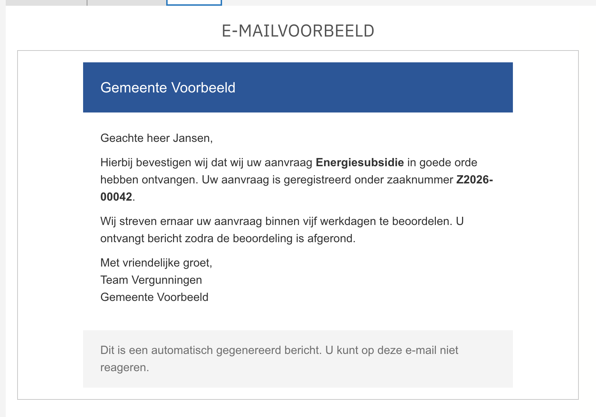
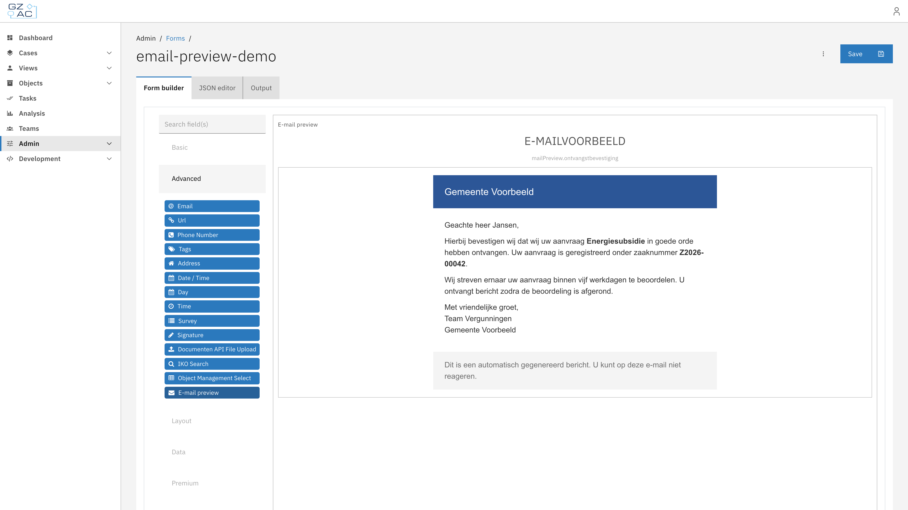
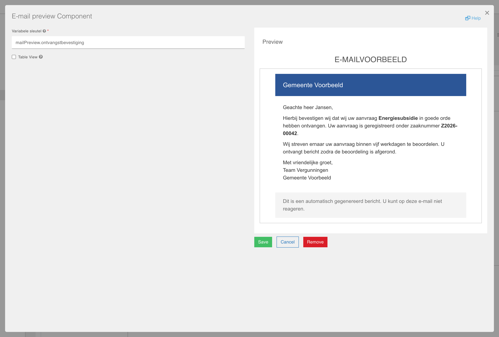
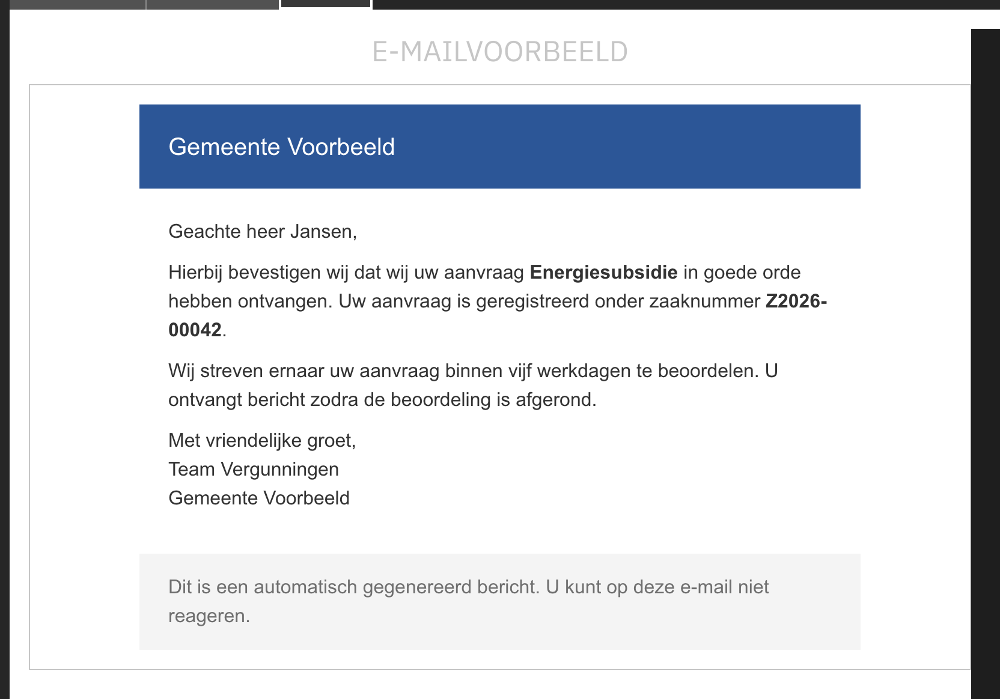

# E-mail preview component

Display a rendered preview of an e-mail inside a form.

## Overview

The E-mail preview component is a custom Form.io component that renders e-mail HTML from a
case or process variable inside a form. This allows a case worker to see the exact e-mail —
for example an automatically generated confirmation — directly in a user task, before it is
sent or after it has been stored on the case.

The component is read-only: it does not collect input, it only renders the HTML value found
at the configured variable key.

## How it works

The component key is automatically set to the configured **Variabele sleutel** (variable
key). Because the key matches the data path of the variable, the standard Valtimo form
prefilling fills the component with the e-mail HTML stored at that path, and the component
renders it as an e-mail preview.

- When a value is present, it is rendered as HTML inside a bordered preview area, below an
  **E-MAILVOORBEELD** header.
- When no value is available yet, a placeholder text is shown instead
  (_Hier wordt het e-mailvoorbeeld getoond._).
- In the form builder, the configured variable key is displayed underneath the header as a
  reminder of which variable is previewed. On rendered forms this key is hidden.

<figure><figcaption><p>A rendered e-mail preview on a form</p></figcaption></figure>


The component renders the variable value as raw HTML. Only point it at trusted content that
is generated by your own implementation (for example e-mail templates filled by a process),
never at free user input.


## Registration

The component must be registered in the application module before it can be used in forms.

```typescript
import {registerFormioMailPreviewComponent} from '@valtimo/components';

@NgModule({
  // ...
})
export class AppModule {
  constructor(private readonly injector: Injector) {
    registerFormioMailPreviewComponent(injector);
  }
}
```

After registration, the **E-mail preview** component appears in the Form.io form builder
under the **Advanced** section.

## Adding the component to a form



Open a form in the form editor, for example from the case's [Forms](../forms.md) tab


In the form builder, expand the **Advanced** group in the component palette and drag
**E-mail preview** onto the form

<figure><figcaption><p>The E-mail preview component in the form builder</p></figcaption></figure>


Configure the component and press **Save**, then save the form



## Configuration

<figure><figcaption><p>The E-mail preview component settings</p></figcaption></figure>

| Field | Required | Description |
|-------|----------|-------------|
| Variabele sleutel | Yes | The data path of the variable that contains the e-mail HTML (e.g. `mailPreview.ontvangstbevestiging`). The component key is automatically set to this path. |
| Table View | No | If checked, the value shows up in the table view of the submissions list. |

### Form JSON example

```json
{
  "type": "valtimo-mail-preview",
  "key": "mailPreview.ontvangstbevestiging",
  "label": "E-mail preview",
  "hideLabel": true,
  "input": true,
  "customOptions": {
    "variableKey": "mailPreview.ontvangstbevestiging"
  }
}
```

## Dark mode

E-mails are authored against a light background. Like an e-mail client, the preview surface
therefore always stays light, regardless of the active Valtimo theme, so the e-mail keeps
displaying exactly as the recipient sees it. The rest of the component follows the active
theme.

<figure><figcaption><p>The e-mail preview in dark mode</p></figcaption></figure>

## Related

* [Forms](../forms.md)
* [What is a form?](../../../fundamentals/form.md)
