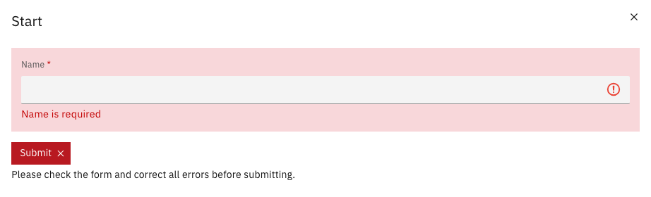
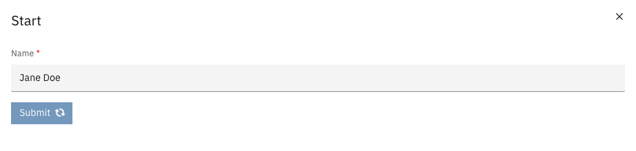
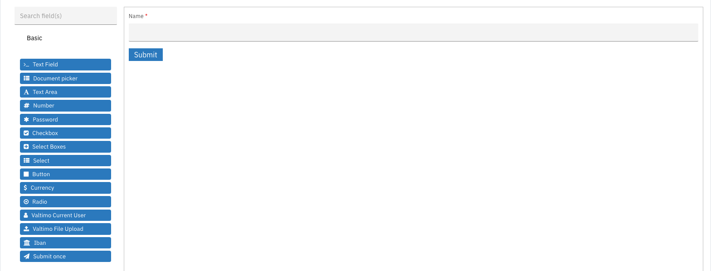
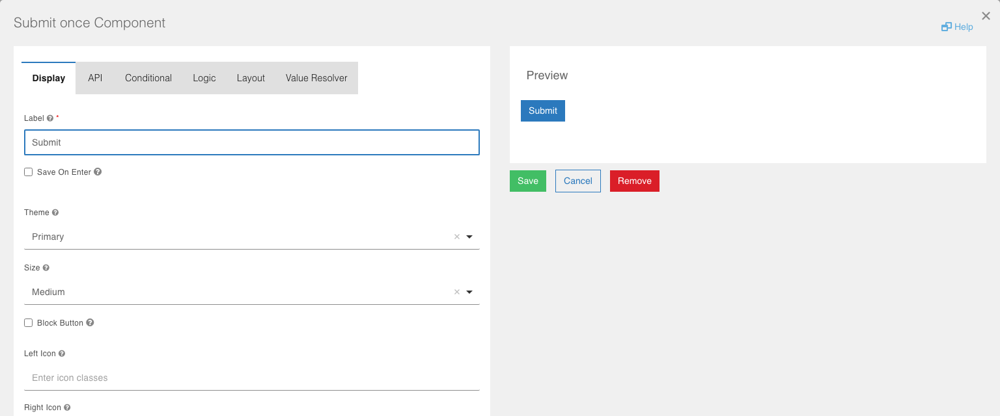

# Submit once button


Available since Valtimo `13.50.0`


A submit button that submits a form only once, however often it is clicked.

## Overview

With the standard Form.io submit button, a user who clicks several times before the form closes
can submit the form more than once: a task is completed twice, or a case is started twice. The
**Submit once** button prevents this.

The Submit once button is the standard submit button with one difference: after the first
successful click it stays disabled. Validation, the highlighting of required fields and the
loading spinner behave exactly as with the standard submit button. Existing forms are not
changed; the button is only used on forms that contain it.

---

## How it works

* When a user clicks **Submit once** and the form is valid, the form is submitted and the button
  is disabled, showing its loading spinner. Further clicks are ignored.
* When the form is not valid, for example because a required field is empty, nothing is
  submitted. The fields are highlighted as with the standard submit button, and the button
  remains usable. After the user corrects the form, one click submits it.

  <figure><figcaption><p>Empty required field</p></figcaption></figure>
* When the screen that shows the form reports that the submit failed, the button becomes usable
  again, so the user can retry without reloading the page. The task screen, the start form of a
  case, the start form of a supporting process and form flows report failures this way.

<figure><figcaption><p>Button disabled after submit</p></figcaption></figure>


After a successful submit, the button stays disabled until the form is opened again. On a screen
that neither closes the form after submitting nor reports a failed submit back to the form, a
failed submit leaves the button disabled until the page is reloaded.


---

## Registration

The component must be registered in the application module before it can be used in forms.

```typescript
import {registerFormioSubmitOnceButtonComponent} from '@valtimo/components';

@NgModule({
  // ...
})
export class AppModule {
  constructor() {
    registerFormioSubmitOnceButtonComponent();
  }
}
```

After registration, the **Submit once** button appears in the Form.io form builder under the
**Basic** group.

---

## Adding the button to a form



Open a form in the form editor, for example from the case's [Forms](../forms.md) tab


In the **Basic** group of the component palette, drag **Submit once** onto the form. Use it
instead of the standard submit button, not next to it.

<figure><figcaption><p>Submit once in the form builder</p></figcaption></figure>


Configure the button and press **Save**, then save the form



---

## Configuration

The Submit once button has the same settings as the standard Form.io button, except **Action**:
the button always submits the form.

<figure><figcaption><p>Submit once settings</p></figcaption></figure>

| Property | Description |
|----------|-------------|
| Label | The text on the button. Defaults to **Submit**. |
| Theme | The color of the button, for example **Primary**. |
| Size | The size of the button. |
| Block Button | If checked, the button spans the full width of the form. |
| Left Icon / Right Icon | Optional icon classes shown beside the label. |

### Form JSON example

```json
{
  "type": "submitOnceButton",
  "label": "Submit",
  "key": "submit",
  "action": "submit",
  "theme": "primary",
  "input": true
}
```

---

## Related

* [Forms](../forms.md)
* [Form flows](../form-flows.md)
* [E-mail preview component](./email-preview-component.md)
* [What is a form?](../../../fundamentals/form.md)
