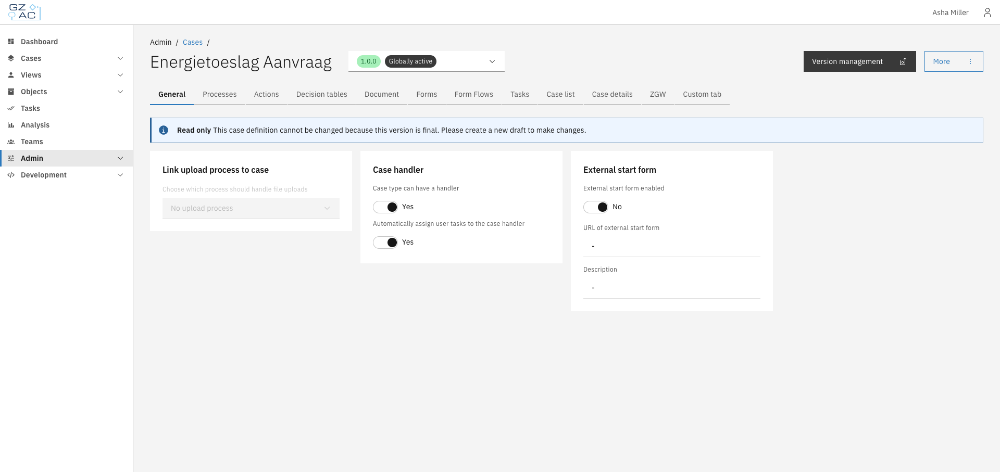
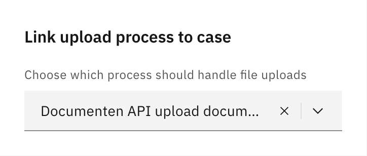
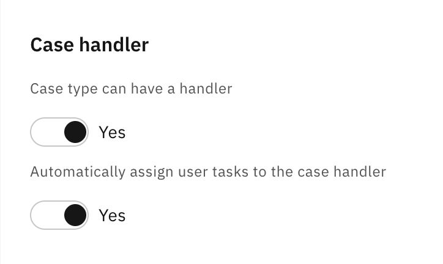
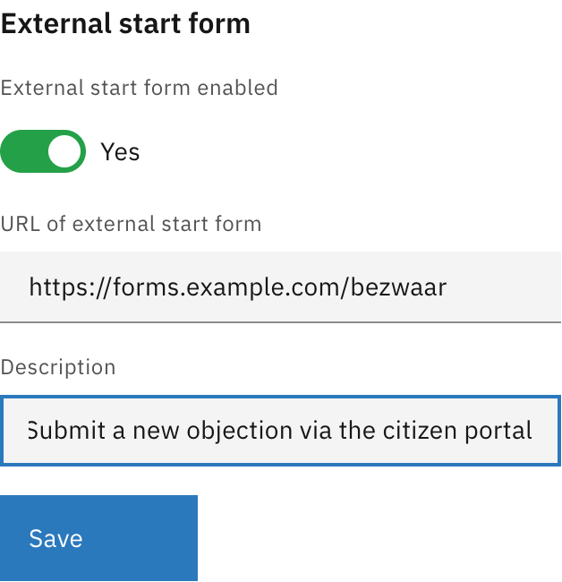

# General

The General tab configures case-level settings that affect how the case behaves across the
application. These settings include case handler assignment, external start forms, and document
upload handling.

## Configuration

Navigate to **Admin** > **Cases** > select a case > **General** tab.


Settings on this tab can only be modified in draft versions. Published versions are read-only.


### Link upload process to case

Select which process should handle file uploads for this case type. When users upload documents
to a case, the selected process is started to handle the upload.

| Property | Description |
|----------|-------------|
| Process | The BPMN process to start when files are uploaded to cases of this type |

Leave empty if document uploads should not trigger a process.

### Case handler

Configure whether cases of this type can be assigned to a handler (case worker) and whether
tasks should automatically be assigned to the case handler.

| Property | Description |
|----------|-------------|
| Case type can have a handler | When enabled, cases can be assigned to users. This enables the assignment UI in the case detail view. |
| Automatically assign user tasks to the case handler | When enabled, new user tasks are automatically assigned to the current case handler. Only available when "Case type can have a handler" is enabled. |

### External start form

Configure an external form URL that users can access to start new cases. This is useful when
case creation happens through an external portal or citizen-facing form application.

| Property | Description |
|----------|-------------|
| External start form enabled | Toggle to enable or disable the external form link |
| URL of external start form | The full URL where users can access the form (e.g., `https://forms.example.com/request`) |
| Description | Label shown in the "Start new case" modal as a clickable tile. When users have multiple ways to start a case (external form + linked processes), this text helps them identify the external form option. |

When enabled, click **Save** to apply changes.

### Missing plugin configurations

When importing a case definition from another environment, plugin configurations referenced in
process links may not exist in the target environment. When this occurs, a notification appears
at the top of the General tab allowing you to map the missing configurations to existing ones.

For each missing plugin configuration:

1. Select an existing plugin configuration from the dropdown
2. Click **Save** to apply the mapping

This resolves the "Needs configuration" status shown in the case list.

## Access control

The General tab is only accessible to users with the `ROLE_ADMIN` role. Individual settings on
this tab do not have separate access control — they are all-or-nothing based on case management
access.

For case handler assignment permissions, see the case access control documentation in
[Cases](README.md#access-control).
