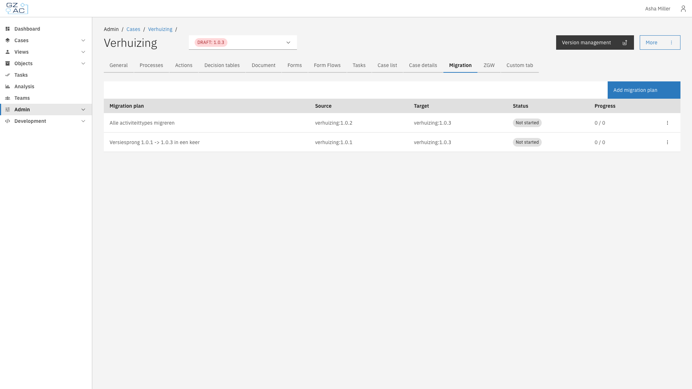
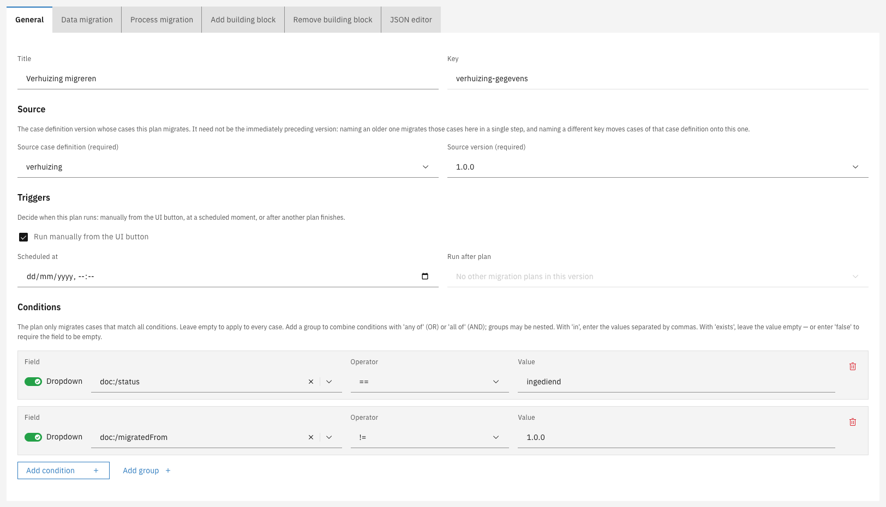
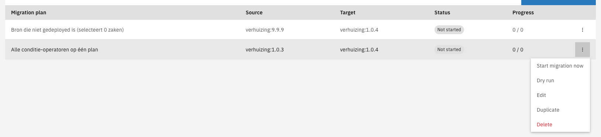

# Migration

A case definition changes over time: new versions add fields, change the data model, or adjust the
process. Cases that were already running stay on the version they were started on, which over time
leaves cases spread across many versions and makes reporting and maintenance harder.

Migration moves existing cases forward — their data and their running process — from an older
version to a newer one, in a controlled and repeatable way. The configuration that describes such a
move is a **migration plan**.

Use migration when:

- A new version changed the data model and existing cases must match it.
- Reporting must run over one consistent data structure.
- A new version contains fixes that older cases should also receive.

This section covers:

- **[Conditions](conditions.md)** — Selecting which cases a plan migrates
- **[Source and target](source-and-target.md)** — Which version a plan reads from and writes to
- **[Building blocks](building-blocks.md)** — Adding, removing, and following building blocks
- **[Running a plan](running-a-plan.md)** — Triggers, dry runs, monitoring, and results


Building block definitions have a **Migration** tab of their own. Building block plans use the same
editor, but they are never started by hand and have no triggers, conditions, or dry run of their
own. See [Building blocks](building-blocks.md) and
[Building blocks > Migration](../../building-blocks/migration.md).


---

## How it works

A migration plan belongs to the version cases are moved **into** — the target. When the plan runs,
Valtimo goes through the eligible cases and, for each one:



Moves the case onto the target version


Applies the configured data changes


Migrates the case's running process to the new version



Migration is all-or-nothing per case: a case is either fully migrated or left untouched. A case that
cannot be migrated is reported as failed and stays on its old version, while the remaining cases
continue. A run can therefore be started again later — cases that were already migrated are skipped.


Changed case data is validated against the new version's data model before it is saved. Data that
does not fit the model fails that case and leaves it untouched.


---

## Finding the migration screen



Expand **Admin** in the left sidebar


Click **Cases** under the Configuration section


Click a case definition to open it


Select the version to migrate cases into


Click the **Migration** tab

<figure><figcaption>Migration tab</figcaption></figure>



The list shows every migration plan for that version:

| Column         | Description                                                                       |
|----------------|-----------------------------------------------------------------------------------|
| Migration plan | The plan's title                                                                  |
| Source         | The version the plan migrates cases from                                          |
| Target         | The version the plan migrates cases into — always the version the plan belongs to |
| Status         | Not started, Running, Completed, or Completed with errors                         |
| Progress       | Cases migrated out of the total, with a tag for the number of errors and warnings |

Click a plan to open its read-only detail modal, which shows the results of the last run. See
[Running a plan](running-a-plan.md).


A version can hold several plans, each handling a different group of cases. Use
[conditions](conditions.md) to target a group, and the **Run after plan** trigger to order them.


---

## Creating a migration plan



Click **Add migration plan**


Fill in the plan across the editor tabs

<figure><figcaption>Plan editor, General tab</figcaption></figure>


Click **Save** in the page header. **Cancel** discards the plan



Each editor tab covers one part of the plan:

| Tab                   | Description                                                                                                                                                                                                                                                                                                                           |
|-----------------------|---------------------------------------------------------------------------------------------------------------------------------------------------------------------------------------------------------------------------------------------------------------------------------------------------------------------------------------|
| General               | The plan's **Title** and **Key** (generated from the title, editable), the **Source** it migrates from, the **Triggers** that decide when it runs, and the **Conditions** that decide which cases it applies to. See [Source and target](source-and-target.md), [Running a plan](running-a-plan.md), and [Conditions](conditions.md). |
| Data migration        | What happens to the case data. Click **Add patch** to add a row. Each patch writes one **Target field** from a **Source**: copy a field's value (**Path**), set a **Fixed value** (**Value**), or clear it (**Null**). A **Target type** can be set per patch, or left on **Auto**.                                                    |
| Process migration     | How the running process moves. Click **Add process migration** to add an instruction. Each instruction pairs a **Source process** with a **Target process** and maps each **Source activity** onto a **Target activity**. Process variables can be set during the migration.                                                          |
| Add building block    | Optionally creates building blocks on each migrated case. See [Building blocks](building-blocks.md).                                                                                                                                                                                                                                  |
| Remove building block | Optionally dissolves building blocks on each migrated case. See [Building blocks](building-blocks.md).                                                                                                                                                                                                                                |
| JSON editor           | A raw view of the whole plan. Everything here is also editable through the guided tabs.                                                                                                                                                                                                                                               |

Plans are configured in the UI and saved with the case definition, so the same plan behaves
identically in every environment.


Field pickers throughout the editor have a **Dropdown** / **Manual** toggle. **Dropdown** offers the
fields of the relevant data model; **Manual** accepts a path typed by hand, for paths the dropdown
does not offer.



Activity mapping follows the process engine's rules: activities are mapped onto activities of a
compatible type. The editor reports an incompatible mapping so it can be corrected before saving.


---

## Managing plans

The overflow menu (⋮) on a plan's row offers the following actions:

| Action              | Effect                                                                                                  |
|---------------------|---------------------------------------------------------------------------------------------------------|
| Start migration now | Runs the plan. Unavailable on plans without the manual trigger. See [Running a plan](running-a-plan.md) |
| Dry run             | Simulates the plan without changing anything. See [Running a plan](running-a-plan.md)                   |
| Edit                | Reopens the plan editor to change any part of the plan                                                  |
| Duplicate           | Creates a copy as a starting point for a similar plan, named with a `copy` suffix                       |
| Delete              | Removes the plan. This cannot be undone                                                                 |

<figure><figcaption>Plan row actions</figcaption></figure>

**Dry run** and **Start migration now** are also available in the footer of a plan's detail modal.
