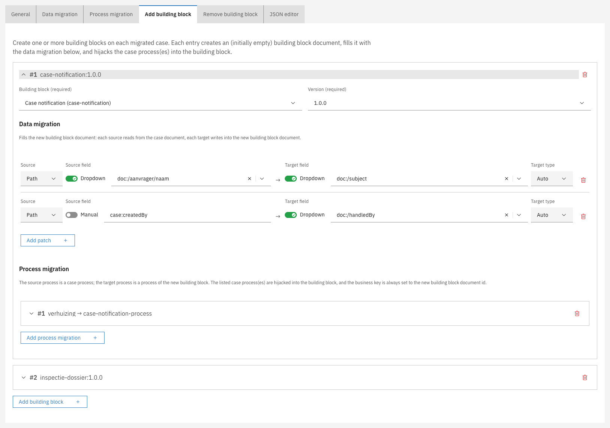
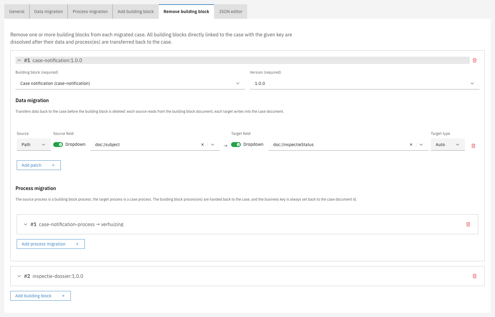

# Building blocks

A new case version may change how a case is split into building blocks, not just its data and
process. A migration plan handles this as part of the same run, through the **Add building block** and
**Remove building block** tabs.

- **Add building block** creates one or more building blocks on each migrated case. Each entry
  selects the building block and version to create, fills the new building block with its own data
  migration reading from the case, and moves one of the case's processes into it.
- **Remove building block** dissolves one or more building blocks on each migrated case. Each
  entry transfers the building block's data back to the case with its own data migration, and hands
  its processes back to the case.

A building block can itself contain building blocks, so a building block plan has the same two tabs.
There the owner is the migrating building block instead of the case: **Add building block** creates a
block nested inside it, and **Remove building block** dissolves a nested block.

---

## Adding a building block



Open the plan editor and go to the **Add building block** tab


Click **Add building block** and select the **Building block** and **Version** to create

<figure><figcaption>Add building block entry</figcaption></figure>


Under the entry's **Data migration**, click **Add patch** for each value to carry over. The source
reads from the case document, the target writes into the new building block document


Under the entry's **Process migration**, click **Add process migration** to select the case process
to move into the building block and map its activities onto the building block's process



Each entry is a collapsible card, numbered and labelled with the building block and version it
creates. Expand a card to configure it; collapse it to see the plan's entries at a glance.


Adding a building block does not start a new process. It moves a process that is already running into
the new building block.


The building block is created empty, filled from the case, and then takes over one of the case's
running processes. That process keeps its activities and its position, but from then on belongs to the
building block. Nothing is started, and nothing is copied. This is what allows a case halfway through
its process to keep its progress while the work moves into a building block, and it is also the source
of every limitation below.

### What adding a building block supports

| Capability                                 | Description                                                                                                                                                                                 |
|--------------------------------------------|---------------------------------------------------------------------------------------------------------------------------------------------------------------------------------------------|
| Move the case's own process                | The work the case was doing becomes work the building block does                                                                                                                            |
| Create several building blocks in one plan | A case can have more than one process running at the same time, and each entry takes over one of them                                                                                       |
| Move a sub-process                         | If the case's process calls another process, an entry can take over that called process instead of the main one. The result behaves exactly like a building block the case started normally |
| Fill the new building block from the case  | Each entry has its own data migration, reading from the case document and writing into the new building block document                                                                      |
| Re-map process activities                  | Each entry has its own process migration, so the activities of the process being taken over can be mapped onto the building block's process model                                           |
| Nest inside a building block               | On a building block plan, the same tab nests a new building block inside the migrating one                                                                                                  |

### Limitations


One process cannot be split into two. If the old version does everything in one process and the new
version should have a shorter process that calls a building block, adding a building block cannot
produce that: the case's process becomes the building block's process, so nothing is left to do the
calling.


This limitation rarely applies when carving work out of a large process into a building block:

- Cases whose process has **not yet reached** that work need no building block entry at all. Migrate
  them normally onto the new version. When the process arrives at the point where the new version
  calls the building block, the building block is created there and then, exactly as for a new case.
- The same holds for cases already **past** that work.
- Only cases **executing that work at the moment of migration** are affected. Let the new version keep
  the old activity alongside the new call for a while, so those cases can be mapped onto the old
  activity, and drop it in a later version once no case is sitting there.

The remaining limitations:

| Limitation                                     | Behavior                                                                                                                                                                                                                                                                                                                                              |
|------------------------------------------------|-------------------------------------------------------------------------------------------------------------------------------------------------------------------------------------------------------------------------------------------------------------------------------------------------------------------------------------------------------|
| No running process means no building block     | If a case has no running process for the entry to take over — a closed case, for example — the entry is skipped and no building block is created. The case still migrates and is not reported as failed, but is listed under **Cases with warnings** with the process that was looked for and not found                                               |
| Every entry needs a process to take over       | An entry that names a building block but no process migration can never create anything, so it is refused on save and again on run. The same applies to an entry naming a process that neither version deploys                                                                                                                                        |
| The target version must use the building block | A plan can only add a building block version that the target case version links, either as a startable item or through a call in one of its processes. Otherwise the building block would be created once and never migrated again by a later plan, because a building block only moves when the version owning it says which version it should be on |
| Adding happens before removing                 | Within one plan, building blocks are added before any are removed, so an entry cannot take over a process that another entry in the same plan is about to hand back. Use two plans chained with **Run after plan** instead                                                                                                                            |
| An entry takes over a whole process instance   | There is no way to move only some activities of a running process into a building block                                                                                                                                                                                                                                                               |


Check the **Cases with warnings** list after a run, and after a dry run, which reports the same
warnings without changing anything. It distinguishes "these cases had nothing to take over" from
"this plan never creates anything".


---

## Removing a building block



Open the plan editor and go to the **Remove building block** tab


Click **Add building block** and select the **Building block** and **Version** to dissolve

<figure><figcaption>Remove building block entry</figcaption></figure>


Under the entry's **Data migration**, add a patch for each value to transfer back. The source reads
from the building block document, the target writes into the case document


Under the entry's **Process migration**, map the building block's processes onto a case process



All building blocks directly linked to the case with the given key are dissolved, after their data and
processes are transferred back to the case.

---

## How building blocks follow a case

A building block lives inside a case, so a building block plan is never started by hand. It runs when
a case migration moves a building block onto the plan's version, and applies to exactly the building
blocks that case migration brings with it. A case that never migrates keeps its building blocks where
they are.

Which building block a case's existing block becomes is read from the case's **new** version: the
building blocks it offers as startable items and the ones its processes call.

| Situation                                                        | Result                                                                                                                                  |
|------------------------------------------------------------------|-----------------------------------------------------------------------------------------------------------------------------------------|
| The new version links a newer version of the same building block | The block is brought up to that version                                                                                                 |
| The new version links a different building block                 | The block is carried over to that building block, which is how one building block replaces another without abandoning running instances |

This requires a **chain of migration plans** leading from the version the block is on to the version
the case links. The plans' own sources form that chain. One plan may cover the whole jump, or there
may be one plan per step — including a step that changes nothing, because every building block version
publishes its own process model and a running block must be moved onto it explicitly.


Two situations stop the migration rather than guess, and both fail the whole case, leaving nothing
half-migrated:

- **Nothing connects them.** No chain of plans leads from where the block is to where the case wants
  it. Add the missing plan.
- **More than one chain connects them.** Which transformations a running block goes through would be
  arbitrary. Remove or re-source one of the plans so a single chain remains.
  

Dry-running the case migration walks the identical chain, so it reports either problem before a real
run does. See [Running a plan](running-a-plan.md).
