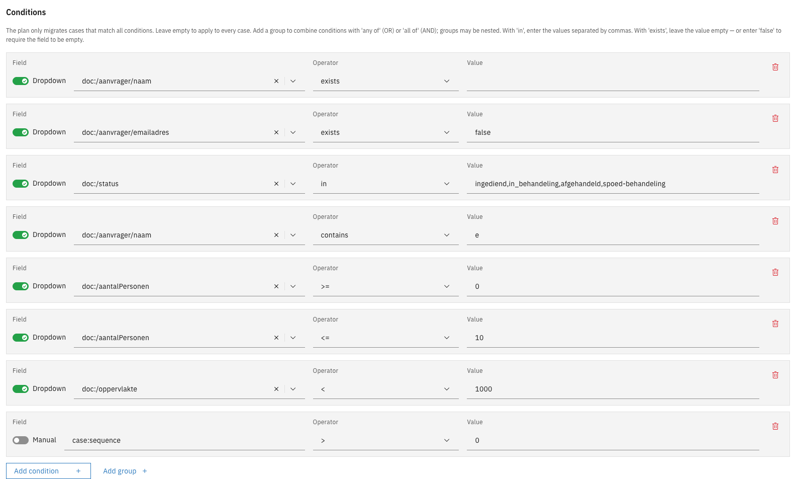
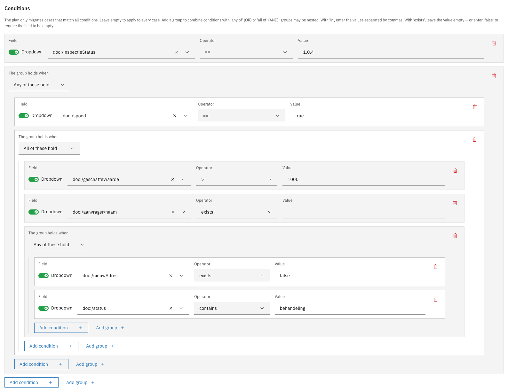

# Conditions

Conditions on the **General** tab of a migration plan decide which cases the plan migrates. A case is
migrated only when all conditions hold. Cases that do not match are left to other plans.

Leave the conditions empty to apply the plan to every case on the source version.

---

## Configuring a condition



Open the plan editor and go to the **General** tab


Under **Conditions**, add a condition and fill in its field, operator, and value

<figure><figcaption>Conditions and operators</figcaption></figure>



A condition consists of a **Field** (a value on the case, such as its status or a field in its data),
an **Operator**, and a **Value**. A case whose value cannot be read does not match.

The Field column has a **Dropdown** / **Manual** toggle. Leave it on **Dropdown** to pick a field
from the case's data model, or switch to **Manual** to type a path the dropdown does not offer, such
as `case:sequence`.

| Operator             | Matches when                                                                                                                  |
|----------------------|-------------------------------------------------------------------------------------------------------------------------------|
| `==`, `!=`           | The field is (not) equal to the value                                                                                         |
| `>`, `>=`, `<`, `<=` | The field is greater or smaller than the value. Numbers are compared as numbers, anything else alphabetically                 |
| `in`                 | The field equals one of several values. Enter the values separated by commas, for example `in-behandeling,wacht-op-klant`     |
| `contains`           | The field contains the value: one of the entries when the field holds a list, part of the text when it holds a single value   |
| `exists`             | The field has a value at all. Leave the value empty, or enter `false` to match only cases where the field is empty or missing |

---

## Combining conditions with groups

Conditions listed one after another must all hold. To express an either/or, add a **group**. Each
group has a **The group holds when** selector, set to either **Any of these hold** (OR) or **All of
these hold** (AND). A group can contain other groups, so conditions can be combined to any shape.



Under **Conditions**, click **Add group**


Set **The group holds when** to **Any of these hold** or **All of these hold**


Add conditions, or further groups, inside it

<figure><figcaption>Nested condition groups</figcaption></figure>



A group must contain at least one condition, and groups may be nested up to ten levels deep.

<details>
<summary>Example: a nested combination in the plan JSON</summary>

The combination "status is `in-behandeling`, and either the case is marked urgent or (the amount is
at least 1000 and a file number is present)" reads as follows in the **JSON editor** tab:

```json
"conditions": [
{"path": "case:internalStatus", "operator": "==", "value": "in-behandeling"},
{
"anyOf": [
{"path": "doc:/spoed", "operator": "==", "value": true},
{
"allOf": [
{"path": "doc:/bedrag", "operator": ">=", "value": 1000},
{"path": "doc:/dossier", "operator": "exists"}
]
}
]
}
]
```

</details>


Building block migration plans have no conditions. They apply to every building block instance the
case migration brings onto the plan's version. See [Building blocks](building-blocks.md).

