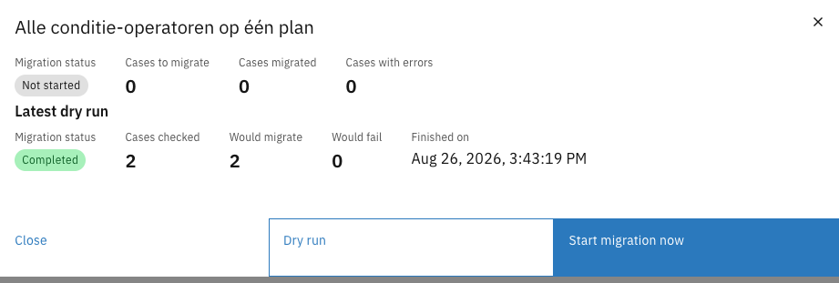
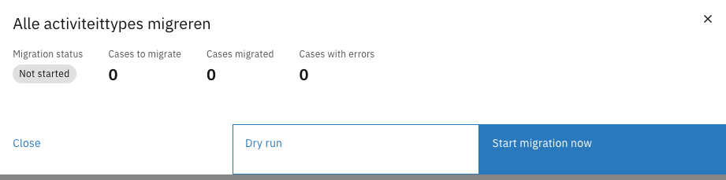

# Running a plan

A migration plan can be started manually, on a schedule, or after another plan finishes. Before
starting it for real, a dry run validates the plan against real data without changing anything.

---

## Triggers

Triggers are configured under **Triggers** on the **General** tab of the plan editor.

| Trigger                         | Effect                                                                                                                                       |
|---------------------------------|----------------------------------------------------------------------------------------------------------------------------------------------|
| Run manually from the UI button | The plan is started with the **Start migration now** button on the migration screen. This is the default and the safest option               |
| Scheduled at                    | The plan starts automatically at the configured moment                                                                                       |
| Run after plan                  | The plan starts once the selected plan has finished. This is also how run order is controlled: split work into separate plans and chain them |


Building block migration plans have no triggers. They run automatically when a case migration moves a
building block onto the plan's version. See [Building blocks](building-blocks.md).


---

## Plan actions

Every action on a plan is reached in one of two places on the **Migration** tab:

- The **overflow menu** (⋮) on the plan's row, which holds **Start migration now**, **Dry run**,
  **Edit**, **Duplicate**, and **Delete**.
- The plan's **detail modal**, opened by clicking the row. The modal is read-only and shows the run
  results described under [Monitoring and results](#monitoring-and-results). Its footer repeats
  **Dry run** and **Start migration now** alongside **Close**.

<figure><figcaption>Plan row actions</figcaption></figure>


**Start migration now** is unavailable on plans without the manual trigger. A plan set to run on a
schedule or after another plan is started by that trigger, not by hand.


---

## Dry run

A dry run goes through exactly the cases the plan would migrate and simulates migrating each one,
applying the data changes and the process migration, then rolls everything back. No case data is
changed, no process is moved, and no trace is left, so a dry run is safe against production data —
with one exception, described under [What a rollback cannot undo](#what-a-rollback-cannot-undo).



Open the **Migration** tab of the case definition version


Select **Dry run** from the plan's overflow menu (⋮), or open the plan and click **Dry run** in the
modal footer


Confirm in the dialog


Open the plan and review the **Latest dry run** section

<figure><figcaption>Latest dry run report</figcaption></figure>



The report shows:

| Field                     | Description                                                                                              |
|---------------------------|----------------------------------------------------------------------------------------------------------|
| Cases checked             | How many cases the plan went through                                                                     |
| Would migrate             | How many cases would migrate successfully                                                                |
| Would fail                | How many cases would fail                                                                                |
| Cases that would fail     | The list of failing cases, each with the full reason — the same detail a real run gives for its failures |
| Warnings from the dry run | Cases that would migrate, but where the plan would not do everything it describes                        |

Because a dry run persists nothing, it never affects a later real run. Whether a case counts as
already migrated is decided only by real runs.

A dry run does the same work as a real run, so it runs in the background too and takes about as long.
The plan's status shows **Running** while it does.


A dry run of a case migration also walks the building block migration chain, so it reports a missing
or ambiguous chain before a real run does. Building block plans have no dry run button of their own.


### What a rollback cannot undo

A dry run undoes its work by running the real migration in a database transaction that is never
committed. That covers everything the standard components do — document changes, process migrations,
and building blocks created or dissolved — because all of it is written through the same transaction.


**A call to an external system is not rolled back.**

If a migration runs a component that writes to an API outside Valtimo — a ZGW record, an email, a
webhook — that call has already left the application by the time the transaction rolls back. Nothing
undoes it, and the dry run still reports the case as **Would migrate**, so the report gives no sign
that anything happened outside.



This only applies to custom migration components added to your installation. The components described
in these guides — data migration, process migration, add and remove building block — write nothing
outside the database and are always fully rolled back.

---

## Starting a plan



Open the **Migration** tab of the case definition version


Select **Start migration now** from the plan's overflow menu (⋮), or open the plan and click
**Start migration now** in the modal footer


Confirm in the dialog



The run starts in the background and works through the matching cases one at a time, so the screen
comes straight back and the plan's status moves to **Running**. The run itself takes as long as it
takes — hours, for tens of thousands of cases — and the **Migration** tab follows its progress while
it does.


Nothing has to stay open. Leave the page, or close the browser, and the run carries on; the tab picks
its progress back up when you return. Starting the plan again while it is still running does nothing —
a run in progress keeps its claim on the plan.


Plans with a **Scheduled at** or **Run after plan** trigger are started by an hourly check instead.

Because each case is migrated in its own transaction, a run interrupted by a restart of the
application leaves no half-migrated case behind, and it resumes on its own: the application picks it
up when it comes back, and hourly after that. Cases that already migrated are skipped, so it continues
rather than starts over.

---

## Monitoring and results

The plan list shows a summary per plan:

| Column   | Description                                                                       |
|----------|-----------------------------------------------------------------------------------|
| Status   | Not started, Running, Completed, or Completed with errors                         |
| Progress | Cases migrated out of the total, with a tag for the number of errors and warnings |

Open a plan to see the full result:

<figure><figcaption>Plan detail modal</figcaption></figure>

| Field               | Description                                                                                                                                                                       |
|---------------------|-----------------------------------------------------------------------------------------------------------------------------------------------------------------------------------|
| Migration status    | Not started, Running, Completed, or Completed with errors                                                                                                                         |
| Cases to migrate    | How many cases still need to migrate                                                                                                                                              |
| Cases migrated      | How many cases were migrated                                                                                                                                                      |
| Cases with errors   | How many cases failed                                                                                                                                                             |
| Cases with warnings | Cases that migrated, but where the plan did not do everything it describes — usually because there was no running process to take over. See [Building blocks](building-blocks.md) |
| Started on          | When the run started                                                                                                                                                              |
| Finished on         | When the run finished                                                                                                                                                             |

Below the metrics, **Cases with errors** lists each failed case with its message. Use the chevron to
show or hide the full stacktrace, and the copy icon to copy it. **Cases with warnings** lists the
cases that migrated with skipped work.

Because migration is all-or-nothing per case and already-migrated cases are skipped, the cause of any
failure can be fixed and the plan run again. Only the remaining and failed cases are processed.
