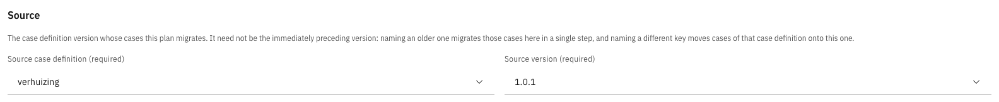

# Source and target

The terms **source** and **target** appear throughout the migration plan editor and always mean the
same thing: the source is where something is read from, the target is where it is written to.

At the level of the whole plan, the target is fixed and the source is configurable. The target is
always the version the plan belongs to, which is why a plan is created under the version cases should
end up on. The source is the version whose cases the plan migrates.

---

## Selecting the source



Open the plan editor and go to the **General** tab


Under **Source**, select a **Source case definition** and a **Source version**

<figure><figcaption>Source selection</figcaption></figure>



| Source                      | Effect                                                                                                                                                                                        |
|-----------------------------|-----------------------------------------------------------------------------------------------------------------------------------------------------------------------------------------------|
| The previous version        | The ordinary case, and what the editor pre-fills for a new plan                                                                                                                               |
| An older version            | Migrates those cases to the target in a single step, instead of requiring a plan on every version in between. Suitable when the intermediate versions change neither the data nor the process |
| A different case definition | Migrates the cases of that case definition onto this one, which is how a renamed or replaced case definition brings its running cases along                                                   |

A plan only touches cases on exactly the version it names. Cases on any other version are left to the
plans that claim them, so several plans may target the same version from different sources without
interfering.


Migrating cases from a different case definition also moves them onto the target's document
definition, which has a different name. Anything keyed on the old document definition name — saved
searches, permissions scoped to it, external integrations — is not rewritten and must be checked.


---

## Source and target within a tab

The same distinction applies inside the editor tabs, where it identifies the document or process
being read from and written to:

| Tab                   | Source                                                     | Target                                                      |
|-----------------------|------------------------------------------------------------|-------------------------------------------------------------|
| Data migration        | The field read from the case document                      | The field written into the migrated case document           |
| Process migration     | The process definition the running instances currently use | The process definition in the target version they move onto |
| Add building block    | The case document and one of its running processes         | The new building block document and its process             |
| Remove building block | The building block document and its processes              | The case document and a case process                        |

See [Building blocks](building-blocks.md) for the building block tabs.
