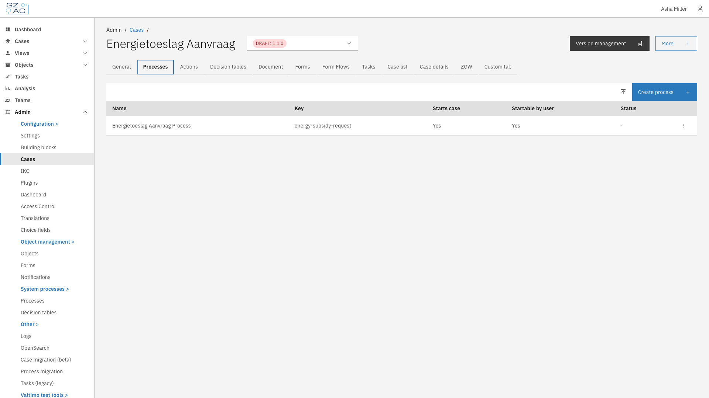
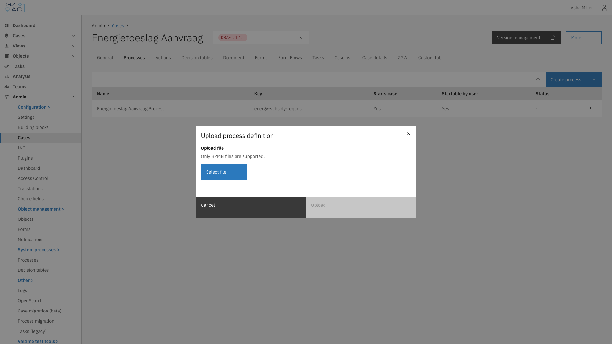
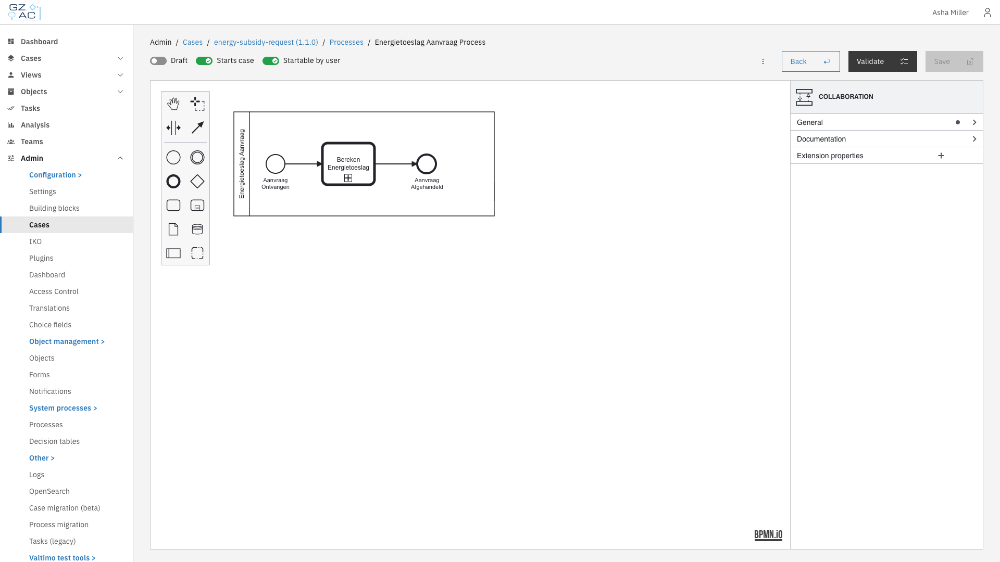

# Processes

The Processes tab lets you manage BPMN process definitions linked to the case definition.

## Overview

Processes define the workflows that drive a case. Each case definition can have multiple
linked processes that handle different aspects of case processing.

Key capabilities:

- Upload existing BPMN process definitions
- Create new processes using the built-in BPMN modeler
- Configure whether a process can start new cases
- Configure whether users can start the process from within an existing case
- Configure process links to connect activities to forms, plugins, and building blocks

## Configuration

Navigate to **Admin** > **Cases** > select a case > **Processes** tab.

<figure><figcaption>The Processes tab displays all process definitions linked to the case.</figcaption></figure>

### Process list columns

| Column | Description |
|--------|-------------|
| Name | Display name of the process definition |
| Key | Technical identifier (process definition key) |
| Starts case | Whether starting this process creates a new case |
| Startable by user | Whether users can start this process from within an existing case |
| Status | Current deployment status (e.g., draft) |

### Uploading a process

1. Click the upload button in the toolbar
2. Select a `.bpmn` file from your computer
3. Click **Upload**

<figure><figcaption>Upload an existing BPMN file to add a process definition.</figcaption></figure>


If you upload a process with a key that already exists, the existing process will be replaced.


### Creating a new process

1. Click **Create process**
2. Design your process using the BPMN modeler
3. Configure process settings using the toggles in the header
4. Click **Save** to deploy

### Editing a process

1. Click on a process row to open the process builder
2. Make changes in the BPMN modeler
3. Click **Save** to deploy changes

<figure><figcaption>The process builder provides a visual BPMN editor with a properties panel.</figcaption></figure>

### Process settings

The process builder header contains toggles to configure process behavior:

| Toggle | Description                                                                                                     |
|--------|-----------------------------------------------------------------------------------------------------------------|
| **Draft** | When enabled, the process is saved as a draft and requires additional confirmation before it can be started     |
| **Starts case** | When enabled, starting this process creates a new case instance. A start form must be linked to the first step. |
| **Startable by user** | When enabled, users can start this process from the case detail page via the start menu                         |

### Validating a process

Click **Validate** to check for errors before saving. Validation errors appear in a
collapsible panel showing the element and issue. Fix any errors before deploying.

### Deleting a process

1. Hover over the process row to reveal the overflow menu
2. Click the overflow menu (three dots)
3. Select **Delete**
4. Confirm deletion in the confirmation dialog

## Access control

Runtime access to processes is controlled through the following permissions.

### Resources and actions

| Resource type | Action | Effect |
|---------------|--------|--------|
| `com.ritense.document.domain.impl.JsonSchemaDocument` | `view` | Required to view process instances linked to a case |
| `com.ritense.valtimo.operaton.domain.OperatonExecution` | `create` | Required to start a process |

### Examples

<details>
<summary>Permission to view process instances for cases</summary>

```json
{
    "resourceType": "com.ritense.document.domain.impl.JsonSchemaDocument",
    "action": "view",
    "conditions": []
}
```

</details>

<details>
<summary>Permission to start any process</summary>

```json
{
    "resourceType": "com.ritense.valtimo.operaton.domain.OperatonExecution",
    "action": "create",
    "conditions": []
}
```

</details>

<details>
<summary>Permission to start a specific process</summary>

```json
{
    "resourceType": "com.ritense.valtimo.operaton.domain.OperatonExecution",
    "action": "create",
    "conditions": [
        {
            "type": "field",
            "field": "processDefinitionKey",
            "operator": "==",
            "value": "my-process-key"
        }
    ]
}
```

</details>
