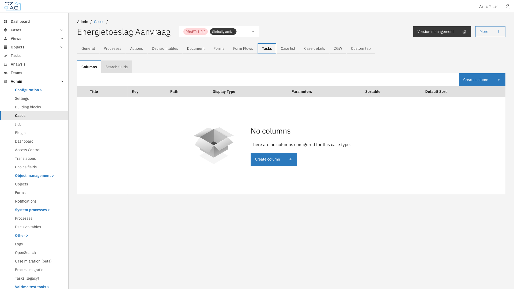

# Tasks

The Tasks tab configures how tasks appear in the end-user task list for a specific case type.
This includes the columns displayed in the list and the search fields available for filtering.

This includes:

- **[Columns](columns.md)** — Columns displayed in the task list
- **[Search fields](search-fields.md)** — Search fields available for filtering tasks

---

## Configuring tasks



Expand **Admin** in the left sidebar


Click **Cases** under the Configuration section


Click a case definition to open it


Click the **Tasks** tab

<figure><figcaption>Tasks tab overview</figcaption></figure>




Task columns and search fields apply to **all** versions of the case definition, not just the
currently selected version. Changes made here affect how all tasks for this case type appear
in the task list.


---

## Access control

Access to tasks can be configured through access control.
More information about access control can be found [here](../../access-control/README.md).

### Resources and actions

| Resource type | Action | Effect |
|---------------|--------|--------|
| `com.ritense.valtimo.operaton.domain.OperatonTask` | `view_list` | Allows viewing tasks in the task list |
| | `view` | Allows viewing individual task details |
| | `claim` | Allows claiming unclaimed tasks |
| | `assign` | Allows assigning tasks to users |
| | `assignable` | Allows being a candidate for task assignment |
| | `complete` | Allows completing tasks |

### Examples

<details>
<summary>Permission to view tasks in the list</summary>

```json
{
    "resourceType": "com.ritense.valtimo.operaton.domain.OperatonTask",
    "action": "view_list",
    "conditions": []
}
```

</details>

<details>
<summary>Permission to complete tasks</summary>

```json
{
    "resourceType": "com.ritense.valtimo.operaton.domain.OperatonTask",
    "action": "complete",
    "conditions": []
}
```

</details>