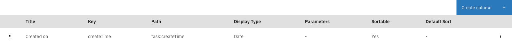
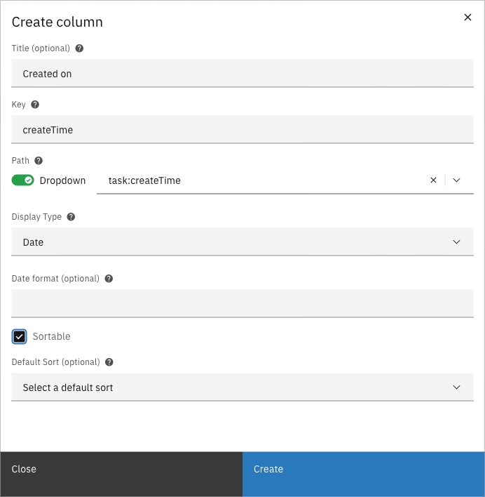

# Columns

Task list columns determine which data fields are visible in the end-user task list for a
specific case type. Each column displays a value from the task, case document, case metadata, or
linked zaak data, and can be configured with sorting and display options.

---

## Configuring columns



Expand **Admin** in the left sidebar


Click **Cases** under the Configuration section


Click a case definition to open it


Click the **Tasks** tab, then the **Columns** sub-tab

<figure><figcaption>Columns configuration</figcaption></figure>



The list shows all configured columns with their key, path, display type, and sorting options.
Drag the handle on the left of each row to reorder columns.

### Creating a column



Click the **Create column** button


Fill in the column properties and select a path from the dropdown

<figure><figcaption>Filled column form</figcaption></figure>


Select a display type and configure additional options (sortable, default sort)


Click **Create** to add the column



#### Column properties

| Property | Description |
|----------|-------------|
| Title | Optional display name for the column header. If not set, the key is used. |
| Key | Unique identifier for the column |
| Path | Path to the data value (e.g., `task:name`, `case:createdOn`) |
| Display type | How the value is rendered in the list |
| Sortable | Whether users can sort the list by this column |
| Default sort | The default sort direction when the list loads (only one column can have a default sort) |

#### Display types

| Type | Description | Additional parameters |
|------|-------------|----------------------|
| Text | Plain text display | None |
| Date | Formatted date | Date format (optional, e.g., `DD-MM-YYYY`) |
| Yes/no | Boolean display as Yes or No | None |
| Enumeration | Maps values to display labels | Key-value pairs for mapping |
| Count | Shows the count of array items | None |
| Underscores to spaces | Replaces underscores with spaces | None |
| Tags | Displays values as tags | Tag amount (how many tags to show) |

#### Path prefixes

| Prefix | Description | Example |
|--------|-------------|---------|
| `task:` | Task fields | `task:name`, `task:createTime`, `task:dueDate` |
| `doc:` | Document (JSON) data fields | `doc:applicantName` |
| `case:` | Case metadata fields | `case:createdOn`, `case:assigneeFullName` |
| `zaak:` | Linked zaak data (ZGW) | `zaak:identificatie` |

### Editing a column

Click a column row to open the edit modal. Modify the properties and click **Save** to apply
changes.

### Deleting a column

Click the overflow menu (three dots) on the right side of a column row and select **Delete**.

### Reordering columns

Drag the handle on the left side of each row to change the column order. The order in the
configuration list matches the order in the end-user task list.