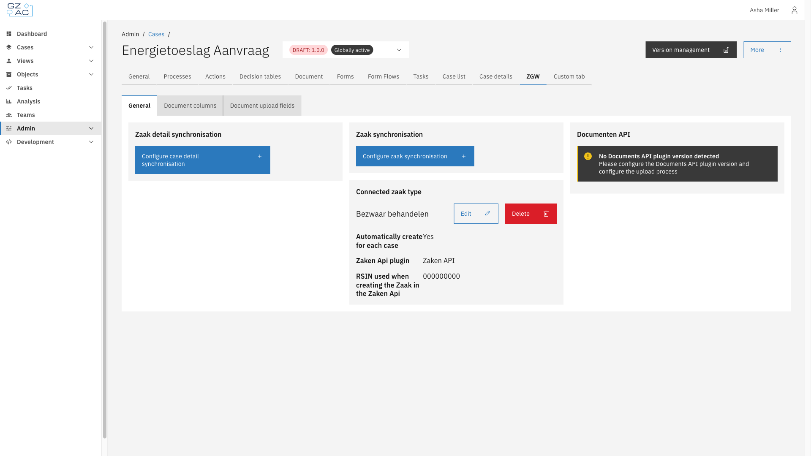

# ZGW

The ZGW tab connects a case to Dutch government ZGW (Zaakgericht Werken) services — linking the case to a zaaktype, synchronizing case and zaak data, and configuring how case documents are listed, uploaded, and tagged.

## Overview

This includes:

- **[General](general.md)** — Link the case to a zaaktype, configure zaak and case detail synchronization, and check the detected Documenten API version
- **[Document columns](document-columns.md)** — Which columns appear in the case's document list, and their default sort order
- **[Document upload fields](document-upload-fields.md)** — Default values and visibility of the fields shown when uploading a document
- **[Document tags](document-tags.md)** — Reusable keywords ("trefwoorden") that can be attached to documents

## Configuration

1. Expand **Admin** in the left sidebar
2. Click **Cases** under the Configuration section
3. Click a case definition to open it
4. Click the **ZGW** tab


Document columns and Document upload fields apply to the case definition as a whole — changes affect every version, not just the version currently selected. General is scoped to the selected case definition version and can only be edited on a draft.
