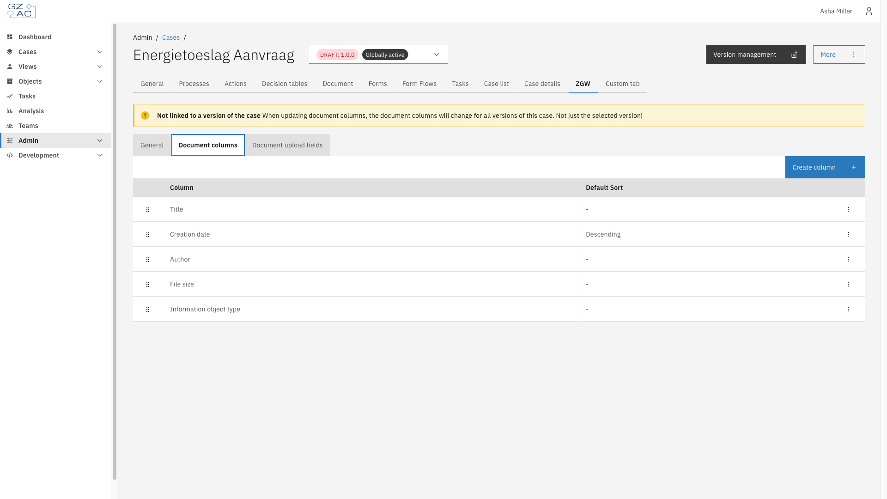
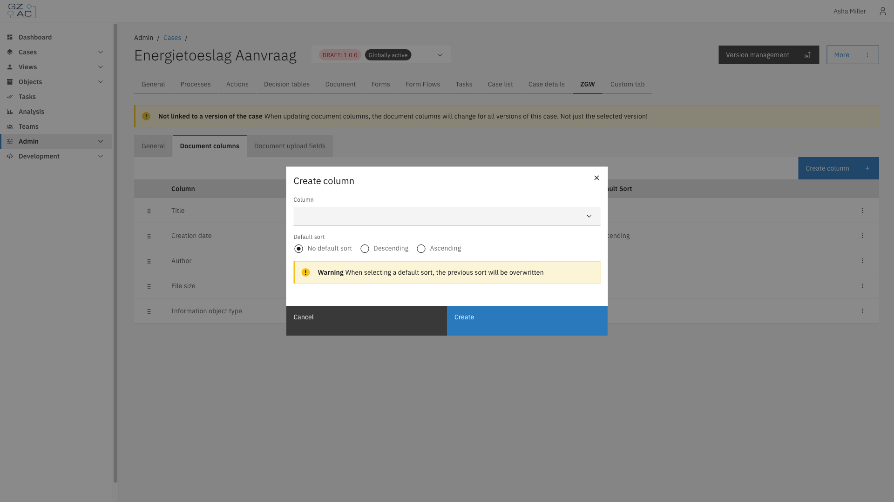
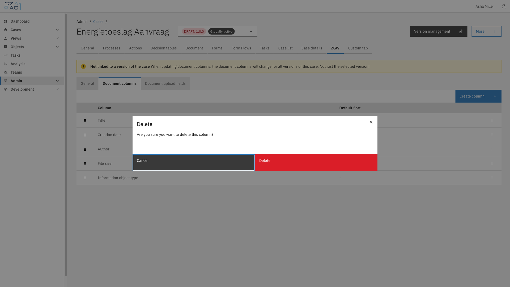

# Document columns

The Document columns sub-tab configures which columns appear in the case's document list, and which column is used as the default sort order.

## Overview

Each configured column corresponds to a Documenten API document property, such as **Title**, **Creation date**, or **Author**. Not every column supports sorting — attempting to set a non-sortable column as the default sort shows a warning instead of sort options.

## Configuration

1. Expand **Admin** in the left sidebar
2. Click **Cases** under the Configuration section
3. Click a case definition to open it
4. Click the **ZGW** tab, then the **Document columns** sub-tab

The list shows every configured column with its default sort direction. Drag a row by its handle to reorder columns.


Document columns apply to the case definition as a whole. Changes affect every version of the case, not just the version currently selected.


### Creating a column

1. Click **Create column**
2. Select a **Column** from the list of properties not yet configured
3. If the column supports sorting, choose a **Default sort** — **No default sort**, **Descending**, or **Ascending**


Only one column can be the default sort at a time. Selecting a default sort on a new or edited column overwrites the previous default.


4. Click **Create**

### Editing or deleting a column

Click a row, or use its overflow menu (⋮), to **Edit** or **Delete** a column. When editing, the **Column** field is locked to the existing property. Deleting a column requires confirmation:

