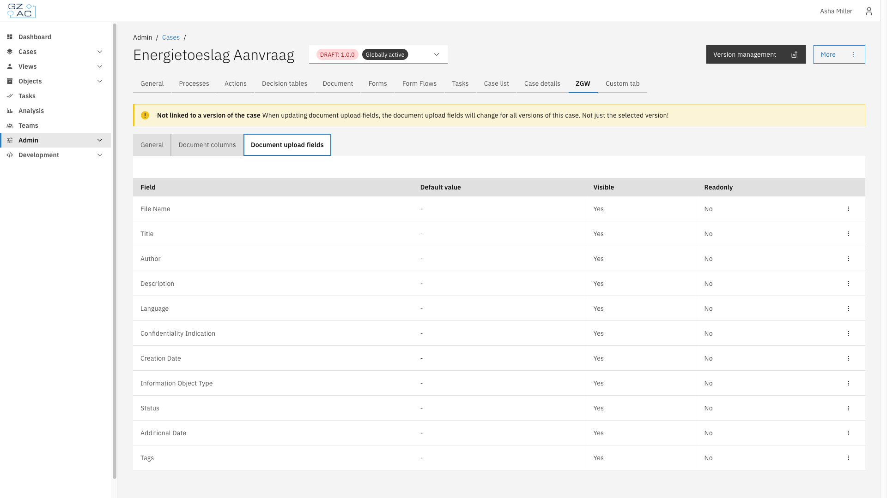
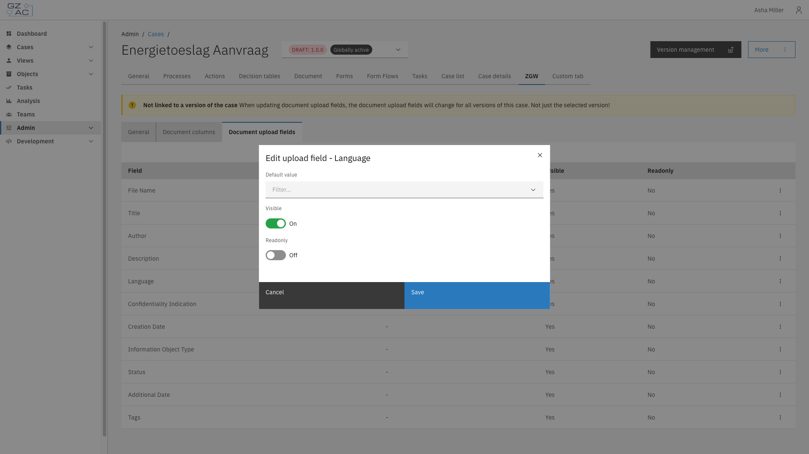

# Document upload fields

The Document upload fields sub-tab configures the default value, visibility, and read-only state of the fields shown to users when uploading a document to a case.

## Overview

Unlike [Document columns](document-columns.md), the list of upload fields is fixed — fields cannot be added or removed, only edited. Each field corresponds to a Documenten API document property, such as **Title**, **Language**, or **Status**.

## Configuration

1. Expand **Admin** in the left sidebar
2. Click **Cases** under the Configuration section
3. Click a case definition to open it
4. Click the **ZGW** tab, then the **Document upload fields** sub-tab

The list shows every upload field with its configured **Default value**, **Visible**, and **Readonly** state.


Document upload fields apply to the case definition as a whole. Changes affect every version of the case, not just the version currently selected.


### Editing a field

Click a row, or use its overflow menu (⋮), to edit a field:

| Property | Description |
|----------|-------------|
| Default value | Pre-filled value for this field on the upload form. The input type depends on the field — for example, a language or document status picker, or a plain text input. Fields such as creation date have no default value option. |
| Visible | Whether the field appears on the upload form |
| Readonly | Whether users can change the field's value on the upload form |

Click **Save** to apply changes.


The **Information object type** field can always be edited, regardless of whether the case definition version is a draft.
