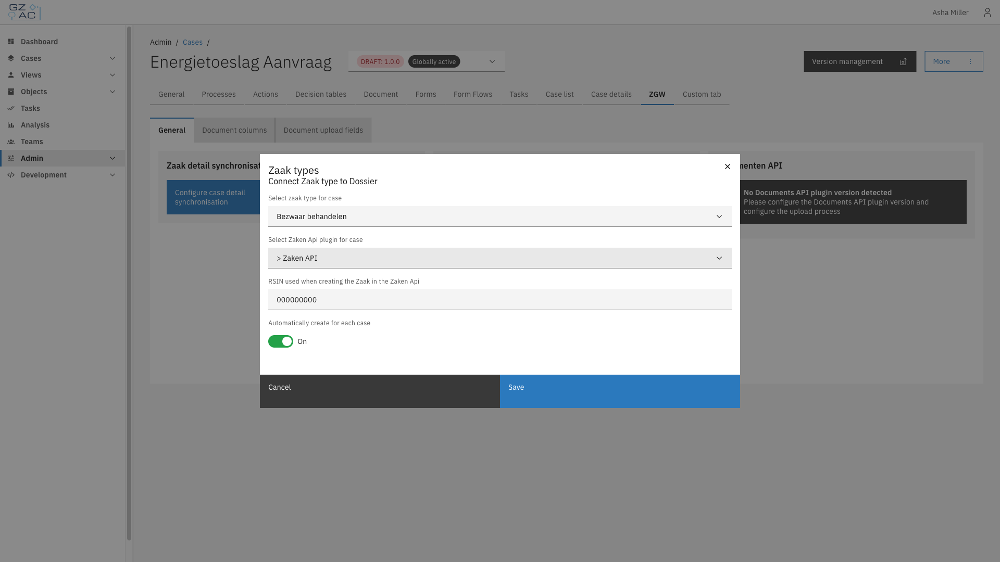
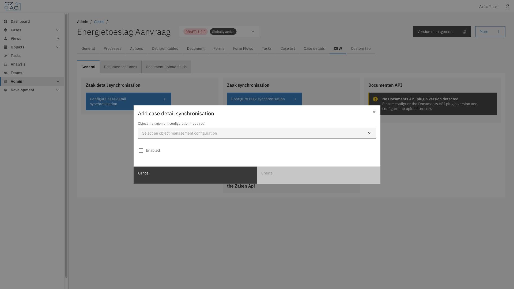

# General

The General sub-tab links the case to a Dutch government zaaktype and configures how case and zaak data synchronize with the Objecten API and Zaken API.

Four independent tiles make up this sub-tab:

- **Zaak detail synchronisation** — synchronizes case details to an object in the Objecten API, based on an Object management configuration
- **Zaak synchronisation** — synchronizes the case's assignee and notes to zaak roles and zaak notes in the Zaken API
- **Documenten API** — shows the Documenten API plugin version detected for the case (read-only)
- **Connected zaak type** — links the case type to a zaaktype and a Zaken API plugin configuration, used to create a zaak for each case

---

## Configuring general ZGW settings



Expand **Admin** in the left sidebar


Click **Cases** under the Configuration section


Click a case definition to open it


Click the **ZGW** tab, then the **General** sub-tab

<figure><figcaption>General sub-tab tiles</figcaption></figure>




These settings apply to the selected case definition version and can only be edited on a draft version.


### Connecting a zaak type



On the **Connected zaak type** tile, click **Link zaak type** (or **Edit** if a zaak type is already connected)


Fill in the zaak type details:

<figure><figcaption>Connect zaak type modal</figcaption></figure>

| Property | Description |
|----------|-------------|
| Select zaak type for case | The zaaktype from the linked Open Zaak / catalogi registration |
| Select Zaken Api plugin for case | The Zaken API plugin configuration used to create the zaak |
| RSIN used when creating the Zaak in the Zaken Api | The organisation's RSIN |
| Automatically create for each case | When enabled, a zaak is created automatically whenever a case of this type is started |


Click **Save**



Click **Delete** on the tile to remove the link. This takes effect immediately, without a confirmation step.

### Configuring zaak detail synchronisation



On the **Zaak detail synchronisation** tile, click **Configure case detail synchronisation**


Select an **Object management configuration** and enable synchronisation:

<figure><figcaption>Case detail synchronisation modal</figcaption></figure>


Click **Create**



Once configured, use **Edit** or **Delete** on the tile to change or remove the synchronisation.

### Configuring zaak synchronisation



On the **Zaak synchronisation** tile, click **Configure zaak synchronisation**


Configure which case data synchronizes to the zaak:

| Property | Description |
|----------|-------------|
| Sync case assignee as ZaakRol | Toggle, plus the Roltype URL to use when creating the role |
| Sync case notes as ZaakNotitie | Toggle, plus the ZaakNotitie subject to use when creating a note |


Click **Create**



### Documenten API version

The **Documenten API** tile shows the version of the Documenten API plugin detected for the case, based on the process linked for file uploads (see [Link upload process to case](../general.md#link-upload-process-to-case)). This tile is read-only. If no version is detected, or multiple conflicting versions are detected, a warning explains what needs to be configured.