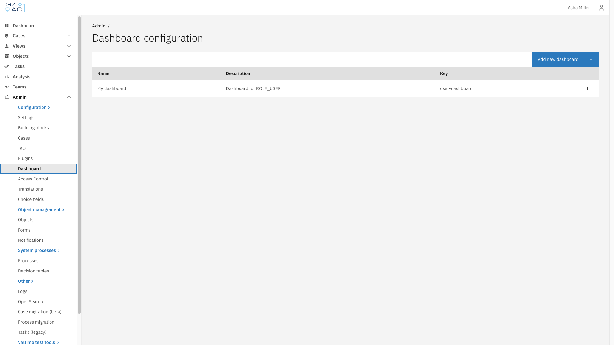
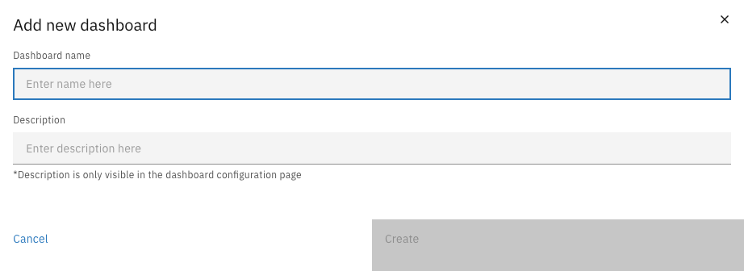
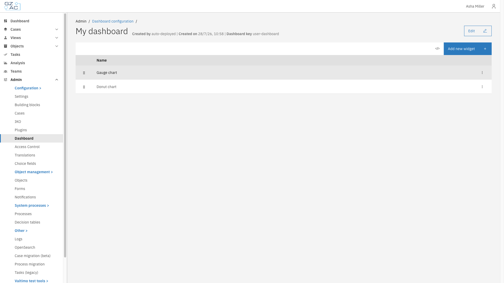
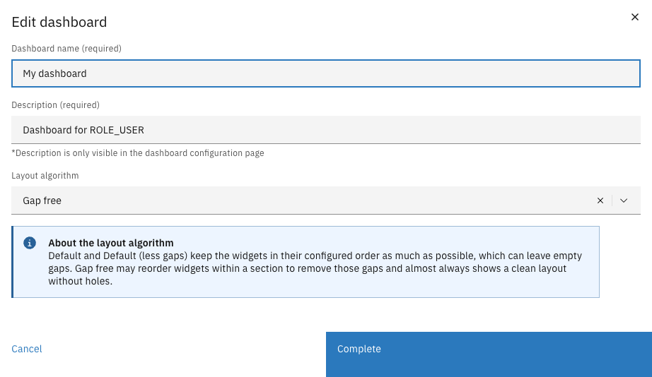

# Dashboard

Dashboards provide customizable analytics views composed of widgets. Each widget combines a data source (where data comes from) with a display type (how data is visualized) to show metrics like case counts, task counts, or grouped statistics.

This section covers:

- **[Widgets](widgets.md)** — Configure widgets with data sources and display types

---

## Configuring dashboards



Navigate to **Admin** in the sidebar


Click **Dashboard**

<figure><figcaption></figcaption></figure>



---

### Creating a dashboard



Click **Add new dashboard**

<figure><figcaption></figcaption></figure>


Enter the dashboard name and description


Click **Create**



| Property | Description |
|----------|-------------|
| Dashboard name | Display name shown in the UI (required) |
| Description | Text explaining the dashboard's purpose (required, visible only in the configuration page) |

---

### Editing a dashboard



Click on a dashboard row to open its detail view

<figure><figcaption></figcaption></figure>


Click **Edit** in the page header

<figure><figcaption></figcaption></figure>


Modify the dashboard name, description, or layout algorithm


Click **Complete** to save changes



#### Layout algorithm

The layout algorithm determines how widgets are arranged on the dashboard.

| Option | Description |
|--------|-------------|
| Default | Muuri's plain masonry layout, keeps widgets in configured order |
| Default (less gaps) | Muuri's masonry with gap filling, keeps widgets in configured order |
| Gap free | Custom gap-free packing, may reorder widgets to remove gaps |


Default and Default (less gaps) keep widgets in their configured order as much as possible, which can leave empty gaps. Gap free may reorder widgets within a section to remove those gaps.


---

### Deleting a dashboard



On the dashboard list page, click the overflow menu (three dots) on a dashboard row


Click **Delete**


Confirm the deletion



---

## Access control

Access to dashboards can be configured through access control. More information about access control can be found [here](../access-control).

### Resources and actions

| Resource type | Action | Effect |
|---------------|--------|--------|
| `com.ritense.dashboard.domain.Dashboard` | `view` | Allows viewing a specific dashboard |
| | `view_list` | Allows viewing dashboards in lists and navigation |

### Examples

<details>
<summary>Permission to view all dashboards</summary>

```json
{
    "resourceType": "com.ritense.dashboard.domain.Dashboard",
    "action": "view",
    "conditions": []
}
```

</details>

<details>
<summary>Permission to view dashboards in navigation</summary>

```json
{
    "resourceType": "com.ritense.dashboard.domain.Dashboard",
    "action": "view_list",
    "conditions": []
}
```

</details>
