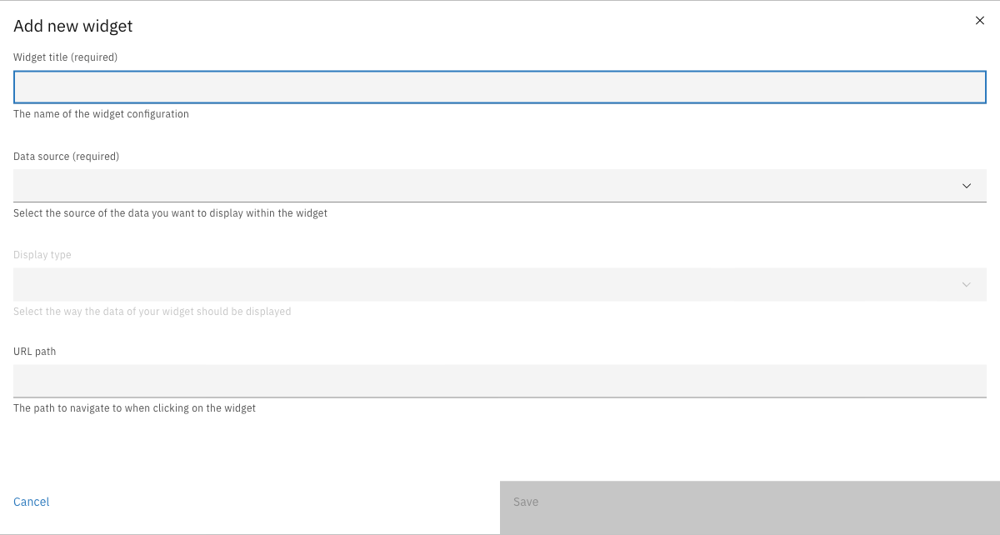
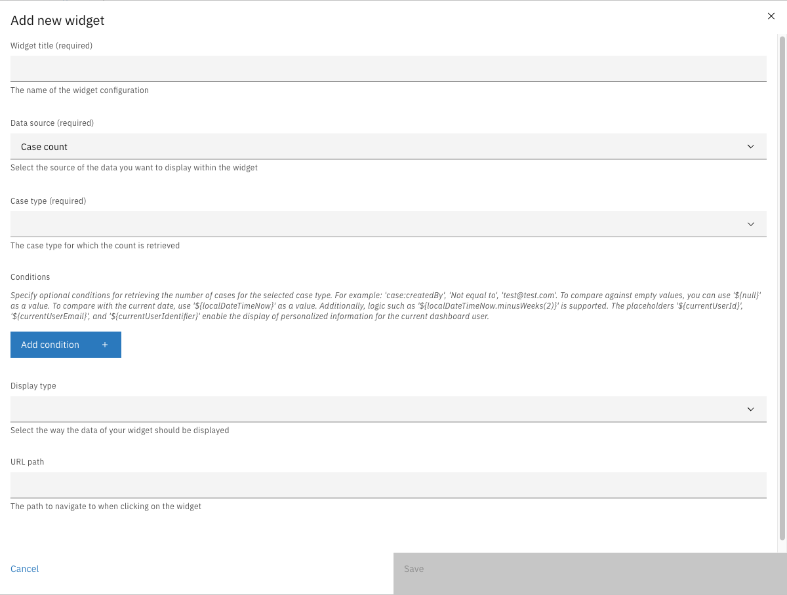
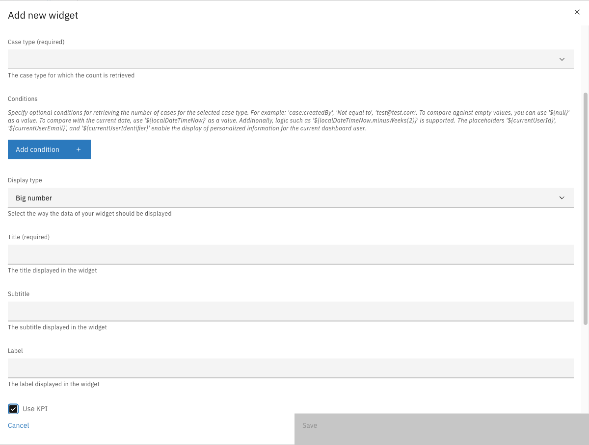

# Widgets

Widgets are the building blocks of dashboards. Each widget combines a data source (which defines what data to retrieve) with a display type (which defines how to visualize the data).

---

## Configuring widgets



Navigate to **Admin** > **Dashboard**


Click on a dashboard to open its detail view


Click **Add new widget**

<figure><figcaption></figcaption></figure>



| Property | Description |
|----------|-------------|
| Widget title | Name of the widget configuration (required) |
| Data source | The source of data to display (required) |
| Display type | How the data should be visualized (required) |
| URL path | Optional path to navigate to when clicking the widget |

---

## Data sources

Data sources define where widget data comes from. Each data source provides specific data features that determine which display types are compatible.

### Case count

Returns a count of cases from a single case definition.

<figure><figcaption></figcaption></figure>

| Property | Description |
|----------|-------------|
| Case type | The case definition to count (required) |
| Conditions | Optional filter conditions |

**Compatible display types:** Big number, Gauge

### Multiple case counts

Returns multiple labeled counts from the same case definition, each with its own conditions.

| Property | Description |
|----------|-------------|
| Case type | The case definition to count (required) |
| Count items | List of labeled condition groups (required) |

Each count item has:

| Property | Description |
|----------|-------------|
| Label | Display label for this count |
| Conditions | Filter conditions for this count |

**Compatible display types:** Donut chart, Bar chart, Meter

### Group by

Groups and counts cases by a specific field value.

| Property | Description |
|----------|-------------|
| Case type | The case definition to count (required) |
| Path | Field path to group by (required) |
| Conditions | Optional filter conditions |
| Enum | Optional value-to-display-label mapping |

**Compatible display types:** Donut chart, Bar chart, Meter

### Task count

Returns a count of tasks matching specified conditions.

| Property | Description |
|----------|-------------|
| Conditions | Optional filter conditions using `task:` prefix |

**Compatible display types:** Big number, Gauge

---

## Conditions

Conditions filter the data returned by data sources. Each condition consists of a path, operator, and value.

### Path prefixes

| Prefix | Description | Example |
|--------|-------------|---------|
| `doc:` | JSON document content fields | `doc:requestDetails.amount` |
| `case:` | Case entity properties | `case:internalStatus.id.key`, `case:assigneeId` |
| `task:` | Task entity properties | `task:assignee`, `task:name` |

### Operators

| Operator | Description |
|----------|-------------|
| `==` | Equals |
| `!=` | Not equals |
| `>` | Greater than |
| `>=` | Greater than or equal |
| `<` | Less than |
| `<=` | Less than or equal |
| `list_contains` | Collection contains value |
| `in` | Value in collection |

### Placeholders

Use these placeholders for dynamic values:

| Placeholder | Description |
|-------------|-------------|
| `${null}` | Compare against empty values |
| `${localDateTimeNow}` | Current date/time |
| `${localDateTimeNow.minusWeeks(2)}` | Date arithmetic |
| `${currentUserId}` | Current user's ID |
| `${currentUserEmail}` | Current user's email |
| `${currentUserIdentifier}` | Current user's identifier |

---

## Display types

Display types define how widget data is visualized. The available display types depend on the selected data source.

### Big number

Displays a single large numeric value with optional KPI color coding.

<figure><figcaption></figcaption></figure>

| Property | Description |
|----------|-------------|
| Title | Widget title (required) |
| Subtitle | Widget subtitle |
| Label | Label displayed in the widget |
| Use KPI | Enable severity-based color coding |

When **Use KPI** is enabled:

| Property | Description |
|----------|-------------|
| Low severity threshold | Values below this are green |
| Medium severity threshold | Values below this are yellow |
| High severity threshold | Values below this are orange; values above are red |

**Required data source features:** `number`

### Gauge

Displays a value as a percentage of a total in a semi-circular gauge.

| Property | Description |
|----------|-------------|
| Title | Widget title (required) |
| Subtitle | Widget subtitle |
| Label | Label shown alongside the total value |

**Required data source features:** `number`, `total`

### Donut chart

Displays proportional data as a circular donut chart with a center label.

| Property | Description |
|----------|-------------|
| Title | Widget title (required) |
| Subtitle | Widget subtitle |
| Label | Label displayed in the donut center |

**Required data source features:** `numbers`

### Bar chart

Displays data as a vertical bar chart.

| Property | Description |
|----------|-------------|
| Title | Widget title (required) |
| Subtitle | Widget subtitle |

**Required data source features:** `numbers`

### Meter

Displays data as a horizontal proportional meter bar.

| Property | Description |
|----------|-------------|
| Title | Widget title (required) |
| Subtitle | Widget subtitle |

**Required data source features:** `numbers`

---

## Data source and display type compatibility

| Data Source | Data Features | Compatible Display Types |
|-------------|---------------|--------------------------|
| Case count | `number`, `total` | Big number, Gauge |
| Multiple case counts | `numbers` | Donut chart, Bar chart, Meter |
| Group by | `numbers` | Donut chart, Bar chart, Meter |
| Task count | `number`, `total` | Big number, Gauge |

---

## Managing widgets

### Editing a widget

Click on a widget row in the dashboard detail view to open the edit modal.

### Duplicating a widget



Click the overflow menu (three dots) on a widget row


Click **Duplicate**



### Deleting a widget



Click the overflow menu (three dots) on a widget row


Click **Delete**


Confirm the deletion



### Reordering widgets

Drag and drop widget rows to change their display order on the dashboard.
