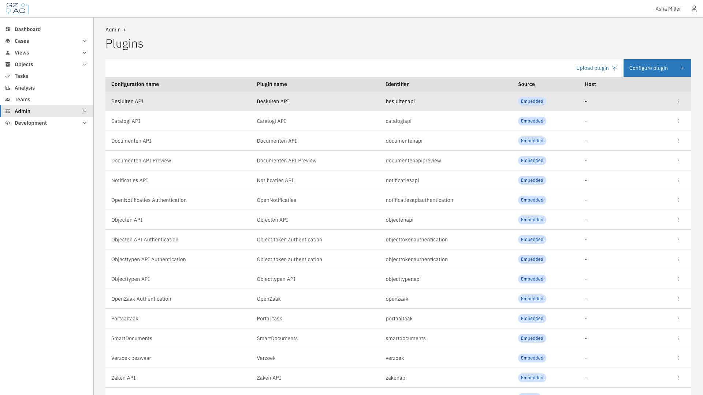

# 🔌 Plugins

Plugins extend Valtimo with integrations and custom behavior. The Plugins configuration area
covers two kinds:

- **Embedded plugins** — plugins that ship as part of the Valtimo application, such as the ZGW
  plugins. They are configured on the same Plugins page but require no infrastructure of their
  own.
- **[External plugins](external-plugins/README.md)** — plugins that run outside the Valtimo
  backend on a plugin host or as a standalone app, and are installed, permissioned, and updated
  independently of Valtimo releases.

This section covers:

- **[External plugins](external-plugins/README.md)** — concepts of the admin screens, and how
  plugin hosts, apps, and plugin configurations fit together
- **[Add a plugin host](external-plugins/add-a-plugin-host.md)** — connect a plugin host to
  Valtimo
- **[Add an app](external-plugins/add-an-app.md)** — connect and configure an app in one flow
- **[Upload a plugin](external-plugins/upload-a-plugin.md)** — install a plugin package on a
  plugin host
- **[Configure a plugin](external-plugins/configure-a-plugin.md)** — activate a plugin and accept
  its permissions
- **[Manage an integration](external-plugins/manage-an-integration.md)** — edit connections,
  event queues, frontend origins, and deletion
- **[Plugin status and reviews](external-plugins/plugin-status-and-reviews.md)** — what a status
  tag means and how to resolve a changed plugin
- **[Plugin logs](external-plugins/plugin-logs.md)** — inspect what a plugin configuration did
- **[External plugins in cases and processes](external-plugins/external-plugins-in-cases-and-processes.md)** —
  where configured plugins are used
- **[Troubleshooting](external-plugins/troubleshooting.md)** — symptoms and their fixes

---

## Accessing the Plugins area



Expand **Admin** in the left sidebar


Under the **Integrations** section, click **Plugins**, **Plugin hosts**, or **Apps**

<figure><figcaption>Plugins page</figcaption></figure>



The three pages divide the work as follows:

| Page | Purpose |
|------|---------|
| **Plugins** | All plugin configurations — embedded and external — with their source and host. Configure new plugins and upload plugin packages here. |
| **Plugin hosts** | The connected plugin hosts and their connection status. |
| **Apps** | The connected apps and their connection status. |


For an introduction to what external plugins are and how they stay secure, read
[What is an external plugin?](../../fundamentals/external-plugins.md) first.



Configuring plugins, uploading packages, and connecting plugin hosts and apps all require an
administrator role.

