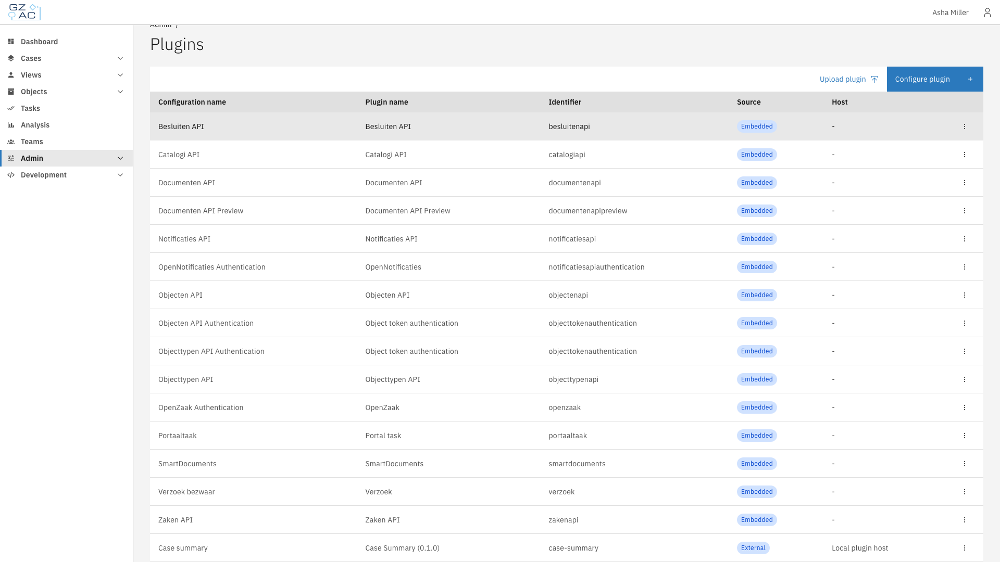
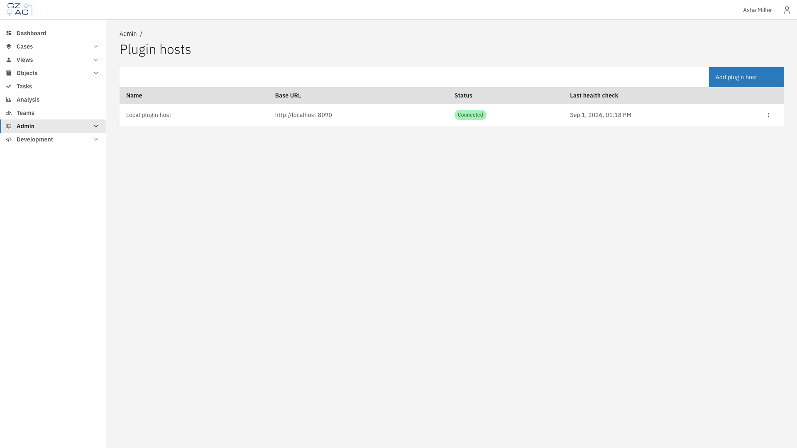

# External plugins

External plugins run outside the Valtimo backend — on a **plugin host** or as a standalone
**app** — and are connected, installed, and activated from the admin interface. This page
introduces the admin screens; the child pages walk through each task step by step.

This includes:

- **[Add a plugin host](add-a-plugin-host.md)** — connect a plugin host that will run uploaded
  plugin packages
- **[Add an app](add-an-app.md)** — connect a service that provides a single built-in plugin
- **[Upload a plugin](upload-a-plugin.md)** — install a plugin package (`.zip`) on a plugin host
- **[Configure a plugin](configure-a-plugin.md)** — activate a plugin, fill in its settings, and
  accept its permissions
- **[Manage an integration](manage-an-integration.md)** — repoint connections, tune event
  delivery, manage frontend origins, and delete safely
- **[Plugin status and reviews](plugin-status-and-reviews.md)** — what each status tag means, and
  how to resolve a plugin that changed after it was accepted
- **[Plugin logs](plugin-logs.md)** — inspect a configuration's log entries and outbound calls
- **[External plugins in cases and processes](external-plugins-in-cases-and-processes.md)** —
  bind configured plugins to processes, tasks, tabs, widgets, and menus
- **[Troubleshooting](troubleshooting.md)** — start from the symptom and find the fix

---

## The three admin pages



Expand **Admin** in the left sidebar


Under **Integrations**, choose a page: **Plugins**, **Plugin hosts**, or **Apps**



**Plugins** lists every plugin configuration. The **Source** column distinguishes **Embedded**
(runs inside Valtimo) from **External** (runs on an integration); external rows also show which
host serves them.

<figure><figcaption>Plugins page with an external configuration</figcaption></figure>

**Plugin hosts** and **Apps** list the connected integrations with their status:

| Status | Meaning |
|--------|---------|
| **Connected** | The last check-in fully succeeded — the integration is reachable and accepts Valtimo's credentials. |
| **Unreachable** | Repeated check-ins failed. Configurations stay in place and recover automatically once the integration is reachable again. |

<figure><figcaption>Plugin hosts page</figcaption></figure>

---

## How Valtimo keeps integrations in sync

Valtimo polls every integration on a fixed interval (one minute by default). Each cycle it:

- discovers the plugins and versions the integration offers, and updates their status;
- re-sends every active configuration together with a fresh, short-lived access token;
- verifies that the installed plugin packages are still exactly the ones that were accepted.

Because of this loop, most problems are self-healing: an integration that was down picks up its
configurations on the next cycle, without any manual step.


If a plugin package on a host changes without an approved upload, Valtimo suspends that plugin —
its actions fail, its screens go dark, and no tokens are issued — until an administrator reviews
and accepts the change. The plugin is tagged **Review required** until then; see
[Plugin status and reviews](plugin-status-and-reviews.md#review-required) for how to resolve it.

